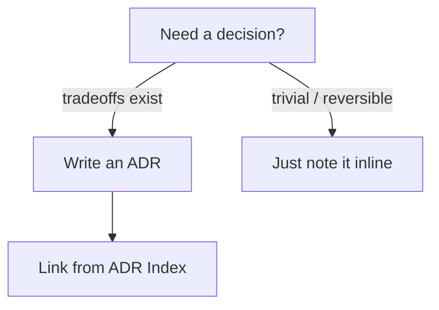
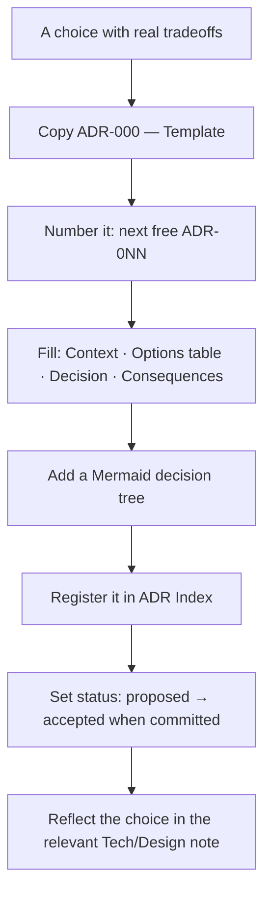
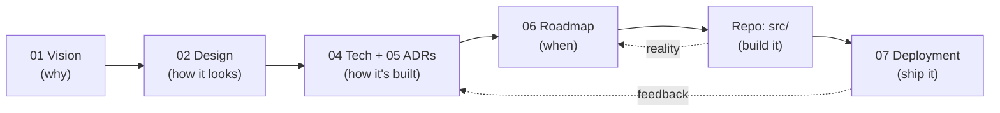

# How to use this vault

This is the **project brain** for Jeronimo Betancur Duque's personal portfolio — a working "second brain", not marketing copy. It holds the *thinking* (vision, design language, architecture, decisions, plans); the *code* lives in the repo. Plan here, build there.

> [!important] One rule above all
> **Every significant choice is decided here before it is coded.** If a decision has tradeoffs, it gets an ADR (see below). The repo should never surprise the vault, and the vault should never lie about the repo.

---

## What this vault is (and isn't)

- **Is:** the durable reasoning behind the project — the *why*, the design system, the architecture, the decisions and their rationale, the roadmap, the deployment plan. A place to think in public (with yourself).
- **Is not:** a copy of the source, an issue tracker, or marketing copy. Don't paste large code blobs here; link concepts and keep snippets illustrative. The repo is canonical for code; the vault is canonical for *decisions and intent*.

The vault is written in **English** (the planning language). The **site itself is bilingual EN/ES** — don't confuse the two. See [[i18n Architecture]].

---

## Folder taxonomy (00–99)

Notes live in numbered folders so the sidebar reads as a project lifecycle, top to bottom. **Obsidian resolves `[[wikilinks]]` by basename**, so the folder a note lives in does not affect how you link to it — link by title alone.

| Folder | Holds | Anchor notes |
| --- | --- | --- |
| `00 — Meta` | How the vault itself works. | [[How to use this vault]], [[Glossary]] |
| `01 — Vision` | The why, the identity, the bar. | [[Vision & Purpose]], [[Developer Identity]], [[Success Criteria]] |
| `02 — Design` | The Frutiger Aero design system. | [[Frutiger Aero — Design Language]], [[Design Tokens]], [[Theming — Light & Dark]] |
| `03 — Information Architecture` | Pages, sitemap, flows. | [[Sitemap]], [[Navigation & Flows]] |
| `04 — Architecture & Tech` | The engineering plan. | [[Tech Stack]], [[Project Structure]], [[Routing]] |
| `05 — Decisions (ADR)` | The decision register. | [[ADR Index]], [[ADR-000 — Template]] |
| `06 — Roadmap` | Phases, focus, backlog, DoD. | [[Roadmap & Phases]], [[Now · Next · Later]], [[Definition of Done]] |
| `07 — Deployment` | Shipping to the VPS. | [[VPS Deployment Plan]], [[CI-CD Pipeline]] |
| `99 — Research` | Grounding digests + references. | [[Tooling Notes]], [[Frutiger Aero — References]] |

> [!tip]
> The numbering leaves gaps on purpose. Need a new area (e.g. analytics, content strategy)? Slot it into an unused number rather than renumbering everything.

---

## Conventions (follow exactly)

### Frontmatter

Every note opens with YAML frontmatter:

```yaml
---
title: <Note Title>
tags: [<area>, <subtype>]   # e.g. [design, frutiger-aero] or [decision, adr]
status: <idea | exploring | decided | accepted | proposed>
created: 2026-06-15
updated: 2026-06-15
related: ["[[Other Note]]", "[[Another]]"]
---
```

Then an `# H1` matching the title.

### Statuses

The `status` field signals maturity. **Update it the moment reality changes — and bump `updated:` too.**

| Status | Use when… |
| --- | --- |
| `idea` | It's a spark, unvetted. |
| `exploring` | You're actively figuring it out; options still open. |
| `proposed` | A concrete proposal awaits acceptance (typical for ADRs mid-flight). |
| `decided` / `accepted` | It's committed; build to it. |

### Tags

Use frontmatter tags for the note's *area* (`[design, frutiger-aero]`, `[decision, adr]`, `[tech, deployment]`) and inline `#tags` where they aid retrieval: `#decision`, `#design`, `#frutiger-aero`, `#risk`, `#todo`, `#a11y`, `#perf`.

### Wikilinks

- Link **generously** to connect ideas — a note with no outbound links is a dead end.
- Link **only to canonical basenames** (the names in this vault's inventory). Obsidian resolves by basename; an invented name creates a broken/orphan link.
- Prefer a wikilink over re-explaining: link [[Glass, Gloss & Depth]] instead of re-deriving the glass recipe.

### Callouts

Use Obsidian callouts for emphasis and scanning:

> [!note] Context or clarification.
> [!tip] A shortcut or best practice.
> [!important] Don't miss this.
> [!decision] A committed choice (ADRs lean on this).
> [!warning] A hazard or gotcha.
> [!todo] An actionable item.
> [!question] / [!example] Open question / worked example.

### Mermaid diagrams

Use ` ```mermaid ` fences. **Every ADR and every main decision/IA note must include at least one diagram** — a `flowchart TD` decision tree, a flow, or a sitemap. Obsidian renders them natively.



### Tables

Use Markdown tables for options-comparison matrices (the heart of any ADR). Columns like: Option · Pros · Cons · Verdict.

### Task lists

Use `- [ ]` for actionable items so they roll up in Obsidian's task views. Park real work in [[Backlog]] and [[Now · Next · Later]], not scattered across notes.

---

## Writing standard

Write **substantive, opinionated, decision-oriented** content. Every note should carry a concrete recommendation + rationale + tradeoffs + alternatives + risks + next actions. Reference the real stack facts (React 19, Vite 8, Tailwind v4, Paraglide, Hono, Caddy…). **No filler.** Where natural, end with a `## Links` / `## See also` and/or `## Open questions` / `## Next actions` section.

---

## How to add a new note

1. **Pick the folder** by lifecycle stage (00–99 table above).
2. **Copy the frontmatter block**, set `title`, `tags`, `status: idea` (or `exploring`), today's `created`/`updated`.
3. **Write the H1**, then the body, using callouts/tables/Mermaid as the content demands.
4. **Wire it in:** add `related:` links, drop inbound wikilinks from neighbouring notes, and — if it's a new area anchor — add it to **[[Home]]**.
5. **Don't invent cross-link targets.** Only link basenames that exist in this vault.

## How to add a new decision (ADR)



> [!decision] When does something deserve an ADR?
> If reasonable people could choose differently, or future-you will ask "why did we pick this?", it's an ADR. Trivial, easily-reversible choices can stay as inline `> [!decision]` callouts. The existing set — [[ADR-001 — Framework & Build Tool]] through [[ADR-008 — Deployment Target (VPS)]] — sets the bar.

---

## Recommended workflow: plan here → build in repo



1. **Anchor in vision.** Anything you build should trace back to [[Vision & Purpose]] and [[Developer Identity]].
2. **Settle the design + the decision** in 02/04/05 before writing code.
3. **Schedule it** via [[Roadmap & Phases]] → [[Now · Next · Later]].
4. **Build in the repo**, to the [[Design Tokens]] and the accepted ADRs.
5. **Gate on quality** — nothing is "done" until it passes [[Definition of Done]].
6. **Ship** per [[VPS Deployment Plan]] / [[CI-CD Pipeline]].
7. **Feed reality back:** when the build teaches you something, update the note and its `updated:` date.

---

## How this relates to the code and `CLAUDE.md`

- **Root `CLAUDE.md`** is the contract for the *coding agent and repo*: the verified stack, repo facts, commit conventions (Conventional Commits via `npm run commit`), and the canonical note inventory. It is the bridge between this brain and the source.
- **This vault** is the *reasoning* `CLAUDE.md` points at — when `CLAUDE.md` says "see [[Frutiger Aero — Design Language]]", this is where that note lives.
- **The repo (`src/`)** is the *implementation*. Today it's a single-file mockup (`src/App.tsx`) to be refactored per [[Project Structure]] — a starting point, not a constraint.

> [!warning] Keep the three in sync
> The repo facts in `CLAUDE.md`, the decisions in the ADRs, and the code in `src/` must agree. If you change a tool, update the ADR **and** `CLAUDE.md` **and** the relevant Tech note in the same stroke — a divergence here is a future debugging trap.

## See also

- **[[Home]]** — the dashboard and map of content.
- **[[Glossary]]** — definitions for every term used across the vault.
- **[[ADR-000 — Template]]** — start a new decision here.
- **[[Definition of Done]]** — the quality gate.

## Next actions

- [ ] When `ADR-009 — Theming Strategy` is authored, register it in [[ADR Index]].
- [ ] Keep [[Home]]'s map current as new area notes land.
- [ ] Periodically sweep for stale `accepted` notes whose `updated:` date is old.
