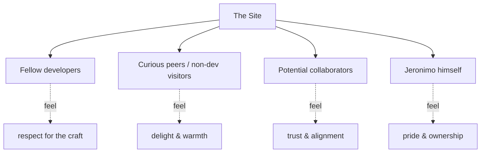

# Audience & Goals

Who visits, and — per [[Vision & Purpose]] — what we want them to **feel** before what we want them to do. This is an **emotion-first** site, not a conversion funnel. Goals here are written as *takeaways* and *feelings*, with any "action" framed as low-pressure and optional.

> [!important] Emotional > conversion
> Every audience goal below leads with a feeling. We never measure ourselves on click-through or lead-capture (see non-goals in [[Vision & Purpose]]). The only "conversion" we care about is the soft one: *they remember Jeronimo.*

## The audiences

### 1. Fellow developers (primary)
People who can read the source, notice the easing curves, spot that the glass is real `backdrop-filter` and not a screenshot. They are the toughest, most rewarding audience.

### 2. Curious peers / non-dev visitors
Friends, family, people who land here without a frontend vocabulary. They don't read code — they feel the *vibe*. The Frutiger Aero spectacle is largely **for them**.

### 3. Potential collaborators
Not "recruiters" in the funnel sense — people who might want to *build something with* Jeronimo. They're scanning for alignment, taste, and reliability, not a keyword-matched CV.

### 4. Jeronimo himself
A real, named audience. This is a personal artifact and a **second brain made public**. It should make its author proud to own and easy to maintain solo (see [[Definition of Done]], [[Principles & Constraints]]).

## Audience → takeaway

| Audience | Should FEEL | Should TAKE AWAY | Soft (optional) action | Key surfaces |
|---|---|---|---|---|
| Fellow developers | respect; "this person sweats the details" | a sense of his taste, rigor, and how he thinks | read a [[Page — Blog]] post; peek the repo | [[Page — Home]], [[Page — Projects]], [[Page — Blog]] |
| Curious peers / non-devs | delight, warmth, "this is beautiful" | "Jeronimo makes lovely, thoughtful things" | share it because it's pretty | hero on [[Page — Home]], [[Imagery & Motifs]] |
| Potential collaborators | trust, alignment, "we'd work well together" | who he is and what he values | reach out via [[Page — Contact]] | [[Page — About]], [[Page — Contact]] |
| Jeronimo (author) | pride, ownership, calm | "this is genuinely *me*, and I can maintain it" | keep writing & shipping | whole site; [[Roadmap & Phases]] |

## Cross-cutting goals (true for everyone)

- **Bilingual parity.** EN and ES visitors get the *same* emotional experience, not a degraded translation (see [[i18n Architecture]]).
- **Accessible delight.** The spectacle reaches people using keyboards, screen readers, reduced-motion, and low-end devices (see [[Accessibility & SEO]], [[Motion & Animation]]).
- **Memorable first 5 seconds.** The hero must land the feeling fast *without* sacrificing the reward-attention philosophy (see [[Page — Home]]).
- **"So him" recognition.** Anyone who knows Jeronimo should immediately recognize him in it (ties to [[Developer Identity]] and a core [[Success Criteria]] signal).

## What we are explicitly NOT optimizing for

> [!warning]
> - Recruiter scan-speed / résumé-matching.
> - Conversion rate, funnels, lead-capture, email lists.
> - Maximizing raw traffic / SEO-for-vanity. (We *do* want correct, crawlable meta and social cards — see [[Accessibility & SEO]] — but that's craft, not growth-hacking.)

## Open questions

- [ ] Is there a secondary "client / freelance" audience, or is collaboration purely peer-to-peer? (Affects [[Page — Contact]] copy.)
- [ ] Default language on first visit — detect locale vs. always-EN-then-switch? See [[i18n Architecture]] / [[Routing]].

## See also

- [[Vision & Purpose]] · [[Developer Identity]] · [[Success Criteria]] · [[Navigation & Flows]]
