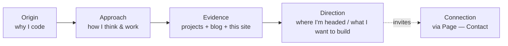

# Developer Identity

The persona the site must express. This is the **source of truth for voice and tone** — it drives [[Page — About]], the [[Page — Home]] hero, and the [[Page — Blog]] register. Per [[Vision & Purpose]], the *build itself* expresses identity; this note captures the *words and values* the build wraps around.

> [!note] How to use this note
> Sections marked `> [!todo]` are **fill-in prompts** for Jeronimo. Answer them in plain prose; copywriting (EN + ES) gets lifted straight from your answers later. Placeholders are fine — leave `TODO:` markers, not blanks, so nothing gets silently dropped.

## Who am I (one-liner)

> [!todo] Fill in
> One sentence, first person, no buzzwords: *"I'm a developer who ______."*
> TODO: `<one sentence>`

Working placeholder (replace): *"I build software the way Frutiger Aero looks — bright, careful, and unmistakably human."*

## Core values (the spine)

What I refuse to compromise on. Keep to 3–5; each becomes a felt quality on the site.

> [!todo] Fill in / confirm
> Candidate values (edit, cut, reorder, add):
> - **Craft over speed** — I'd rather ship one polished thing than five rough ones.
> - **Clarity** — code, UI, and writing that explain themselves.
> - **Humane technology** — tools should feel friendly, not hostile.
> - **Ownership** — self-hosted, no lock-in; I understand my whole stack (see [[VPS Deployment Plan]]).
> - **Curiosity** — TODO: `<is "always learning" true and specific? name a recent rabbit hole>`

## How I work / behave

> [!todo] Fill in
> - When I start a project, I first ______.
> - My code reviews / commits look like ______ (note: this repo enforces Conventional Commits — that's *already* a signal of discipline; see [[Tech Stack]]).
> - I'm at my best when ______.
> - I get frustrated by ______.
> - The thing collaborators say about me is ______.

## Strengths to foreground

> [!todo] Pick 3–4 to make legible on the site
> - Frontend craft & design sensibility (the site itself is exhibit A).
> - Attention to detail / polish.
> - TODO: `<backend? infra/devops? data? specific languages/frameworks?>`
> - TODO: `<a genuine differentiator — what do I do that most devs don't?>`

> [!tip] Show, don't tell
> Each strength should have a **demonstration**, not just a claim:
> - Detail → the glass/gloss micro-interactions ([[Component Visual Library]]).
> - Infra → the self-hosted contact backend + CI/CD ([[Contact Backend]], [[CI-CD Pipeline]]).
> - Writing/thinking → the [[Page — Blog]].

## The story the site should tell

A narrative arc, not a fact dump. The [[Page — About]] should read as a small story.

> [!todo] Fill in the arc
> - **Origin:** TODO: `<what pulled me into software?>`
> - **Approach:** TODO: `<my working philosophy in 2–3 sentences>`
> - **Evidence:** projects + blog + this very site (auto-supplied).
> - **Direction:** TODO: `<what I'm excited to build next / the kind of work I want>`

## Voice & tone

The register for all copy. Frutiger Aero is **optimistic and humane** — the writing should match (see [[Vision & Purpose]]).

| Dimension | Lean toward | Lean away from |
|---|---|---|
| Warmth | warm, friendly, first-person | corporate, distant, third-person |
| Confidence | quietly assured, specific | boastful, vague superlatives |
| Playfulness | a little playful, occasional delight | jokey to the point of unserious |
| Density | concrete, opinionated | filler, hedging, buzzword soup |
| Tech level | accessible to peers and curious non-devs | gatekeeping jargon without context |

> [!todo] Bilingual voice check
> Confirm the **same personality survives in Spanish** — not a literal translation but the same warmth. ES is a first-class citizen (see [[i18n Architecture]]). TODO: `<any phrases that are "very me" in ES that should anchor the Spanish voice?>`

## Identity → page tone map

| Surface | Tone | Notes |
|---|---|---|
| [[Page — Home]] hero | bold, inviting, one-sentence punch | the "one sentence" from [[Vision & Purpose]] |
| [[Page — About]] | personal, story-shaped, warm | the narrative arc above |
| [[Page — Projects]] | proud but plain-spoken | let the work talk |
| [[Page — Blog]] | curious, thinking-out-loud | dev-authored, opinionated |
| [[Page — Contact]] | friendly, low-pressure | "let's talk," not "convert" |

## Open questions

- [ ] Final values list (cut to 3–5, locked).
- [ ] Real GitHub / LinkedIn handles (currently TBD per [[Vision & Purpose]] / project brief).
- [ ] Is there a personal motif/symbol (animal, color, object) that could recur as a Frutiger-Aero motif? See [[Imagery & Motifs]].

## See also

- [[Vision & Purpose]] · [[Audience & Goals]] · [[Page — About]] · [[Page — Blog]]
