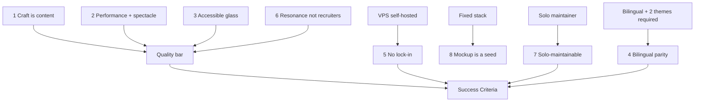

# Principles & Constraints

The **quotable rules** that resolve day-to-day decisions, and the **hard constraints** the project cannot escape. When two options both seem fine, the principle wins; when a principle meets a constraint, the constraint wins. Derived from [[Vision & Purpose]] and the project brief.

## Guiding principles (numbered, quotable)

> [!important] Principle 1 — Craft is the content.
> The build itself is the portfolio. If a detail wouldn't survive a fellow developer reading the source, it isn't done. Polish is not optional finish; it's the message. → [[Developer Identity]], [[Component Visual Library]].

> [!important] Principle 2 — Performance *with* spectacle, not instead of it.
> Beauty and speed are co-required, not traded. Hold the [[Performance Budget]] floor (LCP < 2.5s, INP < 200ms, CLS < 0.1, JS < 150 KB gz) *while* it sparkles. Cap `backdrop-filter` blur ≤ 20px, limit glass layers, animate `transform`/`opacity` only, never animate blurred elements. When red, the spectacle yields first — never the floor.

> [!important] Principle 3 — Accessible despite the glass.
> Translucent UI must still pass WCAG AA. Body text ≥ 4.5:1 over glass (add a tint/scrim/text-shadow behind text). Full keyboard + screen-reader operability. Every aurora/blob/parallax gated behind `prefers-reduced-motion` with a static fallback. Spectacle that excludes people fails the mission. → [[Accessibility & SEO]], [[Motion & Animation]].

> [!important] Principle 4 — Bilingual parity.
> EN and ES are equal citizens. Same content, same emotional weight, same polish — no fallback gaps, no "translate later." Path-prefixed `/en` `/es`; switching language preserves the current slug. → [[i18n Architecture]], [[Routing]].

> [!important] Principle 5 — No vendor lock-in.
> Everything self-hostable and portable. Prefer open, standards-based, first-party solutions (own VPS, own contact backend, own CI/CD). If a dependency can't move to another box in an afternoon, it's a liability. → [[VPS Deployment Plan]], [[Contact Backend]].

> [!important] Principle 6 — Optimize for resonance, not recruiters.
> Decisions serve emotional resonance and "this is so him," never scan-speed or conversion. No funnels, no lead-capture, no growth-hacking. → [[Vision & Purpose]], [[Audience & Goals]].

> [!important] Principle 7 — Solo-maintainable.
> One person maintains this forever. Favor boring-where-it-counts, well-documented, low-surface-area choices. Conventional Commits + the vault *are* the handover doc. If future-Jeronimo would dread touching it, simplify now. → [[Definition of Done]], [[Project Structure]].

> [!important] Principle 8 — The mockup is a seed, not a spec.
> The committed single-file `src/App.tsx` is a starting point to refactor, not a constraint to preserve. Keep nothing just because it's there. → [[Tech Stack]].

> [!tip] Quick tie-breakers
> - Identity vs. spectacle → serve **both**; if forced, alternate the winner ([[Vision & Purpose]]).
> - Pretty vs. accessible → **accessible** (Principle 3).
> - Convenient SaaS vs. self-hosted → **self-hosted** (Principle 5).
> - More feature vs. solo-maintainability → **maintainability** (Principle 7).

## Hard constraints (non-negotiable)

> [!warning] These bound every decision
> - **Self-hosted on Jeronimo's own VPS.** Deployed "to the net" with full control: Docker, reverse proxy (Caddy preferred), a tiny backend container, CI/CD over SSH/registry, custom domain + TLS. No PaaS lock-in. → [[VPS Deployment Plan]], [[ADR-008 — Deployment Target (VPS)]].
> - **Fixed stack baseline (already committed).** React 19.2 + react-dom 19.2, TypeScript ~6 (strict), Vite 8 (`@vitejs/plugin-react` 6), Tailwind v4 via `@tailwindcss/vite` with CSS-first `@theme` and `@import "tailwindcss";` — **no `tailwind.config.js`**. ESLint 10 flat config + typescript-eslint. → [[Tech Stack]].
> - **Commit discipline enforced.** Husky 9 + commitlint (config-conventional) + commitizen; commit via `npm run commit`; Conventional Commits enforced by a `commit-msg` hook. → [[Tech Stack]], [[CI-CD Pipeline]].
> - **Tailwind v4 browser targets.** Chrome 111+ / Safari 16.4+ / Firefox 128+. Features below that line (e.g. some `@property`/`backdrop-filter` edges) need `@supports` fallbacks. → [[Performance Budget]].
> - **Solo maintainer.** One developer, finite time. No process that assumes a team.
> - **v1 scope is bounded.** No dedicated long-form case-study sub-pages, no CMS, no e-commerce in v1. → [[Roadmap & Phases]], [[Backlog]].
> - **Bilingual is required, not optional.** EN + ES both ship in v1.
> - **Two themes required.** A luminous "day/sky" light theme and a deep "ocean/aurora" dark theme; no FOUC (inline head script). → [[Theming — Light & Dark]], [[ADR-009 — Theming Strategy]].

## Principles ↔ constraints map

## How conflicts resolve

> [!decision] Resolution order
> 1. **Hard constraint** beats everything (it's not negotiable).
> 2. Among options that satisfy constraints, the **lower-numbered principle** wins (1 → 8), with the explicit exception that **identity and spectacle are co-equal** ([[Vision & Purpose]]).
> 3. If still tied, choose the **more maintainable** option (Principle 7).
> 4. Record any non-obvious call as an ADR. → [[ADR Index]].

## Open questions

- [ ] Confirm exact VPS specs / RAM headroom (affects Caddy-vs-Coolify and blur budget) — see [[VPS Deployment Plan]].
- [ ] Confirm custom domain choice — see [[Domain, DNS & TLS]].

## See also

- [[Vision & Purpose]] · [[Success Criteria]] · [[Tech Stack]] · [[Performance Budget]] · [[Accessibility & SEO]]
- All decisions trace back here and to [[ADR Index]].
