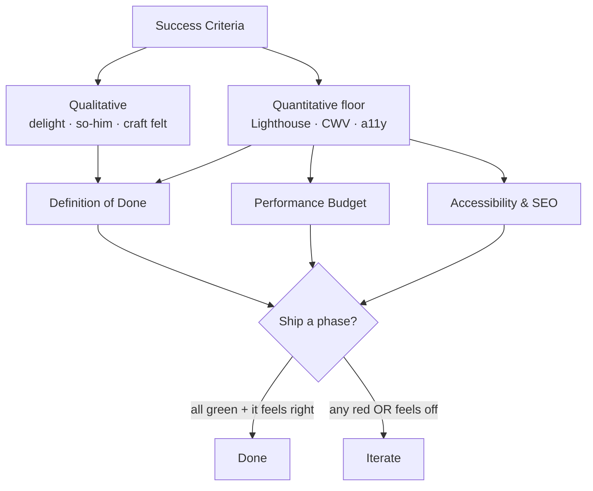

# Success Criteria

How we know it worked. Because [[Vision & Purpose]] makes this an **emotion-first** artifact, the *primary* criteria are qualitative. The quantitative bar exists only to **prove the craft** — to show beauty was achieved *without* breaking performance or access. Both must hold.

> [!important] Qualitative leads, quantitative guards
> A site can hit every Lighthouse target and still fail (cold, generic). It can feel magical and still fail (broken on mobile, inaccessible). **Success = the feeling AND the floor.**

## Qualitative criteria (primary)

> [!example] We succeeded when…
> - **"This is so *him*."** Someone who knows Jeronimo sees it and recognizes him instantly (ties to [[Developer Identity]]).
> - **It delights.** First-time visitors smile, linger, or say "whoa" at the hero / glass / motion (the [[Frutiger Aero — Design Language]] spectacle landed).
> - **Craft is felt.** A fellow developer notices the polish and respects it (see [[Audience & Goals]]).
> - **It feels alive, not templated.** Nobody mistakes it for an off-the-shelf theme.
> - **Bilingual soul.** An ES visitor feels the *same* warmth as an EN visitor (see [[i18n Architecture]]).
> - **The author is proud.** Jeronimo is happy to own it and finds it pleasant to maintain (see [[Definition of Done]]).

How we'll gather these (lightweight, no analytics funnel):
- [ ] Show it to 3–5 developer peers; capture unprompted reactions verbatim.
- [ ] Show it to 3–5 non-dev friends; did they smile / share?
- [ ] One ES-native reviewer confirms the Spanish feels native, not translated.
- [ ] Gut check: would Jeronimo put this at the top of his own bio?

## Quantitative signals (the floor — guards, not goals)

> [!note]
> These are **thresholds the spectacle must not break**, not targets to chase. They make "we held performance while it sparkled" (a [[Vision & Purpose]] claim) *verifiable*. Authoritative numbers live in [[Performance Budget]] and [[Accessibility & SEO]]; this note tracks the headline bar.

| Signal | Target | Source of truth |
|---|---|---|
| Lighthouse — Performance | ≥ 90 (mobile), ≥ 95 (desktop) | [[Performance Budget]] |
| Lighthouse — Accessibility | ≥ 95 | [[Accessibility & SEO]] |
| Lighthouse — Best Practices | ≥ 95 | [[Performance Budget]] |
| Lighthouse — SEO | ≥ 95 | [[Accessibility & SEO]] |
| LCP (Largest Contentful Paint) | < 2.5s | [[Performance Budget]] |
| INP (Interaction to Next Paint) | < 200ms | [[Performance Budget]] |
| CLS (Cumulative Layout Shift) | < 0.1 | [[Performance Budget]] |
| Initial JS (gzip) | < 150 KB | [[Performance Budget]] |
| Contrast over glass | ≥ 4.5:1 body text (WCAG AA) | [[Accessibility & SEO]] |
| `prefers-reduced-motion` honored | 100% of motion gated | [[Motion & Animation]] |
| Keyboard + screen-reader pass | full nav, no traps | [[Accessibility & SEO]] |
| Bilingual completeness | 0 missing/fallback keys EN/ES | [[i18n Architecture]] |

> [!warning] The hard rule
> Frutiger Aero spectacle is GPU-heavy (blur, auroras, blobs). If any signal above turns red, the **spectacle gives way first** — reduce blur radius, cut a blob layer, simplify the aurora — never the accessibility or performance floor. See [[Performance Budget]] for the backdrop-filter / blur caps.

## How success criteria connect

## Relationship to other notes

- A feature is **done** only when it clears both columns here — formalized in [[Definition of Done]].
- The numeric floor is owned by [[Performance Budget]] and [[Accessibility & SEO]]; this note must stay consistent with them (update both sides together).
- Per-phase exit criteria live in [[Roadmap & Phases]] and [[Now · Next · Later]].

## Open questions

- [ ] Lock final Lighthouse/CWV numbers once [[Performance Budget]] is authored (this table mirrors it).
- [ ] Decide whether to capture a real-user CWV signal post-launch (privacy-respecting) or stay lab-only.

## See also

- [[Vision & Purpose]] · [[Audience & Goals]] · [[Definition of Done]] · [[Performance Budget]] · [[Accessibility & SEO]]
