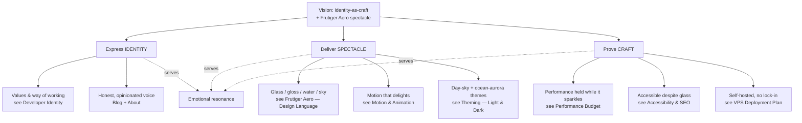

# Vision & Purpose

> [!important] The one sentence
> A personal, beautiful, hand-crafted artifact — drenched in **Frutiger Aero** — that fully expresses who Jeronimo *is* as a developer, where the craft of the build is itself the argument.

This is **not** a job-hunting site. It is **craft-as-statement**. We optimize for emotional resonance and polish, never for recruiter scan-speed or conversion funnels.

## Why this exists (the WHY)

Two co-equal north stars. Neither subordinates the other:

1. **Identity-as-craft.** The site *is* the portfolio. The way it's built — the discipline of the [[Glass, Gloss & Depth]] system, the bilingual parity, the performance budget held while it sparkles — demonstrates how Jeronimo thinks and works far better than any bullet list of skills. The medium is the message.
2. **Frutiger Aero spectacle.** A flashy, memorable, joyful experience: glassy surfaces, skies, auroras, bubbles, gloss. Techno-optimism you can *feel*. See [[Frutiger Aero — Design Language]], [[Color & Gradients]], [[Imagery & Motifs]], [[Motion & Animation]].

> [!decision] These are co-equal
> When a tradeoff pits "more identity" against "more spectacle," do **not** auto-pick one. Find the move that serves both; if forced, alternate which one wins so neither atrophies. Spectacle without identity is a theme demo; identity without spectacle is a résumé.

## Manifesto

- The future is **bright, friendly, and humane** — and so is this site.
- **Craft is the content.** Every gradient, easing curve, and translucent rim is a sentence about how I work.
- **Delight is a feature, not decoration.** If a visitor smiles, that is a success metric (see [[Success Criteria]]).
- **Performance and beauty are not in tension** — holding both *is* the flex. See [[Performance Budget]].
- **Accessible glass or no glass.** Spectacle that excludes people fails the mission. See [[Accessibility & SEO]].
- **Two languages, one soul.** EN and ES are equal citizens, not a translation afterthought. See [[i18n Architecture]].
- **My VPS, my rules.** Self-hosted, no vendor lock-in — control is part of the identity. See [[VPS Deployment Plan]].

## What success FEELS like

> [!example] The felt experience
> A fellow developer lands on the home page, the sky/aurora hero breathes, glass panels catch light as they scroll, and within seconds they think: *"Okay — this person actually cares, and they can really build."* They poke a [[Glass, Gloss & Depth]] gel button just to feel it respond. They read a blog post. They leave remembering **the feeling**, and remembering *Jeronimo*.

See [[Success Criteria]] for how we make that felt sense legible.

## The vision pillars

## Explicit non-goals

> [!warning] What this site is NOT
> - **Not** a recruiter funnel. No "Download my résumé," no lead-capture, no conversion-rate obsession.
> - **Not** optimized for scan-speed. It rewards attention; it does not pander to a 4-second skim.
> - **Not** a generic template re-skin. The committed single-file mockup is a *starting point*, not the destination (see [[Tech Stack]]).
> - **Not** a SaaS-dependent build. No vendor lock-in (see [[ADR-008 — Deployment Target (VPS)]]).
> - **Not** scope-creeping into v1: no long-form case-study sub-pages, no CMS, no e-commerce (see [[Roadmap & Phases]]).

## How the pillars map to the build

| Pillar | Primary notes | Proof in the artifact |
|---|---|---|
| Identity | [[Developer Identity]], [[Page — About]], [[Page — Blog]] | Voice, values, dev-authored writing |
| Spectacle | [[Frutiger Aero — Design Language]], [[Component Visual Library]], [[Motion & Animation]] | Glass, gloss, auroras, water motifs |
| Craft | [[Performance Budget]], [[Accessibility & SEO]], [[CI-CD Pipeline]] | Lighthouse, a11y, self-hosted CI/CD |

## Next actions

- [ ] Lock the "one sentence" pitch verbatim into [[Page — Home]] hero copy.
- [ ] Confirm the two-theme commitment in [[Theming — Light & Dark]].
- [ ] Validate non-goals against [[Roadmap & Phases]] and [[Backlog]] each phase.

## See also

- [[Developer Identity]] · [[Audience & Goals]] · [[Success Criteria]] · [[Principles & Constraints]]
- [[Vision & Purpose]] is the parent of [[Sitemap]] and all [[ADR Index]] decisions.
