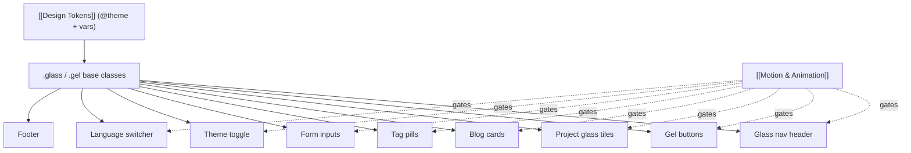

# Component Visual Library

The catalog of UI components in the Frutiger Aero language. This is the **bridge from tokens to implementation** — every value here resolves to a token in [[Design Tokens]], every glass/gloss recipe lives in [[Glass, Gloss & Depth]], every motion gesture is gated per [[Motion & Animation]]. Each entry gives **Look → States → Motion → a11y**.

> [!tip]
> Two foundational CSS classes underpin most components: **`.glass`** (frosted translucent panel) and **`.gel`** (aqua glossy control). Define them once in the CSS layer; components compose them with Tailwind utilities. Keep glass layers few — see [[Performance Budget]].

---

## 1. Glass nav header

- **Look:** sticky top bar using `.glass` with `--blur-strong` (20px) backdrop, `--color-glass-fill`, 1px `--color-glass-border` top rim, `--shadow-glass`. Logo/wordmark left (humanist `--font-display`), nav links center/right, [[#7. Theme toggle|theme toggle]] + [[#8. Language switcher|language switcher]] far right. Subtle bottom hairline that strengthens on scroll.
- **States:** *at top* = more translucent, no shadow; *scrolled* = increases fill opacity + adds `--shadow-soft` (frosted "lifts"); link *hover* = `--color-accent` underline grows from center, faint glow; *active route* = persistent accent underline + bolder weight.
- **Motion:** scroll-state transition on `--dur-base`/`--ease-glide`; mobile menu opens as a glass sheet sliding from top with `--ease-spring`. Gate the slide behind reduced-motion (fade instead).
- **a11y:** semantic `<header><nav>`; `aria-current="page"` on active link; visible focus ring (`--color-ring`); mobile toggle is a real `<button aria-expanded>`; ensure link text ≥4.5:1 over the blurred fill (add scrim if a busy hero scrolls behind it).

## 2. Gel / aqua buttons (primary action)

- **Look:** the signature **aqua button** — `--grad-gel` vertical multi-stop fill, `--radius-pill`, `--shadow-gel` (inset top highlight + inset bottom shadow + outer drop), white label with subtle `text-shadow`, and a `::before` top-half **sheen** (`--grad-sheen`). Candy, glossy, beveled.
- **Variants:** *primary* (blue gel), *secondary* (`.glass` ghost with accent text), *accent* (grass-green gel for positive/submit). Sizes sm/md/lg via padding tokens.
- **States:** *hover* = brighten gradient + lift (`translateY(-1px)`) + `--shadow-glow`; *active* = press in (`translateY(1px)`, reduce outer shadow, deepen inset) for a tactile "squish"; *focus-visible* = `--color-ring` outline; *disabled* = desaturate, drop sheen, `cursor:not-allowed`; *loading* = sheen shimmer sweep + spinner.
- **Motion:** spring (`--ease-spring`, `--dur-fast`) on hover/press; loading shimmer on `--dur-amb`-style loop. Reduced-motion → no lift/squish, only color change.
- **a11y:** real `<button>`; label ≥4.5:1 (white-on-blue passes; verify white-on-cyan); never rely on the sheen for affordance; disabled state communicated via `aria-disabled` + visual, not color alone.

## 3. Project cards — glass tiles

- **Look:** `.glass` tile, `--radius-lg`, holding a project thumbnail (rounded, slight inner shadow), title (`--font-display`), one-line summary (`--color-text-soft`), a row of [[#5. Tag pills|tag pills]], and a gel "View" / external-link affordance. A faint diagonal sheen sweeps the glass. Optional floating bubble/bokeh accent (decorative) behind the grid — see [[Imagery & Motifs]].
- **States:** *rest* = soft `--shadow-soft`; *hover* = tile lifts + `--shadow-glass` deepens, thumbnail subtly scales (overflow-hidden), sheen animates across, accent glow on border; *focus-within* = same as hover via keyboard; *pressed* = slight scale-down.
- **Motion:** entrance via **scroll reveal** (stagger, fade + rise) per [[Motion & Animation]]; hover lift on `--ease-glide`; thumbnail parallax-tilt optional. All gated by reduced-motion (reveals become instant, no tilt).
- **a11y:** the whole tile is **one link** (wrap, don't nest interactive elements); accessible name = project title; decorative thumbnail `alt=""`; tag pills are not separate links inside the card link; maintain contrast of summary text over glass.

## 4. Blog cards

- **Look:** lighter-weight `.glass` row/tile: date + reading time (small, soft), localized title, excerpt, lang badge (EN/ES), tags. Leading accent bar or small gel "read" chevron. Designed for a responsive grid and a list view on the [[Page — Blog]].
- **States:** *hover* = title shifts to `--color-accent`, card lifts slightly, chevron nudges right; *visited* (optional) = subtly dimmed title.
- **Motion:** staggered scroll reveal; hover nudge on `--dur-fast`. Reduced-motion → static.
- **a11y:** card is one link to the post; date in a real `<time datetime>`; lang badge has text (not just color); excerpt contrast verified per theme ([[Theming — Light & Dark]]).

## 5. Tag pills

- **Look:** small `--radius-pill` chips, `.glass`-light fill with a tinted accent border, label in `--color-text-soft`; on category color-coding, tint toward `--aero-leaf`/`--aero-sky`/`--aero-sun` sparingly. Gel-lite sheen optional on filter pills.
- **States:** *static* (in a card, non-interactive) vs *interactive filter* (on blog/projects): *hover* = fill brightens; *selected* = filled gel accent + checkmark; *focus-visible* = ring.
- **Motion:** selection toggle springs the fill (`--ease-spring`, `--dur-fast`); reduced-motion → instant fill swap.
- **a11y:** interactive pills are `<button>`/`<a>` with clear labels; selected state uses `aria-pressed`/`aria-current`, not color alone; min 24×24 (ideally 44×44) target — see [[Accessibility & SEO]].

## 6. Form inputs (contact)

- **Look:** `.glass`-inset fields (`--radius-sm`), translucent fill with an *inner* top shadow (recessed, "water in a tray" feel), floating or top-aligned labels in `--color-text-soft`, gel **submit** button (accent-green). Honeypot field visually hidden (see [[Contact Backend]]). Optional Turnstile widget styled to sit on glass.
- **States:** *rest*; *focus* = `--color-ring` glow + border brighten + label rises; *filled*; *invalid* = warm/amber border + inline message + `aria-invalid`; *submitting* = button loading shimmer + disabled fields; *success* = glass card flips to a confirmation with a bubble/ripple flourish; *server error* = inline alert.
- **Motion:** label float + focus glow on `--dur-fast`; success ripple on `--dur-slow`. Reduced-motion → no ripple, instant label/state.
- **a11y:** every field has a real `<label for>`; errors announced via `aria-describedby` + `role="alert"` (not color-only); focus ring always visible on glass; honeypot is `aria-hidden`+`tabindex=-1`; never disable the submit so hard that keyboard users lose feedback (use `aria-busy`).

## 7. Theme toggle

- **Look:** a gel pill (`--radius-pill`, `--shadow-gel`) with **sun** (day/sky) and **moon/aurora** (ocean) icons and a glossy sliding knob. The track tints to the active theme (sky-blue ↔ deep-ocean). Skeuomorphic and candy — a little jewel in the header.
- **States:** *light* = knob left, sun lit, warm sky track; *dark* = knob right, moon/aurora lit, deep track; *hover* = knob brightens + glow; *focus-visible* = ring; reflects "system" by a neutral mid-state until first explicit click (see [[Theming — Light & Dark]]).
- **Motion:** knob slides on `--ease-spring`; the whole-page theme swap optionally wrapped in a View Transition cross-fade — **both gated by reduced-motion** (knob jumps, page swaps instantly).
- **a11y:** real `<button>` with `aria-pressed` (true = dark) and a label that updates ("Switch to dark theme"); icons decorative (`aria-hidden`); never communicate state by knob position alone — the label carries it.

## 8. Language switcher

- **Look:** compact `.glass` segmented control **EN | ES** (or a globe button → glass popover for >2 locales later). Active locale = gel-filled segment; flags optional but **text labels are primary** (flags ≠ languages).
- **States:** *active* segment filled; *hover* on inactive segment brightens; *focus-visible* ring. Swapping preserves the current slug, only flipping the `/:lang` path segment (`/en/blog/x` ↔ `/es/blog/x`) per [[i18n Architecture]].
- **Motion:** active fill slides between segments on `--ease-spring`; reduced-motion → instant.
- **a11y:** `<nav aria-label="Language">` with links carrying `hreflang` + `lang` and `aria-current` on active; readable labels; ensure it doesn't lose the user's place on switch.

## 9. Footer

- **Look:** a wide `.glass` slab anchored to a deeper gradient (sky settling to horizon in light; abyss in dark), with subtle floating bubbles / god-ray accent. Columns: wordmark + one-line identity statement, nav, social/contact, locale + theme mirror, build/year. A thin top rim highlight ties it to the glass system.
- **States:** link *hover* = accent + glow; otherwise static.
- **Motion:** gentle ambient bubble drift (`--dur-amb`) **off under reduced-motion**; links spring on hover.
- **a11y:** semantic `<footer>`; all links labeled; decorative bubbles `aria-hidden`; maintain contrast of small print over the gradient (this is a common failure — add a scrim) per [[Accessibility & SEO]].

---

## Cross-cutting rules

> [!important]
> - **Contrast first:** any text on glass/gradient must pass **AA (≥4.5:1)** in *both* themes. When in doubt, add a semi-opaque scrim or `text-shadow` — see [[Glass, Gloss & Depth]] and [[Theming — Light & Dark]].
> - **Focus is sacred:** every interactive component shows a visible `--color-ring` focus state; never `outline:none` without a replacement.
> - **Motion is opt-in by capability:** every animated state has a reduced-motion fallback ([[Motion & Animation]]).
> - **Glass is expensive:** budget the number of simultaneous `backdrop-filter` layers ([[Performance Budget]]).

## Next actions

- [ ] Implement `.glass` + `.gel` base classes in the CSS layer (recipes in [[Glass, Gloss & Depth]]).
- [ ] Build header → buttons → cards → form in that order (covers most patterns).
- [ ] Snapshot each component in **light AND dark** and run a contrast pass.
- [ ] Wire motion variants with a shared `useReducedMotion()` gate.

## See also

- [[Design Tokens]] · [[Glass, Gloss & Depth]] · [[Color & Gradients]] · [[Typography]]
- [[Motion & Animation]] · [[Theming — Light & Dark]] · [[Accessibility & SEO]] · [[Performance Budget]]
