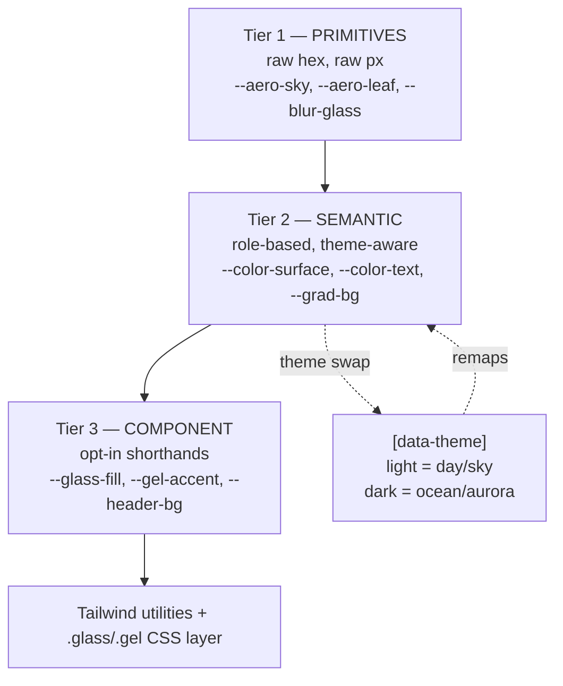

# Design Tokens

This note is the **single source of truth** for every design primitive in the portfolio. Colors, gradients, radii, shadows, blur, spacing, type, and motion timing all live here as **Tailwind v4 CSS-first tokens** (`@theme` in `src/index.css`). Every other design note — [[Color & Gradients]], [[Typography]], [[Glass, Gloss & Depth]], [[Motion & Animation]], [[Theming — Light & Dark]], [[Component Visual Library]] — references these names rather than hardcoding values.

> [!decision]
> Tokens are authored **CSS-first** per [[ADR-002 — Styling Approach]]. There is **no `tailwind.config.js`** (Tailwind v4). Static, theme-independent tokens live in `@theme` (so Tailwind generates utilities like `bg-aero-sky`, `rounded-glass`, `shadow-glass`). **Theme-variant** tokens (anything that differs between light/dark) live as **plain CSS custom properties** under `:root` / `[data-theme="dark"]` and are *referenced* by semantic `@theme` tokens — see [[Theming — Light & Dark]].

---

## 1. Token architecture — three tiers

We use a **primitive → semantic → component** layering so themes only have to remap the middle tier.



- **Primitives** never change between themes (a `--aero-sky` is always `#6FD7EC`).
- **Semantic** tokens (`--color-surface`, `--color-text`, `--grad-bg`) are what components consume; the theme swap only touches these.
- **Component** tokens are convenience aliases for the busiest surfaces (glass panel, gel button) so the CSS layer stays readable.

> [!tip]
> Rule of thumb: **components reference semantic tokens, never primitives.** If a component needs a primitive directly, that's a signal a semantic token is missing.

---

## 2. Color primitives (theme-independent)

Grounded in the Frutiger Aero palette from [[Frutiger Aero — References]] and [[Color & Gradients]].

| Token | Hex | Name / use |
|---|---|---|
| `--aero-sky` | `#6FD7EC` | sky / primary cyan |
| `--aero-scooter` | `#35BCDE` | mid scooter blue |
| `--aero-eastern` | `#1299CA` | eastern blue |
| `--aero-blue` | `#0689E4` | bright deep blue (primary action) |
| `--aero-deep` | `#0050A0` | deep ocean blue |
| `--aero-leaf` | `#71AB23` | grass / leaf green |
| `--aero-aurora` | `#4ADE80` | aurora green (dark accent) |
| `--aero-ice` | `#9CEFF2` | ice highlight |
| `--aero-cloud` | `#F4FBFF` | cloud white |
| `--aero-sun` | `#FBB905` | sun amber accent |
| `--aero-violet` | `#7C5CFF` | aurora violet (dark accent) |
| `--aero-teal` | `#13C2C2` | teal glow (dark) |
| `--aero-abyss` | `#02132E` | abyss navy (dark base) |
| `--aero-night` | `#003C78` | deep night blue (dark surface) |

> [!warning]
> Amber (`--aero-sun`) and lime (`--aero-leaf`/`--aero-aurora`) are **accents only** — small areas. Blue→cyan→green is the dominant spectrum in both themes. Never let amber become a primary surface.

---

## 3. Semantic color tokens (theme-aware)

These are the only colors components should name. Light = "day/sky", dark = "ocean/aurora" — full rationale in [[Theming — Light & Dark]].

| Semantic token | Light (day/sky) | Dark (ocean/aurora) | Role |
|---|---|---|---|
| `--color-bg` | `#EAF7FF` | `#02132E` | page base behind everything |
| `--color-surface` | `rgba(255,255,255,0.55)` | `rgba(8,30,60,0.45)` | default raised surface |
| `--color-glass-fill` | `rgba(255,255,255,0.18)` | `rgba(120,180,230,0.10)` | frosted glass fill |
| `--color-glass-border` | `rgba(255,255,255,0.55)` | `rgba(150,200,240,0.22)` | glass rim |
| `--color-text` | `#063A5E` | `#EAF7FF` | primary text |
| `--color-text-soft` | `#3C6E8F` | `#9CC4DE` | secondary text |
| `--color-accent` | `#0689E4` | `#13C2C2` | primary action / link |
| `--color-accent-2` | `#71AB23` | `#4ADE80` | secondary accent |
| `--color-ring` | `rgba(6,137,228,0.55)` | `rgba(19,194,194,0.6)` | focus ring |

> [!important]
> Text-over-glass must hit **≥4.5:1** (WCAG AA). The semantic `--color-text` values above are tuned for that on the *default* glass fill. Any custom translucent surface needs a re-check — see the contrast guidance in [[Accessibility & SEO]] and [[Glass, Gloss & Depth]].

---

## 4. Gradient tokens

Gradients are central to the aesthetic ([[Color & Gradients]]). Defined as reusable custom properties; consumed by `.aurora`, hero backgrounds, and gel buttons.

| Token | Value (light) | Use |
|---|---|---|
| `--grad-sky` | `linear-gradient(180deg,#9CEFF2 0%,#6FD7EC 45%,#0689E4 100%)` | hero day sky |
| `--grad-aurora` | `conic-gradient(from var(--ang,0deg),#6FD7EC,#71AB23,#0689E4,#6FD7EC)` | animated aurora |
| `--grad-gel` | `linear-gradient(180deg,#bfeaff 0%,#5cb8f5 48%,#1f8fe0 52%,#3aa6ee 100%)` | aqua/gel button |
| `--grad-sheen` | `linear-gradient(180deg,rgba(255,255,255,.85),rgba(255,255,255,0))` | top gloss sheen |
| `--grad-bg` | (light) `radial-gradient(120% 120% at 50% 0%,#EAF7FF,#CDEBFB 60%,#A9DCF6 100%)` / (dark) `radial-gradient(120% 120% at 50% 0%,#063256,#02132E 70%)` | page backdrop, theme-swapped |

> [!example]
> The aurora's `--ang` is an animated registered property (`@property --ang { syntax:"<angle>"; ... }`) so the conic gradient can *rotate its hue* cheaply — see [[Motion & Animation]] for the keyframes and the reduced-motion freeze.

---

## 5. Radius, blur, shadow/glass tokens

| Token | Value | Use |
|---|---|---|
| `--radius-pill` | `999px` | gel buttons, tag pills |
| `--radius-glass` | `16px` | glass panels, cards |
| `--radius-lg` | `24px` | hero glass, large tiles |
| `--radius-sm` | `10px` | inputs, small chips |
| `--blur-glass` | `14px` | standard frosted blur (cap ≤20px for GPU) |
| `--blur-strong` | `20px` | header / overlay max |
| `--blur-soft` | `8px` | subtle inner panels |
| `--shadow-glass` | `0 8px 32px rgba(2,40,80,.12), inset 0 1px 0 rgba(255,255,255,.45)` | glass elevation + top rim |
| `--shadow-gel` | `inset 0 1px 1px rgba(255,255,255,.9), inset 0 -6px 12px rgba(0,40,90,.45), 0 6px 16px rgba(20,110,200,.45)` | gel button depth |
| `--shadow-soft` | `0 4px 18px rgba(2,40,80,.10)` | low-elevation cards |
| `--shadow-glow` | `0 0 24px var(--color-accent)` | focus / hover glow |

> [!warning]
> `backdrop-filter` is GPU-heavy. Keep `--blur-glass` ≤ 20px, limit the number of simultaneous glass layers, and **never animate a blurred element's blur radius**. Provide a solid fallback via `@supports not (backdrop-filter: blur(1px))` — see [[Performance Budget]].

---

## 6. Spacing & type tokens

Spacing rides Tailwind's default 4px scale; we add a few semantic rhythm tokens. Type follows [[Typography]] — humanist, Myriad/Frutiger-evoking, **Source Sans 3** lead with **Hind**/**Open Sans** fallbacks.

| Token | Value | Use |
|---|---|---|
| `--font-sans` | `"Source Sans 3","Hind","Open Sans",system-ui,"Segoe UI",sans-serif` | all UI text |
| `--font-display` | `"Source Sans 3","Hind",system-ui,sans-serif` | headings (heavier weight) |
| `--text-hero` | `clamp(2.75rem,6vw,5rem)` | hero headline |
| `--space-section` | `clamp(4rem,10vw,8rem)` | vertical section rhythm |
| `--space-gutter` | `clamp(1rem,4vw,2.5rem)` | page gutter |

---

## 7. Motion tokens

Durations and easings consumed by [[Motion & Animation]] and the [[Component Visual Library]]. Spring-leaning, gentle, floaty.

| Token | Value | Use |
|---|---|---|
| `--ease-spring` | `cubic-bezier(.2,.9,.25,1.2)` | playful overshoot (buttons, reveals) |
| `--ease-glide` | `cubic-bezier(.16,1,.3,1)` | smooth deceleration (panels, page) |
| `--ease-soft` | `cubic-bezier(.4,0,.2,1)` | standard hover |
| `--dur-fast` | `140ms` | hover, focus |
| `--dur-base` | `280ms` | most transitions |
| `--dur-slow` | `520ms` | reveals, page transitions |
| `--dur-amb` | `18s` | ambient aurora / drift loops |

> [!important]
> Every motion token has meaning **only when motion is allowed**. The global `@media (prefers-reduced-motion: reduce)` rule (defined in [[Motion & Animation]]) neutralizes ambient loops and collapses transitions to opacity — the tokens stay, the motion stops.

---

## 8. The `@theme` block (drop-in for `src/index.css`)

> [!example] Single source of truth
> This replaces the current minimal `src/index.css`. Theme-variant values stay as plain custom properties under `:root`/`[data-theme]`; `@theme` consumes them so Tailwind still emits utilities. Order: import → primitives & variant vars → `@theme` → `@property` → CSS layer (in [[Component Visual Library]] / [[Glass, Gloss & Depth]]).

```css
@import "tailwindcss";

/* ---- registered animatable props (aurora hue) ---- */
@property --ang { syntax: "<angle>"; inherits: false; initial-value: 0deg; }

/* ---- Tier 1: primitives + Tier 2: semantic (LIGHT default) ---- */
:root {
  /* primitives */
  --aero-sky:#6FD7EC; --aero-scooter:#35BCDE; --aero-eastern:#1299CA;
  --aero-blue:#0689E4; --aero-deep:#0050A0; --aero-leaf:#71AB23;
  --aero-aurora:#4ADE80; --aero-ice:#9CEFF2; --aero-cloud:#F4FBFF;
  --aero-sun:#FBB905; --aero-violet:#7C5CFF; --aero-teal:#13C2C2;
  --aero-abyss:#02132E; --aero-night:#003C78;

  /* semantic — light "day/sky" */
  --color-bg:#EAF7FF;
  --color-surface:rgba(255,255,255,.55);
  --color-glass-fill:rgba(255,255,255,.18);
  --color-glass-border:rgba(255,255,255,.55);
  --color-text:#063A5E;
  --color-text-soft:#3C6E8F;
  --color-accent:#0689E4;
  --color-accent-2:#71AB23;
  --color-ring:rgba(6,137,228,.55);
  --grad-bg:radial-gradient(120% 120% at 50% 0%,#EAF7FF,#CDEBFB 60%,#A9DCF6 100%);
}

/* semantic — dark "ocean/aurora" (see [[Theming — Light & Dark]]) */
[data-theme="dark"] {
  --color-bg:#02132E;
  --color-surface:rgba(8,30,60,.45);
  --color-glass-fill:rgba(120,180,230,.10);
  --color-glass-border:rgba(150,200,240,.22);
  --color-text:#EAF7FF;
  --color-text-soft:#9CC4DE;
  --color-accent:#13C2C2;
  --color-accent-2:#4ADE80;
  --color-ring:rgba(19,194,194,.6);
  --grad-bg:radial-gradient(120% 120% at 50% 0%,#063256,#02132E 70%);
}

@theme {
  /* fonts */
  --font-sans:"Source Sans 3","Hind","Open Sans",system-ui,"Segoe UI",Roboto,sans-serif;
  --font-display:"Source Sans 3","Hind",system-ui,sans-serif;

  /* expose semantic colors as utilities (bg-surface, text-soft, ...) */
  --color-bg:var(--color-bg);
  --color-surface:var(--color-surface);
  --color-text:var(--color-text);
  --color-soft:var(--color-text-soft);
  --color-accent:var(--color-accent);
  --color-accent-2:var(--color-accent-2);

  /* primitives as utilities (bg-aero-sky, ...) */
  --color-aero-sky:#6FD7EC; --color-aero-blue:#0689E4;
  --color-aero-leaf:#71AB23; --color-aero-sun:#FBB905;
  --color-aero-teal:#13C2C2; --color-aero-aurora:#4ADE80;

  /* radius */
  --radius-sm:10px; --radius-glass:16px; --radius-lg:24px; --radius-pill:999px;

  /* blur (backdrop) */
  --blur-soft:8px; --blur-glass:14px; --blur-strong:20px;

  /* motion */
  --ease-spring:cubic-bezier(.2,.9,.25,1.2);
  --ease-glide:cubic-bezier(.16,1,.3,1);
  --ease-soft:cubic-bezier(.4,0,.2,1);
  --dur-fast:140ms; --dur-base:280ms; --dur-slow:520ms; --dur-amb:18s;
}

/* gradients & shadows kept as plain props (not utility-generating) */
:root {
  --grad-sky:linear-gradient(180deg,#9CEFF2 0%,#6FD7EC 45%,#0689E4 100%);
  --grad-aurora:conic-gradient(from var(--ang),#6FD7EC,#71AB23,#0689E4,#6FD7EC);
  --grad-gel:linear-gradient(180deg,#bfeaff 0%,#5cb8f5 48%,#1f8fe0 52%,#3aa6ee 100%);
  --grad-sheen:linear-gradient(180deg,rgba(255,255,255,.85),rgba(255,255,255,0));
  --shadow-glass:0 8px 32px rgba(2,40,80,.12), inset 0 1px 0 rgba(255,255,255,.45);
  --shadow-gel:inset 0 1px 1px rgba(255,255,255,.9), inset 0 -6px 12px rgba(0,40,90,.45), 0 6px 16px rgba(20,110,200,.45);
  --shadow-soft:0 4px 18px rgba(2,40,80,.10);
  --shadow-glow:0 0 24px var(--color-accent);
  --text-hero:clamp(2.75rem,6vw,5rem);
  --space-section:clamp(4rem,10vw,8rem);
  --space-gutter:clamp(1rem,4vw,2.5rem);
}
```

> [!note]
> The duplicated `--color-bg:var(--color-bg)` inside `@theme` is intentional: it tells Tailwind to *generate* the `bg-bg`/`text-text` utilities while keeping the runtime value sourced from the theme-swapped `:root` property. Confirm utility naming during implementation and adjust aliases (e.g. `--color-surface` → `bg-surface`) to taste.

---

## Open questions

- [ ] Do we want a separate `--color-glass-fill-strong` for the header vs cards, or is one fill + opacity-via-utility enough?
- [ ] Should `--space-*` rhythm tokens become Tailwind spacing utilities, or stay raw for `padding:` in the CSS layer only?
- [ ] Confirm whether Source Sans 3 ships all needed weights (400/600/700) self-hosted vs Google Fonts — decide in [[Typography]].

## See also

- [[Theming — Light & Dark]] — how these tokens swap per theme + anti-FOUC
- [[Color & Gradients]] · [[Typography]] · [[Glass, Gloss & Depth]]
- [[Component Visual Library]] — tokens applied to real components
- [[Motion & Animation]] — motion tokens in use
- [[ADR-002 — Styling Approach]] · [[ADR-009 — Theming Strategy]] · [[Performance Budget]]
