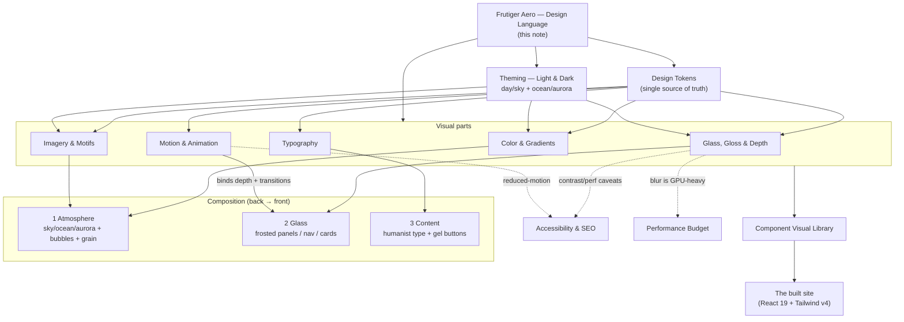

# Frutiger Aero — Design Language

> [!important] This is the master design-system note.
> Everything visual on this site descends from here. If a screen does not read as **Frutiger Aero** at a glance, it is wrong. This note defines the language; the sibling notes ([[Color & Gradients]], [[Typography]], [[Glass, Gloss & Depth]], [[Imagery & Motifs]], [[Motion & Animation]]) define the parts; [[Design Tokens]] and [[Component Visual Library]] make it buildable.

## Why this language, for this person

The site is **craft-as-statement**, not a job-hunting funnel (see [[Vision & Purpose]] and [[Developer Identity]]). The two co-equal north stars are: **express who Jeronimo IS** and **delight through Frutiger Aero spectacle**. Frutiger Aero is the right vessel because its core thesis — *"the future is bright, friendly, and humane"* — is itself a statement of values. A techno-optimist, water-and-light aesthetic says: *this developer believes software can be beautiful, warm, and human.* That is the message. #design #frutiger-aero

## Mood (the one-paragraph north star)

Clean futurism with a wet, sunlit shine. Glass you want to touch; gel buttons that look like candy; skies and water and aurora light behind frosted panels; bubbles drifting up; a humanist typeface that feels spoken, not engineered. Saturated but never garish. Optimistic, tactile, alive. The 2004–2013 Vista/Aqua/Wii dream, rebuilt with 2026 CSS — and re-legitimised by Apple's 2025 "Liquid Glass" and Windows 11 glass UI, so this reads as *current revival*, not pure nostalgia.

## The ingredient checklist

Every page should deploy a deliberate subset of these. Not all at once — **pick 2–4 per screen** so the composition breathes.

- [ ] **Glass / Aero** — translucent frosted panels, `backdrop-filter: blur() saturate()`, 1px translucent-white top rim, soft outer + inner-highlight shadow. → [[Glass, Gloss & Depth]]
- [ ] **Gloss / Skeuomorphism** — aqua/gel buttons, top-half sheen, beveled depth, candy controls. → [[Glass, Gloss & Depth]]
- [ ] **Water** — droplets, bubbles, ripples, caustics, condensation. → [[Imagery & Motifs]]
- [ ] **Nature** — green grass, blue skies, fluffy clouds, god-rays, leaves, koi, bokeh, lens flares, auroras. → [[Imagery & Motifs]]
- [ ] **Luminous saturated color** — sky blue, aqua/cyan, lime/grass green, glossy whites, deep ocean blues, sunny amber accents; gradients central. → [[Color & Gradients]]
- [ ] **Organic shape** — generous rounding, blobs, smooth pill/gel forms.
- [ ] **Humanist type** — warm, spoken sans (Source Sans 3 family), never geometric/grotesque. → [[Typography]]
- [ ] **Atmosphere** — animated multi-stop gradients/auroras, film grain, parallax bubbles, soft glows, smooth spring motion. → [[Motion & Animation]]

## Do / Don't

| Do | Don't |
| --- | --- |
| Translucent frosted glass with a bright scene visible **behind** it | Flat opaque cards with no depth; "glass" over a solid wall (blur has nothing to show) |
| Multi-stop blue→cyan→lime gradients & radial light blooms | Single flat brand color; muddy desaturated palettes |
| Glossy gel buttons with a top sheen and inset bevel | Ghost/outline buttons or hard flat material rectangles |
| Generous rounding (16–24px), organic blobs, pills | Sharp 0–4px corners, rigid grids with no curvature |
| Humanist sans (Source Sans 3 / Hind / Open Sans) | Geometric (Poppins, Montserrat) or grotesque (Helvetica-cold) faces |
| Water/sky/aurora motifs as *atmosphere* behind content | Literal clipart fish/grass slapped on as decoration; meme-tier Vista wallpaper |
| Bright optimism, sunbeams, lens flares used sparingly | Dark-edgy, brutalist, or corporate-minimal moods |
| Verify ≥4.5:1 contrast with a tint/scrim behind text on glass | Translucent low-contrast text floating on a busy gradient |
| Gate every aurora/blob/parallax on `prefers-reduced-motion` | Always-on heavy motion; animating blurred layers |

> [!warning] The failure mode is *kitsch*.
> Frutiger Aero done badly is a clipart koi on a grass field. Done well, it is **disciplined atmosphere**: real glass physics, restrained motifs, impeccable type, accessible contrast. We are aiming for the second. Restraint is what separates "craft statement" from "nostalgia meme".

## How the pieces combine into a system

The system is **layered front-to-back**, like looking through a window at a bright day:

1. **Atmosphere layer (back)** — the animated sky/ocean/aurora gradient + parallax bubbles/blobs + faint film grain. Lives at the page root, theme-aware. → [[Color & Gradients]], [[Imagery & Motifs]]
2. **Glass layer (middle)** — frosted panels, nav bars, cards, modals that sit *over* the atmosphere so the blur has something luminous to refract. → [[Glass, Gloss & Depth]]
3. **Content layer (front)** — humanist type, gel buttons, controls, with guaranteed contrast (tint/scrim behind text). → [[Typography]], [[Component Visual Library]]
4. **Motion** binds the layers: parallax depth between atmosphere and glass, spring micro-interactions on the content, View-Transitions between routes. → [[Motion & Animation]]
5. **Tokens** are the single source of truth so light "day/sky" and dark "ocean/aurora" themes are one system, not two designs. → [[Design Tokens]], [[Theming — Light & Dark]]

## Bridging to the real stack

Implementation is **Tailwind v4 CSS-first** (`@import "tailwindcss"; @theme { … }` — no `tailwind.config.js`) plus a hand-rolled CSS layer of Aero utilities/components (`.glass`, `.aqua`/`.gel-button`, `.aurora`, blob/bubble backgrounds). See [[Tech Stack]] and [[Design Tokens]] for where these live. The existing `--font-sans: system-ui, "Segoe UI", …` is a deliberate Aero-era anchor (Segoe UI was the Vista/7 system face) and stays as the fallback tail under our self-hosted humanist primary — see [[Typography]].

> [!decision] Frutiger Aero is the accepted, non-negotiable design language for v1.
> Alternatives (neo-brutalist, corporate-minimal, generic glassmorphism without the nature/water thesis) are rejected as they do not express the techno-optimist identity that is the whole point. #decision

## Open questions

- [ ] Single signature "hero scene" (one big WebGL/canvas water-caustic moment on Home) vs. lightweight CSS atmosphere everywhere? Lean CSS-everywhere + **one** canvas hero, gated on perf. → [[Page — Home]], [[Performance Budget]]
- [ ] How playful do gel buttons go before they read as dated rather than charming? Prototype 2–3 sheen intensities in [[Component Visual Library]].

## See also

- [[Color & Gradients]] · [[Typography]] · [[Glass, Gloss & Depth]] · [[Imagery & Motifs]] · [[Motion & Animation]]
- [[Theming — Light & Dark]] · [[Design Tokens]] · [[Component Visual Library]]
- [[Vision & Purpose]] · [[Developer Identity]] · [[Principles & Constraints]]
- [[Accessibility & SEO]] · [[Performance Budget]]
