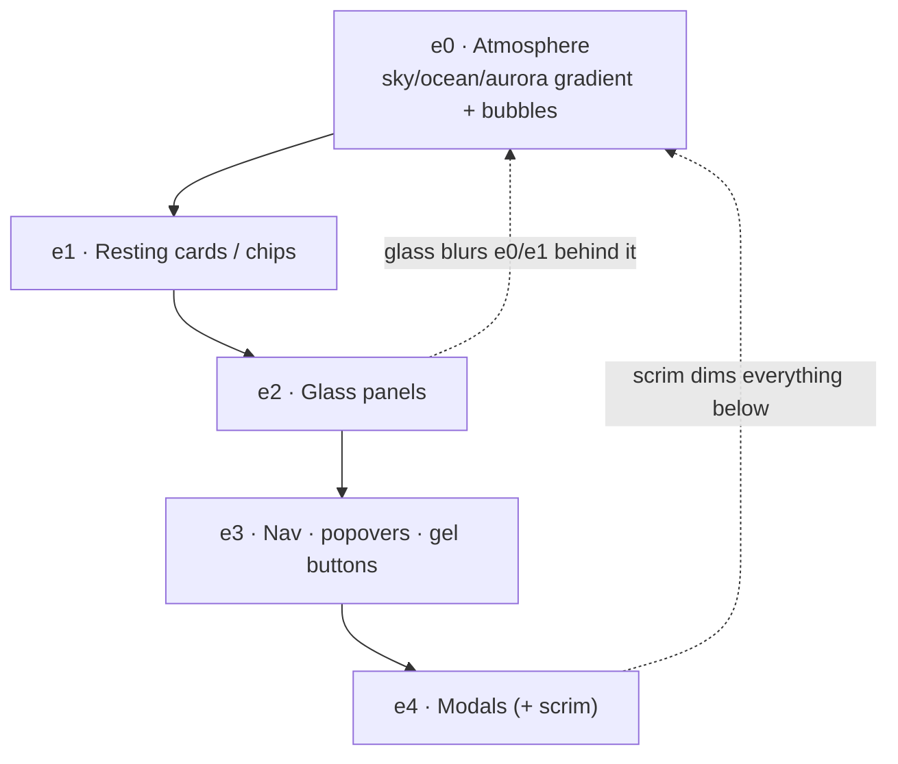

# Glass, Gloss & Depth

> [!important] These are the signature surfaces.
> **Glass** (frosted translucent panels) is the structural material of the UI; **gloss** (aqua/gel buttons) is the candy you click; **depth** (the elevation scale) makes the layers read as physical. Copy-pasteable recipes below. They become utilities/components in the hand-rolled CSS layer (see [[Tech Stack]]) and tokens in [[Design Tokens]].

## 1. Glass (glassmorphism)

> [!warning] Blur needs something behind it.
> `backdrop-filter` only shows if the panel is **semi-transparent** AND sits over a luminous scene (the atmosphere layer from [[Color & Gradients]] / [[Imagery & Motifs]]). Glass over a solid wall looks like nothing. Always ship the `-webkit-` prefix and an `@supports` fallback.

```css
.glass {
  background: rgba(255, 255, 255, 0.12);
  -webkit-backdrop-filter: blur(14px) saturate(160%);
  backdrop-filter: blur(14px) saturate(160%);
  border: 1px solid rgba(255, 255, 255, 0.25);   /* translucent white rim */
  border-radius: 16px;
  box-shadow:
    0 8px 32px rgba(0, 0, 0, 0.10),              /* soft outer drop */
    inset 0 1px 0 rgba(255, 255, 255, 0.40);     /* top highlight rim */
}

/* Fallback: no backdrop-filter support → solid-ish tint, still legible */
@supports not ((backdrop-filter: blur(1px)) or (-webkit-backdrop-filter: blur(1px))) {
  .glass { background: rgba(244, 251, 255, 0.92); }
}
```

**Dark-theme glass** uses a dark tint instead of white so it reads as deep frosted ocean glass:

```css
.dark .glass {
  background: rgba(2, 19, 46, 0.35);
  border-color: rgba(111, 215, 236, 0.22);       /* cyan rim-light */
  box-shadow:
    0 8px 32px rgba(0, 0, 0, 0.45),
    inset 0 1px 0 rgba(255, 255, 255, 0.10);
}
```

**Tailwind v4 equivalent** (utility composition): `bg-white/10 border border-white/25 rounded-2xl backdrop-blur-[14px] backdrop-saturate-150`. Register reusable values in `@theme`:

```css
@theme {
  --backdrop-blur-glass: 14px;
  --radius-glass: 16px;
}
```

> [!tip] Keep blur ≤ 20px and limit the number of stacked glass layers.
> Higher blur and many overlapping translucent layers are the main GPU cost. **Never animate a blurred element's `backdrop-filter`** — it re-rasterises every frame. → [[Performance Budget]]

### Glass variants we'll actually need

- `.glass` — default cards/panels (blur 14px).
- `.glass-nav` — sticky top nav, slightly heavier blur (16–18px) + stronger bottom shadow on scroll.
- `.glass-modal` — dialogs, add a dark scrim behind for focus + contrast.
- `.glass-chip` — small tags/pills, blur 8px, more opaque fill for legibility at small size.

## 2. Gloss (aqua / gel buttons)

The Aero candy button: multi-stop vertical gradient + inset top highlight + inset bottom shadow + a pseudo-element sheen over the **top ~50%**.

```css
.aqua, .gel-button {
  position: relative;
  display: inline-flex;
  align-items: center;
  gap: 0.5rem;
  padding: 0.7rem 1.4rem;
  border: 0;
  border-radius: 999px;
  font-weight: 600;
  color: #fff;
  text-shadow: 0 1px 1px rgba(0, 30, 70, 0.6);
  background: linear-gradient(180deg,
    #bfeaff 0%,
    #5cb8f5 48%,
    #1f8fe0 52%,   /* hard mid step = the "gel" waist */
    #3aa6ee 100%);
  box-shadow:
    inset 0 1px 1px rgba(255, 255, 255, 0.90),    /* crisp top bevel */
    inset 0 -6px 12px rgba(0, 40, 90, 0.45),      /* bottom inner shade */
    0 6px 16px rgba(20, 110, 200, 0.45);          /* outer glow/lift */
  cursor: pointer;
  transition: transform 120ms ease, box-shadow 120ms ease;
}

.aqua::before {           /* glossy top sheen — the signature */
  content: "";
  position: absolute;
  inset: 2px 2px 50% 2px;                          /* top half only */
  border-radius: 999px;
  background: linear-gradient(180deg,
    rgba(255, 255, 255, 0.85), rgba(255, 255, 255, 0));
  pointer-events: none;
}

.aqua:hover  { transform: translateY(-1px); }
.aqua:active { transform: translateY(1px);
  box-shadow:
    inset 0 2px 6px rgba(0, 40, 90, 0.55),
    0 2px 6px rgba(20, 110, 200, 0.35); }          /* press in */

.aqua:focus-visible {
  outline: 3px solid #FBB905;                       /* amber focus, high vis */
  outline-offset: 2px;
}
```

**Color variants** swap only the gradient stops + glow color: `--action` blue (default), `--leaf` green (success/CTA secondary), `--sun` amber (rare emphasis). Keep them in [[Design Tokens]]; render previews in [[Component Visual Library]].

> [!tip] Restraint keeps gloss charming, not dated.
> Use **one** primary gel button per view. Secondary actions can be quieter glass chips. Over-glossing every control reads as 2008 kitsch — the discipline is what makes it craft (see Do/Don't in [[Frutiger Aero — Design Language]]).

## 3. Depth / elevation scale

A 5-step scale so layering reads consistently. Outer shadow grows + softens with elevation; glass also gains an inner top-highlight at higher levels. Keep raw shadow values as tokens.

| Level | Use | Light shadow |
| --- | --- | --- |
| `e0` | page atmosphere (back) | none |
| `e1` | resting cards, chips | `0 2px 8px rgba(0,0,0,0.06)` |
| `e2` | default glass panels | `0 8px 32px rgba(0,0,0,0.10), inset 0 1px 0 rgba(255,255,255,0.4)` |
| `e3` | sticky nav, popovers, gel buttons | `0 12px 40px rgba(0,0,0,0.14)` |
| `e4` | modals/dialogs (front) | `0 24px 64px rgba(0,0,0,0.22)` + scrim |

```css
@theme {
  --shadow-e1: 0 2px 8px rgba(0,0,0,0.06);
  --shadow-e2: 0 8px 32px rgba(0,0,0,0.10);
  --shadow-e3: 0 12px 40px rgba(0,0,0,0.14);
  --shadow-e4: 0 24px 64px rgba(0,0,0,0.22);
  --highlight-rim: inset 0 1px 0 rgba(255,255,255,0.40);
}
```

Dark theme deepens outer shadows (`0.45+` alpha) and softens the inner rim to `~0.10`. Elevation maps directly to the front-to-back composition layers in [[Frutiger Aero — Design Language]].



## 4. Caveats — contrast & performance (read before shipping)

> [!warning] Translucent text fails WCAG.
> Never set body text directly on `.glass`. Add a **semi-opaque tint behind the text**, a subtle dark scrim, or a `text-shadow`, and verify **≥4.5:1** (large text ≥3:1). The cyan/lime atmosphere is bright — dark navy `--ink` text needs a light enough tint behind it. Full method + measured pairings live in [[Accessibility & SEO]] (with palette in [[Color & Gradients]]).

> [!warning] `backdrop-filter` is GPU-heavy.
> - Cap blur ≤ 20px; limit count of glass layers per screen.
> - Promote with `will-change: transform` **sparingly** (it costs memory); remove it when idle.
> - Never animate blur or stack many large blurred layers on mobile.
> - Provide the `@supports not (...)` solid fallback above.
> Budget targets and measurement in [[Performance Budget]].

## Next actions

- [ ] Implement `.glass`, `.aqua`/`.gel-button`, depth tokens in the hand-rolled CSS layer; expose in [[Component Visual Library]].
- [ ] Build the `@supports` fallback + dark-theme variants alongside, not after.
- [ ] Profile a busy page (multiple glass panels + animated aurora) on a mid-range phone against [[Performance Budget]].
- [ ] Contrast-audit every glass/text combo → record in [[Accessibility & SEO]].

## See also

- [[Frutiger Aero — Design Language]] · [[Color & Gradients]] · [[Imagery & Motifs]]
- [[Design Tokens]] · [[Component Visual Library]] · [[Theming — Light & Dark]]
- [[Accessibility & SEO]] · [[Performance Budget]]
