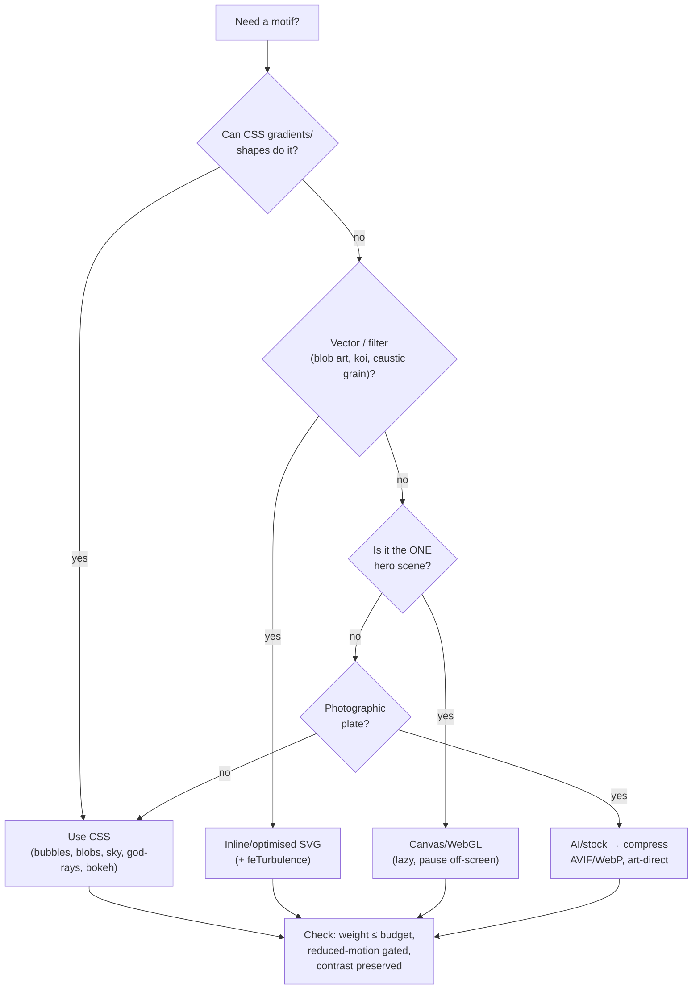

# Imagery & Motifs

> [!important] Motifs are *atmosphere*, not stickers.
> The nature/water kit — bubbles, blobs, caustics, skies, god-rays, auroras, bokeh, lens flares, koi, leaves — lives mostly **behind** the glass layer as ambient scenery (see the front-to-back composition in [[Frutiger Aero — Design Language]]). Used as literal clipart they read as kitsch; used as diffuse light and motion they read as craft. → [[Glass, Gloss & Depth]] for what sits on top, [[Color & Gradients]] for the hues.

## The motif kit

| Motif | What it is | Best technique | Cost | Where it appears |
| --- | --- | --- | --- | --- |
| **Bubbles** | small rising translucent spheres | CSS radial-gradient circles + `translateY` | very low | hero, footer, ambient on most pages |
| **Blobs** | soft organic shapes, slow morph | CSS `border-radius` morph **or** SVG path | low | section backdrops, behind cards |
| **Aurora** | drifting color light bands | conic/radial gradient + `blur(70px)` | low-med | dark-theme background, hero |
| **Sky + clouds** | luminous gradient + soft cloud forms | gradient + blurred white blobs / SVG | low | light-theme page base |
| **God-rays / sunbeams** | angled light shafts | layered linear gradients, `screen` blend | low | hero top, light theme |
| **Bokeh** | soft out-of-focus light dots | blurred radial circles, varied opacity | low | depth behind glass, blog header |
| **Lens flare** | bright streak + rings | stacked radial gradients (`screen`) or PNG sprite | low-med | one accent moment, **sparingly** |
| **Water caustics / ripple** | rippling refracted light | SVG `feTurbulence`+`feDisplacementMap`, or canvas/WebGL | **high** | one signature hero scene only |
| **Water droplets / condensation** | beads on glass | SVG/PNG droplet sprites + inner highlights | low | accent on glass edges |
| **Koi / fish / leaves** | literal nature objects | SVG illustration, subtle + few | low | tasteful accents only — easy to overdo |

## Source / generate — decision

| Method | Use it for | Notes |
| --- | --- | --- |
| **CSS** | bubbles, blobs, sky gradients, god-rays, bokeh, shimmer | first choice — tiny, themeable, animatable, no asset weight |
| **SVG** | blobs, koi/leaf illustration, droplets, `feTurbulence` grain & caustics | crisp, scalable, inline-able, filter-capable; export optimised |
| **Canvas / WebGL** | the **one** hero water-caustic scene | only where CSS/SVG can't; lazy-load, pause off-screen, gate on perf |
| **AI image gen** | bespoke hero photographs / cloud plates if needed | upscale, then **compress hard** to AVIF/WebP; risk: generic "AI Aero" look — art-direct it |
| **Stock** | period-correct sky/water photography | mid-2000s Aero stock vibe; license-check; same compression discipline |

> [!decision] CSS/SVG first; **exactly one** canvas/WebGL hero moment; AI/stock only for true photographic plates.
> This keeps the page weight inside the [[Performance Budget]] and keeps everything theme-aware and animatable. A WebGL water scene everywhere would blow the JS + GPU budget; a single art-directed hero is the spectacle, the rest is cheap ambient CSS. #decision #frutiger-aero



## Copy-pasteable recipes

### Rising bubbles (pure CSS)

```css
.bubble {
  position: absolute;
  border-radius: 50%;
  background: radial-gradient(circle at 35% 30%, #fff, rgba(255,255,255,0) 45%);
  opacity: 0.5;
  animation: rise 14s linear infinite;
}
@keyframes rise {
  from { transform: translateY(20vh) scale(0.6); opacity: 0; }
  20%  { opacity: 0.6; }
  to   { transform: translateY(-110vh) scale(1); opacity: 0; }
}
@media (prefers-reduced-motion: reduce) { .bubble { animation: none; opacity: 0.25; } }
```

### Organic blob (animated border-radius morph)

```css
.blob {
  border-radius: 42% 58% 63% 37% / 41% 44% 56% 59%;
  background: radial-gradient(circle at 30% 30%, #9CEFF2, #1299CA);
  filter: blur(2px);
  animation: morph 12s ease-in-out infinite alternate;
}
@keyframes morph { to { border-radius: 58% 42% 37% 63% / 56% 59% 41% 44%; } }
```

### Film grain / noise (SVG `feTurbulence`, low opacity)

```css
.grain::after {
  content: ""; position: absolute; inset: 0;
  opacity: 0.06; pointer-events: none; mix-blend-mode: overlay;
  background-image: url("data:image/svg+xml,%3Csvg xmlns='http://www.w3.org/2000/svg'%3E%3Cfilter id='n'%3E%3CfeTurbulence type='fractalNoise' baseFrequency='0.9' numOctaves='2'/%3E%3C/filter%3E%3Crect width='100%25' height='100%25' filter='url(%23n)'/%3E%3C/svg%3E");
}
```
Tune `baseFrequency` (grain size) and `numOctaves` (detail). The same `feTurbulence` + `feDisplacementMap` pattern drives water-caustic/ripple distortion in the hero (Codrops technique).

### God-rays (layered gradients, screen blend)

```css
.god-rays {
  background:
    linear-gradient(110deg, rgba(255,255,255,0.5) 0 2%, transparent 4%),
    linear-gradient(120deg, rgba(255,255,255,0.35) 0 1.5%, transparent 3%),
    linear-gradient(100deg, rgba(251,185,5,0.25) 0 2%, transparent 5%);
  mix-blend-mode: screen;
}
```

(Aurora, shimmer, radial light blooms live in [[Color & Gradients]]. Glass/gloss surfaces live in [[Glass, Gloss & Depth]].)

## Where each motif appears (placement map)

- **Home hero** ([[Page — Home]]): the signature scene — sky/ocean gradient + god-rays + bubbles + **the one** canvas caustic; lens flare as a single accent. Most spectacle is concentrated here.
- **Section backdrops**: slow blobs + bokeh behind glass cards, very low contrast so text stays readable.
- **Nav / footer**: a few ambient bubbles; keep subtle.
- **Blog reading view** ([[Page — Blog]]): calm — soft sky gradient + faint grain only, **no** moving motifs competing with text.
- **Dark theme**: swap sky/god-rays for aurora bands + teal/violet bokeh + cyan rim-light droplets.

## Keeping weight & perf sane

> [!warning] Motifs are the easiest way to blow the perf budget.
> - Prefer **`transform`/opacity** animations (compositor-only); never animate layout props or blurred elements (see [[Glass, Gloss & Depth]]).
> - Large blurred blobs: `position: fixed`, few in number, so they don't repaint on scroll.
> - Inline SVG noise as data-URI (no extra request); keep `opacity ≤ 0.08`, `pointer-events: none`.
> - Lazy-load + pause the WebGL hero when off-screen (IntersectionObserver) and on low-power/data-saver.
> - Compress photographic plates to **AVIF/WebP**, responsive `srcset`, explicit `width`/`height` to avoid CLS.
> Targets in [[Performance Budget]]; motion gating in [[Motion & Animation]].

> [!important] Accessibility of decorative imagery.
> Decorative motifs are **`aria-hidden` / empty alt** — they carry no information and must not be announced. **All** motion (bubbles, blobs, auroras, caustics, parallax) collapses to static under `prefers-reduced-motion: reduce`. Never let a motif drop text/control contrast below threshold. → [[Accessibility & SEO]].

## Next actions

- [ ] Build the CSS motif primitives (`.bubble`, `.blob`, `.grain`, `.god-rays`) and preview in [[Component Visual Library]].
- [ ] Prototype the single hero canvas caustic; measure against [[Performance Budget]]; ship CSS fallback for reduced-motion/low-power.
- [ ] Source/compress any photographic sky/water plates (AVIF/WebP) if CSS proves insufficient.
- [ ] Curate dark-theme aurora/bokeh variants alongside light-theme sky/god-rays.

## See also

- [[Frutiger Aero — Design Language]] · [[Color & Gradients]] · [[Glass, Gloss & Depth]] · [[Motion & Animation]]
- [[Component Visual Library]] · [[Performance Budget]] · [[Accessibility & SEO]]
