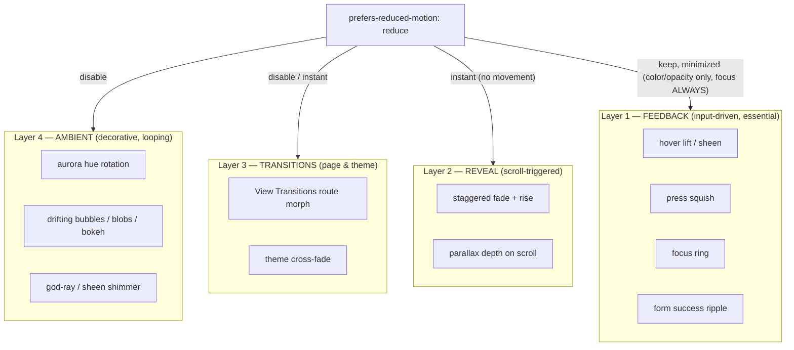

# Motion & Animation

Motion in this portfolio is **calm, buoyant, and liquid** — never a carnival. Frutiger Aero's feeling is *techno-optimism*: things float, glass shimmers, water ripples, controls have a soft gel "give." The goal is **delight that breathes**, with motion that always degrades gracefully and respects the user. Timing/easing values are tokens in [[Design Tokens]]; this note owns the *principles, placement, library direction, and the reduced-motion contract*.

> [!decision]
> Library direction per [[ADR-006 — Animation Library]]: **Motion** (the `motion` package, framer-motion's successor) for React component motion (`AnimatePresence`, layout, gestures, ships `useReducedMotion()`) + **plain CSS/`@keyframes`** for ambient glass/gloss/aurora loops + the **native View Transitions API** (`document.startViewTransition`) for route/theme changes where supported, with Motion as the fallback. **GSAP is reserved** only if a scroll-driven hero timeline demands it.

---

## 1. Motion principles (the Aero "feel")

- **Gentle spring, not bounce.** Controls and reveals overshoot *slightly* (`--ease-spring`) then settle. Soft gel give, not cartoon springiness.
- **Floaty parallax & drift.** Background bubbles, blobs, and bokeh drift slowly and continuously on `--dur-amb` (~18s) loops. Foreground reacts subtly to scroll/pointer. Everything feels suspended in light/water.
- **Glossy shimmer.** Sheen sweeps across glass/gel surfaces on hover and during loading — a moving highlight, cheaply done by animating `background-position` on an oversized gradient, never by animating blur.
- **Water ripple.** Discrete, meaningful moments (form submit success, a CTA tap) emit a single expanding ripple/caustic. Used *sparingly* as punctuation.
- **Liquid continuity.** Page and theme changes cross-fade/morph rather than cut — View Transitions where possible.

> [!tip]
> Animate only **cheap, compositor-friendly props**: `transform` (translate/scale/rotate), `opacity`, and animatable custom properties (e.g. `--ang` for aurora hue, `background-position` for sheen). **Never animate** `backdrop-filter` blur, `width/height`, `top/left`, or box-shadow spread in loops — they paint-thrash. See [[Performance Budget]].

---

## 2. Where motion appears

| Surface | Motion | Token(s) | Library |
|---|---|---|---|
| **Hero** | ambient aurora hue rotation, drifting bubbles/blobs, optional pointer parallax, headline rise-in | `--dur-amb`, `--ease-glide`, `--ang` | CSS keyframes (+ optional GSAP for scroll hero) |
| **Hover** (buttons, cards, links) | gel lift/squish, sheen sweep, accent glow, chevron nudge | `--dur-fast`, `--ease-spring` | CSS + Motion gestures |
| **Scroll reveal** | staggered fade + rise of sections, cards, blog items | `--dur-slow`, `--ease-glide` | Motion (`whileInView`) or CSS `animation-timeline: view()` |
| **Page transitions** | cross-fade / shared-element morph between routes | `--dur-base`, `--ease-glide` | View Transitions API → Motion `AnimatePresence` fallback |
| **Theme swap** | whole-page cross-fade between day/sky ↔ ocean/aurora | `--dur-base` | View Transitions (see [[Theming — Light & Dark]]) |
| **Form** | label float, focus glow, success ripple | `--dur-fast`/`--dur-slow` | CSS + Motion |
| **Ambient (footer/bg)** | slow bubble drift, soft god-ray shimmer | `--dur-amb` | CSS keyframes |

Component-by-component specifics live in [[Component Visual Library]]; glass/gloss sheen recipes live in [[Glass, Gloss & Depth]].

---

## 3. Motion layers

We think of motion as **four stacked layers**, ordered by how essential they are. Reduced-motion peels them off top-down until only essential, instant feedback remains.



> [!important]
> **Layer 1 feedback never fully disappears** — focus rings and basic state changes must remain even under reduced motion (they are accessibility, not decoration). Reduced motion removes *movement*, not *feedback*.

---

## 4. The reduced-motion contract (the pattern)

This is non-negotiable per [[Accessibility & SEO]] and [[Principles & Constraints]]. We implement it **three ways in concert**:

**(a) Global CSS kill-switch** — neutralizes ambient loops and collapses transitions site-wide:

```css
@media (prefers-reduced-motion: reduce) {
  *, *::before, *::after {
    animation-duration: 0.001ms !important;
    animation-iteration-count: 1 !important;   /* stop infinite loops */
    transition-duration: 0.001ms !important;
    scroll-behavior: auto !important;
  }
  /* freeze the aurora on a static, still-beautiful gradient */
  .aurora { animation: none !important; }
}
```

**(b) React hook gate** — for Motion-driven animations, branch on the user's preference so reveals become *instant* (opacity only), not removed:

```tsx
import { useReducedMotion, motion } from "motion/react";

function Reveal({ children }: { children: React.ReactNode }) {
  const reduce = useReducedMotion();
  return (
    <motion.div
      initial={reduce ? { opacity: 0 } : { opacity: 0, y: 24 }}
      whileInView={{ opacity: 1, y: 0 }}
      viewport={{ once: true, margin: "-10%" }}
      transition={
        reduce
          ? { duration: 0.001 }
          : { duration: 0.52, ease: [0.16, 1, 0.3, 1] } // --dur-slow / --ease-glide
      }
    >
      {children}
    </motion.div>
  );
}
```

**(c) Capability gate for View Transitions / theme swap** — only animate when both supported *and* allowed:

```ts
const reduce = matchMedia("(prefers-reduced-motion: reduce)").matches;
if ("startViewTransition" in document && !reduce) {
  (document as any).startViewTransition(apply);
} else {
  apply(); // instant
}
```

> [!warning]
> The global CSS rule alone is a blunt safety net — it kills *durations* but Motion's JS-driven values can still tween. Always pair **(a)** with the **(b)** `useReducedMotion()` branch for any `motion.*` component, and **(c)** for transitions. Belt and suspenders.

> [!tip]
> Provide a **static-but-gorgeous fallback**, not a dead page. Under reduced motion the aurora freezes on a chosen frame, bubbles render in place, and the hero is fully composed — the *spectacle is preserved as a still image*, only the movement stops. This keeps the Frutiger Aero delight intact for motion-sensitive users.

---

## 5. Performance guardrails

- Cap concurrent animated layers; ambient loops use `transform`/custom-props only ([[Performance Budget]]).
- Use `will-change: transform` *sparingly* on the few persistently-animating elements (aurora, bubbles) and remove it when idle.
- Lazy-mount heavy hero/scroll animation code behind route-level `lazy()` so it never bloats the initial JS budget (~<150 KB gzip).
- Prefer CSS `animation-timeline: view()/scroll()` for scroll reveals where browser support allows — **zero JS**, and it auto-respects the reduced-motion media query.
- Never run ambient loops on offscreen/`hidden` elements; pause when `document.hidden`.

## 6. Build checklist

- [ ] Land the global reduced-motion CSS kill-switch in `src/index.css`.
- [ ] Create a shared `<Reveal>` (Motion + `useReducedMotion`) and use it for all scroll reveals.
- [ ] Implement the aurora keyframes on `--ang` + a frozen reduced-motion fallback.
- [ ] Wrap route + theme changes in the View-Transitions capability gate.
- [ ] Add gel hover/press gestures (CSS-first; Motion for spring where needed).
- [ ] Verify focus rings survive reduced motion; QA the static fallback visually.

## Open questions

- [ ] Do we add a scroll-driven hero (justifies GSAP), or keep the hero ambient-only (CSS)? — defer to [[Page — Home]].
- [ ] Shared-element morph for project thumbnail → project page on cross-document nav (Safari/Chrome only) — worth the complexity for v1?

## See also

- [[ADR-006 — Animation Library]] — the decision + alternatives
- [[Design Tokens]] — duration/easing tokens used here
- [[Component Visual Library]] — per-component motion specs
- [[Glass, Gloss & Depth]] · [[Color & Gradients]] — sheen & aurora recipes
- [[Theming — Light & Dark]] · [[Accessibility & SEO]] · [[Performance Budget]]
