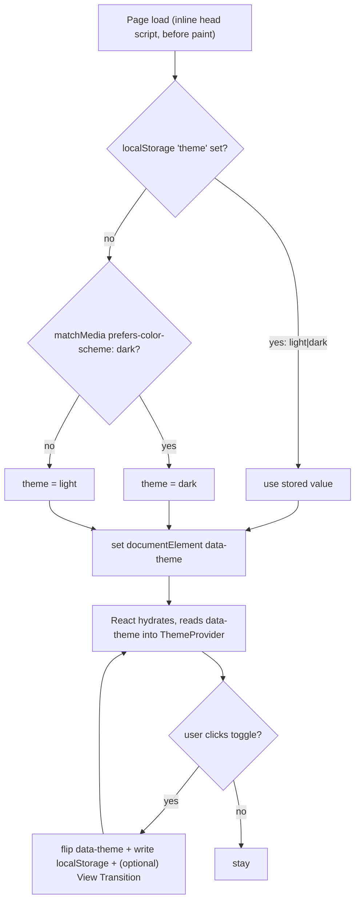

# Theming — Light & Dark

Frutiger Aero is intrinsically **bright and glossy**, so the light theme is the *hero* expression, not an afterthought. But the era's deep-ocean / aurora imagery gives us a fully authentic dark mode too. We ship **two first-class themes**, both unmistakably Aero:

- **Light — "day/sky":** luminous cyan→sky gradients, grass-green accents, glossy white glass, sunbeams. Optimistic daytime.
- **Dark — "ocean/aurora":** deep abyss navy, teal/aurora-green glows, violet rim-light, bioluminescent gloss. Night dive under an aurora.

> [!decision]
> Strategy per [[ADR-009 — Theming Strategy]]: **CSS custom properties + a `data-theme` attribute on `<html>`**, defaulting from `prefers-color-scheme`, overridable by a persisted user toggle, with an **inline head script to prevent the flash** (FOUC). Token values are owned by [[Design Tokens]]; this note owns the *strategy, mapping intent, UX, and the anti-FOUC script*.

---

## 1. Theme decision flow



The **inline script is the source of truth at first paint**; React's `ThemeProvider` reads the already-applied attribute on mount so there is never a mismatch. We do **not** keep theme in React state as the *initial* authority — that would re-flash.

---

## 2. Token mapping per theme

We **never restyle components per theme.** Components consume *semantic* tokens; the theme only remaps those. This is the whole point of the tiered system in [[Design Tokens]].

| Intent | Light "day/sky" | Dark "ocean/aurora" |
|---|---|---|
| Page base (`--color-bg`) | `#EAF7FF` cloud-sky | `#02132E` abyss |
| Backdrop (`--grad-bg`) | radial cloud→sky bloom | radial deep-blue→abyss |
| Glass fill (`--color-glass-fill`) | `rgba(255,255,255,.18)` frosty white | `rgba(120,180,230,.10)` cool tint |
| Glass rim (`--color-glass-border`) | bright white `.55` | cool blue `.22` |
| Primary text (`--color-text`) | `#063A5E` deep teal-navy | `#EAF7FF` cloud |
| Soft text (`--color-text-soft`) | `#3C6E8F` | `#9CC4DE` |
| Primary accent (`--color-accent`) | `#0689E4` bright blue | `#13C2C2` teal glow |
| Secondary accent (`--color-accent-2`) | `#71AB23` grass | `#4ADE80` aurora green |
| Focus ring (`--color-ring`) | blue `.55` | teal `.6` |
| Aurora hero | sky-blue→lime→cyan | teal→aurora-green→violet |
| Gloss/sheen | bright specular white | dimmer, cooler specular |

> [!important]
> **Contrast is theme-specific and must be re-verified per theme.** Light text on light glass is the classic Aero failure. The mapped `--color-text` values target **≥4.5:1** against the *default* glass fill in each theme. Custom translucent surfaces (hero overlays, colored cards) need their own check + a scrim or `text-shadow` — see [[Accessibility & SEO]] and the contrast rules in [[Glass, Gloss & Depth]].

> [!tip]
> In dark mode, **dial glass opacity DOWN and glow UP**: reduce `--color-glass-fill` alpha (less milky), and lean on `--shadow-glow` / aurora bleed for depth. Pure-white specular highlights look harsh on abyss navy — cool them toward `#9CEFF2`/`#6FD7EC`.

---

## 3. Toggle UX

The control itself is specced as a component in [[Component Visual Library]] (the glossy **theme toggle**). Behavior contract:

- **Placement:** in the glass nav header, next to the [[i18n Architecture|language switcher]].
- **Affordance:** a gel pill with a **sun** (day/sky) and **moon/aurora** (ocean) icon; the active state slides a glossy knob — skeuomorphic, candy-like, on-brand.
- **Three logical states, two stored values:** `light`, `dark`, and *unset* (= follow system). First explicit click writes a concrete value; an optional long-press / settings entry can clear back to "system."
- **Transition:** wrap the flip in `document.startViewTransition()` where supported for a soft cross-fade; otherwise a CSS `transition` on `--grad-bg`/colors. **Gate the animated version behind `prefers-reduced-motion`** — see [[Motion & Animation]].
- **Announce:** the button is a real `<button>` with `aria-pressed` reflecting dark state and an `aria-label` that updates ("Switch to dark theme" / "Switch to light theme").

> [!example]
> Minimal React toggle (reads the attribute the inline script already set):
> ```tsx
> function setTheme(next: "light" | "dark") {
>   const run = () => {
>     document.documentElement.setAttribute("data-theme", next);
>     localStorage.setItem("theme", next);
>   };
>   if (
>     "startViewTransition" in document &&
>     !window.matchMedia("(prefers-reduced-motion: reduce)").matches
>   ) {
>     (document as any).startViewTransition(run);
>   } else {
>     run();
>   }
> }
> ```

---

## 4. Default from `prefers-color-scheme`

- **No stored preference → follow the OS.** Read `window.matchMedia("(prefers-color-scheme: dark)")`.
- **Live OS changes:** add a `change` listener so that if the user is on "system" (no stored value) and flips their OS theme, the site follows. Once they've toggled explicitly, the stored value wins and we ignore OS changes.
- The `<meta name="theme-color">` should be **swapped per theme** too (cloud `#EAF7FF` / abyss `#02132E`) so mobile browser chrome matches.

---

## 5. Persistence

- **Storage:** `localStorage["theme"]` = `"light" | "dark"` (absence = system). Synchronous, available to the inline script, no cookie needed because theming is purely client-side (SSG output is theme-agnostic — see [[Performance Budget]]).
- **SSG caveat:** prerendered HTML from `vite-react-ssg` has **no theme baked in**; the inline script applies it before paint. This is correct and intended — the static HTML stays cacheable and theme-neutral.

---

## 6. Anti-FOUC inline script

> [!important]
> This MUST be **inline in `index.html`, in `<head>`, before any CSS/JS, render-blocking on purpose.** It is tiny (~250 bytes) so the block is negligible. It sets `data-theme` on `<html>` *before first paint*, so the page never flashes the wrong theme.

```html
<!-- index.html, inside <head>, BEFORE the stylesheet link -->
<script>
  (function () {
    try {
      var stored = localStorage.getItem("theme");
      var system = matchMedia("(prefers-color-scheme: dark)").matches
        ? "dark" : "light";
      var theme = stored === "light" || stored === "dark" ? stored : system;
      document.documentElement.setAttribute("data-theme", theme);
    } catch (e) {
      document.documentElement.setAttribute("data-theme", "light");
    }
  })();
</script>
```

- `try/catch` guards private-mode / disabled storage → falls back to light (the brand-default).
- Uses `data-theme` (not a class) so Tailwind v4's custom dark variant can key off it; declare the variant once in CSS: `@custom-variant dark (&:where([data-theme="dark"] *));`.
- Because it runs before the stylesheet, **the very first paint already has correct colors** — zero flash, no layout thrash.

> [!warning]
> Do **not** move this logic into a React effect or a deferred module — that runs *after* paint and reintroduces the flash. The inline, render-blocking placement is the entire mechanism.

---

## 7. Build checklist

- [ ] Add the inline anti-FOUC script to `index.html` `<head>` before the CSS link.
- [ ] Declare `@custom-variant dark` keyed on `[data-theme="dark"]` in `src/index.css`.
- [ ] Land the dark-theme token block from [[Design Tokens]] under `[data-theme="dark"]`.
- [ ] Build the gel theme-toggle component (see [[Component Visual Library]]).
- [ ] Wrap toggle in `startViewTransition` + reduced-motion guard (see [[Motion & Animation]]).
- [ ] Swap `<meta name="theme-color">` per theme.
- [ ] Verify **AA contrast in BOTH themes** on glass surfaces ([[Accessibility & SEO]]).
- [ ] Add a `change` listener for OS theme when user is on "system".

## Open questions

- [ ] Expose an explicit "System" option in UI, or keep it implicit (clear-to-system via a reset)?
- [ ] Should the aurora hero animation differ enough between themes to warrant two keyframe sets, or just remap colors? (decide with [[Motion & Animation]])

## See also

- [[Design Tokens]] — the values these themes swap
- [[Color & Gradients]] · [[Glass, Gloss & Depth]] — per-theme color & glass behavior
- [[Component Visual Library]] — the theme toggle control
- [[ADR-009 — Theming Strategy]] · [[Accessibility & SEO]] · [[Performance Budget]]
