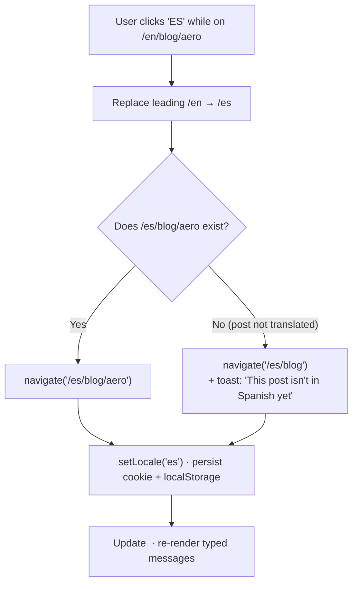
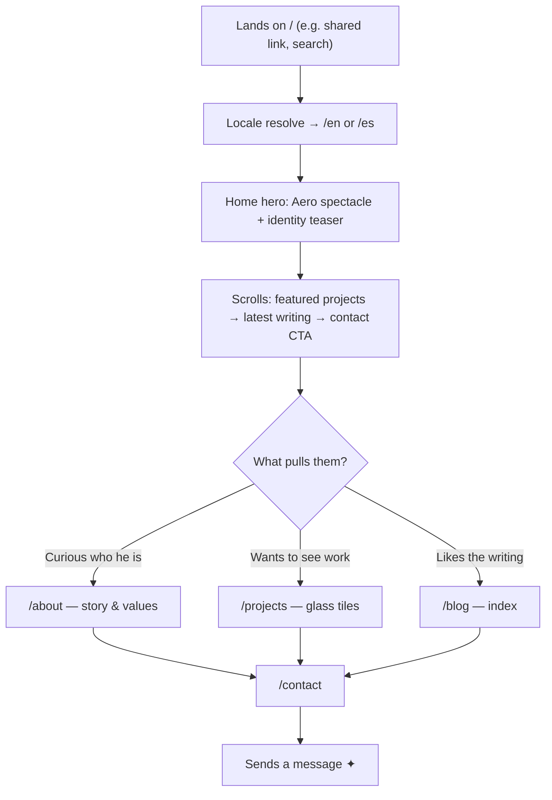
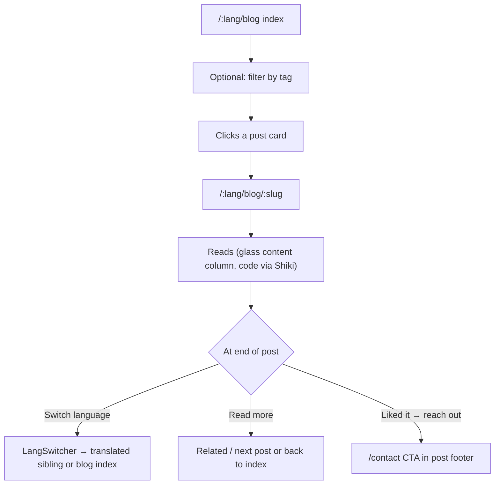
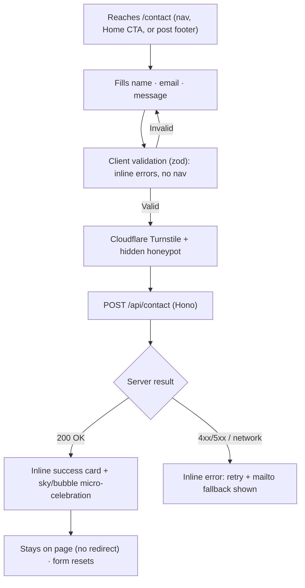

# Navigation & Flows

Navigation is itself a piece of [[Frutiger Aero — Design Language|Aero]] craft: a **glass top bar** that floats over the content with `backdrop-filter` blur, a translucent white top-rim, and a soft outer shadow (see `.glass` in [[Glass, Gloss & Depth]]). The job of nav is to disappear into delight on desktop and stay one-thumb reachable on mobile, while never letting the [[Accessibility & SEO|a11y]] contract slip.

## Primary navigation model

A single persistent **glass header**, full-width, `position: sticky; top`, that condenses (height + blur intensify) on scroll.

```
┌──────────────────────────────────────────────────────────────────────────┐
│  ◉ Jeronimo        About   Projects   Blog   Contact      [EN|ES]  [☼/☾] │  ← glass bar
└──────────────────────────────────────────────────────────────────────────┘
   logo→Home          primary links (active = aqua underline glow)   i18n   theme
```

- **Brand / logo (left)** → `/:lang` Home. Doubles as the "reset" affordance.
- **Primary links (center/right)**: About · Projects · Blog · Contact. Exactly the four sibling pages from the [[Sitemap]]. The active route gets an **aqua gel underline glow** (a gloss accent, not just a color) — see [[Component Visual Library]].
- **Utilities (far right)**: language switcher, then theme toggle. Grouped and visually quieter than primary links.
- Header components live in [[Component Visual Library]] (`GlassHeader`, `NavLink`, `LangSwitcher`, `ThemeToggle`).

> [!tip] Header contrast over glass
> Because the bar is translucent and floats over skies/auroras, link text needs a guaranteed ≥4.5:1. Use a subtle dark scrim *inside* the glass tint (not just blur) and a 1px text-shadow on light theme. Verify both [[Theming — Light & Dark|themes]]. Glassy ≠ illegible.

## Mobile navigation

Below ~`md`: collapse primary links into a **hamburger → full-height glass drawer** (slide-in from right, spring motion via [[Motion & Animation|Motion]]). Utilities stay in the bar where possible.

```
┌───────────────────────────────┐
│  ◉ Jeronimo      [EN|ES] ☼  ☰ │   ← bar keeps i18n + theme + menu trigger
└───────────────────────────────┘
            ↓ tap ☰
┌───────────────────────────────┐
│                            ✕  │
│   About                       │
│   Projects                    │   ← frosted drawer, large gel tap targets
│   Blog                        │     (≥44px), active item highlighted
│   Contact                     │
│  ───────────────────────────  │
│   [ EN | ES ]     [ ☼  /  ☾ ] │   ← utilities repeated for thumb reach
└───────────────────────────────┘
```

- Drawer traps focus, closes on `Esc`, on backdrop tap, and on route change.
- Trigger is an `<button aria-expanded aria-controls>`; respect `prefers-reduced-motion` (fade instead of slide).
- Bottom-anchored utilities so the **theme toggle and language switcher are thumb-reachable** even one-handed.

## Language switcher

A small pill (`EN | ES`) that performs a **pure pathname swap** and re-navigates, preserving everything after the locale segment.



- For the four fixed pages the swap is mechanical (slugs aren't translated — see [[Sitemap]]).
- For blog posts the switcher consults the [[Blog Content Pipeline|content index]] for a translated sibling; missing → graceful fallback to the locale's blog index with a non-blocking notice.
- Choice persists in a cookie **and** localStorage so the next visit and the SSR/redirect at `/` both honor it. See [[i18n Architecture]].

## Theme toggle

A glossy day/night **gel toggle** (sun ↔ moon) that flips `data-theme` on `<html>`, persists to localStorage, and animates via the [[Motion & Animation|View Transitions API]] (circular reveal from the toggle) where supported, gated on `prefers-reduced-motion`. Default theme comes from `prefers-color-scheme`; an inline head script applies it pre-paint to kill FOUC. Full spec in [[Theming — Light & Dark]] / [[ADR-009 — Theming Strategy]].

## Key user journeys

### 1 — First-time visitor (land → understand → wander)


Goal: within one scroll of Home, a visitor should *feel* the [[Developer Identity|identity]] and have three clear next doors. See [[Page — Home]].

### 2 — Reading a blog post (discover → read → continue)


See [[Page — Blog]] and [[Blog Content Pipeline]].

### 3 — Sending a contact message (intent → submit → confirm)


Full field/validation/spam spec in [[Page — Contact]] and [[Contact Backend]].

## Cross-cutting rules

- **Active state** is derived from the route (`NavLink` aware of `:lang` prefix); the logo is active only on Home.
- **Keyboard**: visible focus rings everywhere (a soft aqua glow, never `outline:none` without replacement); skip-to-content link as the first focusable element. [[Accessibility & SEO]].
- **Scroll restoration**: restore on back/forward; scroll-to-top on forward navigation to a new page; **preserve scroll** when only the locale/theme changes.
- **Page transitions**: View Transitions API for route changes, Motion `AnimatePresence` fallback, both gated on reduced-motion. [[Motion & Animation]].

## Next actions

- [ ] Prototype `GlassHeader` + mobile drawer in [[Component Visual Library]] with both [[Theming — Light & Dark|themes]].
- [ ] Wire `LangSwitcher` fallback logic against the [[Blog Content Pipeline]] index.
- [ ] Decide toast vs inline notice for "post not translated" (lean toast — non-blocking).

## See also

- [[Sitemap]] · [[Page — Home]] · [[Page — Contact]] · [[Theming — Light & Dark]]
