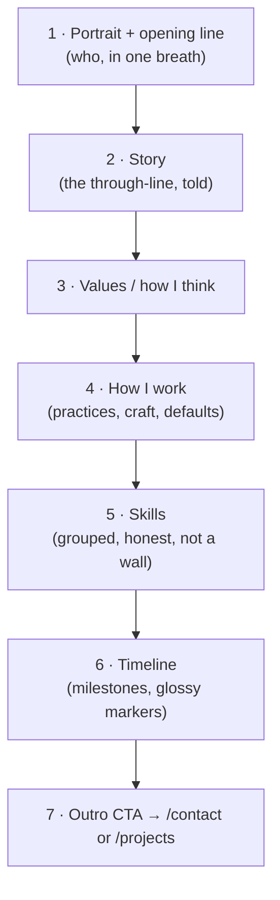

# Page — About

Route: `/:lang/about`. If [[Page — Home]] is the *spark*, About is the *campfire* — the long-form telling of who Jeronimo is, drawn directly from [[Developer Identity]]. This page is the clearest expression of north-star #1 (express identity). It is a narrative, not a résumé. See [[Vision & Purpose]].

> [!important] Voice over credentials
> About is **first-person, warm, opinionated**. It tells a *story* and states *values* before it lists skills. Skills/timeline exist for completeness but are subordinate. We are NOT optimizing for recruiter scan-speed ([[Audience & Goals]]).

## Section order & rationale

### 1 — Portrait + opening line
- A real photo or a tasteful Aero-styled avatar inside a **glass medallion** (soft gloss rim, droplet sheen). Beside it, one or two sentences that are the *essence* — the same voice as the Home hook but expanded. Pull from [[Developer Identity]].
- Component: `GlassPanel` + `AvatarMedallion` ([[Component Visual Library]]).

### 2 — Story
- The narrative through-line: how Jeronimo came to build software, what keeps him here, what he's reaching for. Concrete, specific, human — not "passionate full-stack developer" boilerplate.
- Layout: a comfortable glass **reading column** (same column treatment as [[Page — Blog|blog posts]] for consistency), generous line-height, humanist [[Typography|Source Sans 3]].

### 3 — Values / how I think
- 3–5 named values, each a short paragraph (not just a pill). These are the *principles* that govern the work — connect to [[Principles & Constraints]]. e.g. *craft as care*, *clarity over cleverness*, *play is serious*, *tech in service of humans* (echoes the Aero techno-humanist mood).
- Layout: a responsive grid of **glass value cards**, each with a small motif icon (droplet, leaf, bubble) from [[Imagery & Motifs]].

### 4 — How I work
- Defaults and practices: how he approaches a problem, tools he reaches for ([[Tech Stack]]), collaboration style, what "done" means to him ([[Definition of Done]]). This is the *behavioral* identity — the WHY of north-star #1.
- Tone: declarative and specific ("I start by writing the README" / "I delete code I can't justify").

### 5 — Skills
- Grouped, **honest**, and curated — not an exhaustive logo wall. Groups e.g. *Languages*, *Frontend*, *Backend/Infra*, *Craft & process*. Indicate genuine depth vs. familiarity rather than fake percentage bars.
- Layout: grouped lists or **gel chips** in a glass panel. Component: `SkillGroup` + `ValuePill`/chip ([[Component Visual Library]]).

> [!tip] No fake skill meters
> Percentage/level bars read as filler and undercut the craft statement. Prefer grouping + a short qualifier. Skills should feel chosen, not dumped.

### 6 — Timeline
- A vertical timeline of real milestones (education, key roles/projects, turning points) with **glossy aqua node markers** and connecting line, scroll-revealed.
- Component: `Timeline` + `TimelineNode` ([[Component Visual Library]]).
- Motion: nodes fade/rise as they enter the viewport (`whileInView`), gated on reduced-motion → appear instantly. [[Motion & Animation]].

### 7 — Outro CTA
- A warm close that points onward: "See what I've built" → [[Page — Projects]] and/or "Say hello" → [[Page — Contact]]. Glass band + gel button, consistent with Home's CTA.

## Tone & writing guidelines

- First person, present tense, specific. Short paragraphs. Real opinions.
- Avoid: buzzwords, "passionate", "ninja/rockstar", generic mission statements.
- Every claim should be something only Jeronimo would write. Draw verbatim seeds from [[Developer Identity]].

## Bilingual notes

- The story, values, and how-I-work prose are **authored independently in EN and ES** — these carry voice and idiom and must not be machine-translated. Keys live in [[i18n Architecture]] (or, if long enough, the prose can live in locale MDX/partials — decide alongside [[Blog Content Pipeline]]).
- Skill group *labels* and timeline *dates* are translated keys; proper nouns (company/school names) stay as-is.
- Keep EN and ES roughly equal in length so layout (timeline, cards) stays balanced. #todo

## Motion notes

- Reading column: gentle entrance, no parallax (readability first).
- Value cards + timeline nodes: staggered `whileInView`.
- Avatar medallion: a slow specular gloss sweep / droplet shimmer (decorative only). All reduced-motion-safe. [[Motion & Animation]].

## Components used

`GlassPanel` · `AvatarMedallion` · reading-column · value `GlassCard` · `SkillGroup` · `Timeline` / `TimelineNode` · `GelButton` — see [[Component Visual Library]].

## Open questions

- [ ] Photo vs. illustrated Aero avatar? (Lean real photo in a glass medallion for warmth.)
- [ ] Does "How I work" overlap [[Principles & Constraints]] / [[Definition of Done]]? About = personal voice; those notes = the canonical rules. Cross-link, don't duplicate.
- [ ] Long prose: i18n message keys vs. locale MDX partials. #todo

## See also

- [[Developer Identity]] — the primary source for everything on this page
- [[Page — Home]] · [[Page — Projects]] · [[Page — Contact]]
- [[Typography]] · [[Imagery & Motifs]] · [[Component Visual Library]]
