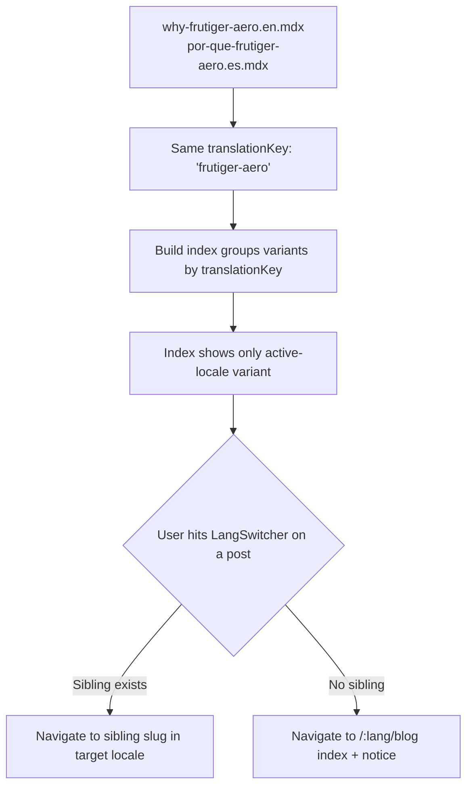

# Page — Blog

Routes: `/:lang/blog` (index) and `/:lang/blog/:slug` (post). Dev-authored, local **MDX** content ([[ADR-005 — Blog Content Source]]); the technical machinery lives in [[Blog Content Pipeline]]. This page is identity-through-thinking: the writing *shows* how Jeronimo reasons.

> [!note] Content source
> Posts are local `*.mdx` files in the repo, indexed at build via `import.meta.glob('./posts/*.mdx', { eager: true })`, compiled through `@mdx-js/rollup`, with `remark-frontmatter` + `remark-gfm` + `rehype-pretty-code`/Shiki. Every URL is SSG-prerendered. Full pipeline + folder layout: [[Blog Content Pipeline]].

## Frontmatter schema

Each post file begins with YAML frontmatter that feeds routing, the index, meta tags, and bilingual linking:

```yaml
---
title: "Why Frutiger Aero, and why now"
slug: "why-frutiger-aero"        # per-locale, URL-safe
date: 2026-06-10                 # ISO; drives sort + display
updated: 2026-06-12              # optional
lang: en                         # en | es
summary: "A short dek for cards, meta description, and OG."
tags: [design, frutiger-aero]    # drives tag pages/filter
cover: "./covers/aero.jpg"       # optional; fallback = Aero gradient
draft: false                     # excluded from prod build when true
translationKey: "frutiger-aero"  # links en/es siblings (see below)
ogImage: "./og/aero.png"         # optional precomputed OG (else generated)
---
```

| Field            | Required | Used by                                                    |
| ---------------- | -------- | ---------------------------------------------------------- |
| `title`          | ✓        | Post H1, card, `<title>`, OG                               |
| `slug`           | ✓        | URL `/:lang/blog/:slug`                                     |
| `date`           | ✓        | Sort (desc), display, sitemap `lastmod`                    |
| `lang`           | ✓        | Locale filtering; sets `<html lang>`                        |
| `summary`        | ✓        | Card dek, meta description, OG description                  |
| `tags`           | ✓        | Tag filter on index                                        |
| `cover`          | –        | Card + post header art (fallback gradient)                 |
| `draft`          | –        | Excluded from production index/build                       |
| `translationKey` | ✓*       | Cross-links EN↔ES variants (see bilingual)                 |
| `ogImage`        | –        | Social card (else generated at build — [[Accessibility & SEO]]) |
| `updated`        | –        | "Updated on" display                                       |

`*` required once a post exists in more than one language.

## Index layout (`/:lang/blog`)

```
╔══════════════════════════════════════════════════════╗
║   Writing                                            ║
║   “Notes on craft, the web, and bright software.”    ║
║                                                      ║
║   Tags:  [ All ] [ design ] [ frutiger-aero ] [ … ]  ║  ← gel filter pills
║                                                      ║
║   ┌────────────────────────────────────────────┐    ║
║   │ [cover]  Why Frutiger Aero, and why now     │    ║
║   │          2026-06-10 · 6 min · #design       │    ║  ← PostCard (glass)
║   │          short summary dek…                 │    ║
║   └────────────────────────────────────────────┘    ║
║   ┌────────────────────────────────────────────┐    ║
║   │ [cover]  …                                  │    ║
║   └────────────────────────────────────────────┘    ║
╚══════════════════════════════════════════════════════╝
```

- Posts filtered to the **active locale**, `draft:false`, sorted by `date` desc.
- **Tag filter**: single-select gel pills, active tag in the query string (`?tag=design`) — same pattern as [[Page — Projects]]. (A future `/:lang/blog/tag/:tag` page is possible but deferred — [[Backlog]].)
- `PostCard` = cover (or gradient), title, date, reading time, first tag, summary. Reading time computed at build from word count.
- Empty state (no posts for a tag/locale) is friendly and offers reset.

## Post layout (`/:lang/blog/:slug`)

```
╔══════════════════════════════════════════════════════╗
║   ░ cover / Aero header art ░                        ║
║   Why Frutiger Aero, and why now                     ║
║   2026-06-10 · 6 min read · #design #frutiger-aero   ║
╠══════════════════════════════════════════════════════╣
║      ┌────────────────────────────────────┐          ║
║      │  reading column (glass, ~68ch)     │          ║
║      │  humanist type, big line-height    │          ║
║      │  prose, headings, code (Shiki),    │          ║
║      │  images, callouts, MDX components  │          ║
║      └────────────────────────────────────┘          ║
║   ── footer ──                                        ║
║   [← All writing]   [Switch language?]   [Say hello] ║
╚══════════════════════════════════════════════════════╝
```

### Reading experience

- **Reading column** ~`65–72ch`, generous `line-height` (~1.7), humanist [[Typography|Source Sans 3]]; a `prose`-style typographic scale tuned for both [[Theming — Light & Dark|themes]].
- Content sits in a **calm glass panel** over a *quiet* backdrop — the spectacle dials *down* here so the words lead. (Aero restraint = craft.)
- **Code blocks**: Shiki/`rehype-pretty-code`, both-theme aware, with a copy button. Inline code in a subtle gel chip.
- **MDX components**: a small allowed set (callout/`Aside`, `Figure`, `Video`, maybe a `Demo` embed) registered via `MDXProvider`; catalogue in [[Component Visual Library]].
- **Reading aids**: reading-time, a slim scroll-progress bar (top), optional auto Table of Contents from headings for long posts.
- **Footer**: back-to-index, the [[Navigation & Flows|language switcher]] (post-aware), and a contact nudge → [[Page — Contact]]. Optionally prev/next or related-by-tag.

### Motion

- Header art subtle parallax/gloss; content fades in; scroll-progress bar. All gated on `prefers-reduced-motion`. Keep reading distraction-free. [[Motion & Animation]].

## Tags

- Drawn from the union of all posts' `tags`. Use a **small, curated vocabulary** (e.g. `design`, `frutiger-aero`, `frontend`, `infra`, `meta`) — don't mint a new tag per post; keep it consistent with [[Glossary]]. Tag *labels* localize via [[i18n Architecture]]; tag *ids* are stable.

## Bilingual posts strategy



- Variants live as `slug.en.mdx` / `slug.es.mdx` (or per-locale folders) sharing a `translationKey`; the [[Blog Content Pipeline]] index maps siblings so the switcher cross-links exactly ([[Navigation & Flows]]).
- A post may exist in **only one** language — that's fine; it simply doesn't appear in the other locale's index, and the switcher falls back gracefully.
- Per-locale slugs are encouraged (real Spanish slugs read better and rank better). See [[Sitemap]].

## SEO / meta (per post)

- `<title>`, meta description (from `summary`), canonical (self), `hreflang` alternates to the sibling locale (or omit if none), article OG/Twitter tags, and a static **OG image** (precomputed or generated at build). `date`/`updated` → structured data + sitemap `lastmod`. See [[Accessibility & SEO]] and [[Performance Budget]].

## Authoring checklist (per post)

- [ ] Frontmatter complete (title, slug, date, lang, summary, tags, translationKey).
- [ ] Tags from the existing vocabulary.
- [ ] Cover provided or gradient fallback accepted.
- [ ] If translating, set the matching `translationKey` on both files.
- [ ] Code blocks language-tagged; images have alt text. #todo

## Open questions

- [ ] Dedicated tag pages (`/:lang/blog/tag/:tag`) for SEO, or query-string filter only? (v1: query string; revisit.)
- [ ] RSS/Atom feed per locale? (Cheap to generate at build — likely yes, [[Backlog]].)
- [ ] Auto-ToC threshold (e.g. only posts with ≥4 H2s).

## See also

- [[Blog Content Pipeline]] — MDX compile, indexing, OG generation
- [[Component Visual Library]] — `PostCard`, reading column, MDX components
- [[Typography]] · [[Page — Home]] (latest writing) · [[Page — Contact]]
