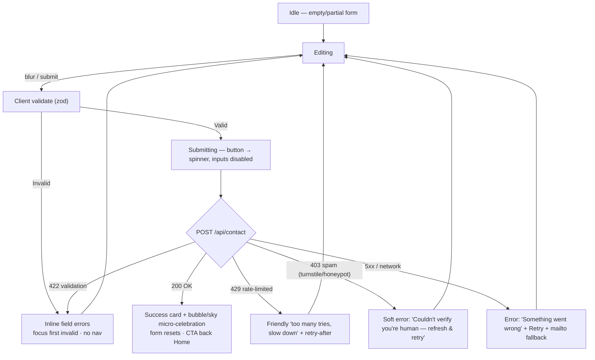

# Page — Contact

Route: `/:lang/contact`. A **real, self-hosted, working** contact form — not a `mailto:` — posting to a tiny Hono API on the VPS. The backend spec lives in [[Contact Backend]] / [[ADR-007 — Contact Form Backend]]; this note is the *page & UX* spec. Tone is warm and low-pressure: this is an invitation, not a lead-capture funnel ([[Vision & Purpose]]).

> [!important] This must actually send
> The form hits `POST /api/contact` (Hono → Resend) guarded by **honeypot + Cloudflare Turnstile + IP rate-limit**, validated with `zod` on both client and server. Success and failure are handled **inline** — the user never leaves the page. Details: [[Contact Backend]].

## Wireframe

```
╔══════════════════════════════════════════════════════╗
║   Say hello                                          ║
║   “Got an idea, a question, or just want to chat?”   ║
║                                                      ║
║   ┌────────────────────────────────────────────┐    ║
║   │  Name        [____________________]         │    ║   glass form panel
║   │  Email       [____________________]         │    ║
║   │  Message     [                    ]         │    ║
║   │              [                    ]         │    ║
║   │  (honeypot: hidden, off-screen)             │    ║
║   │  [ Turnstile widget ]                       │    ║
║   │                       [  Send message  ]    │    ║   gel button
║   └────────────────────────────────────────────┘    ║
║                                                      ║
║   Or reach me directly:                              ║
║   ✉ jbetancur@idtsas.com   ⌜GitHub⌟  ⌜LinkedIn⌟      ║
╚══════════════════════════════════════════════════════╝
```

## Form fields

| Field      | Type        | Required | Client validation (zod)                          | Notes                                  |
| ---------- | ----------- | -------- | ------------------------------------------------ | -------------------------------------- |
| `name`     | text        | ✓        | 1–80 chars, trimmed, not empty                   | `autocomplete="name"`                  |
| `email`    | email       | ✓        | valid email, ≤120 chars                           | `autocomplete="email" inputmode="email"`|
| `message`  | textarea    | ✓        | 10–2000 chars                                     | counter shown near limit               |
| `subject`  | text        | –        | ≤120 chars                                        | optional; helps triage                 |
| `honeypot` | text        | hidden   | MUST be empty (bots fill it → silently reject)    | visually hidden + `aria-hidden` + `tabindex=-1` + `autocomplete=off` |
| `turnstile`| token       | ✓        | present (set by widget)                           | verified server-side via `siteverify`  |

- The same `zod` schema is **shared** client↔server (single source of truth) — see [[Contact Backend]].
- Labels are real `<label for>`; errors linked via `aria-describedby`; required marked semantically, not only with color. [[Accessibility & SEO]].

## States & UX



- **Idle**: clean glass panel; submit enabled but guarded by validation on click.
- **Editing**: inline, on-blur validation; don't nag while typing a field (validate on blur/submit).
- **Submitting**: gel **`Send` button → loading state** (spinner + "Sending…"), inputs disabled to prevent double-submit; the request is idempotent-ish via a client-side in-flight guard.
- **Success**: an inline **glass success card** ("Thanks — your message is on its way ✦") with a small Aero micro-celebration (rising bubbles / soft sky bloom), gated on `prefers-reduced-motion` → static checkmark. Form clears. Offers "Back home" / "Read the blog". User **stays on `/contact`** (no redirect) so they keep context.
- **Error**: inline, specific, recoverable. Always surface the **direct email fallback** in the error so a failed POST never strands the user.

> [!tip] Spam protection should be invisible to humans
> Honeypot + Turnstile do the work; the human just types and sends. Don't add a visible captcha puzzle, and never block on JS-only checks without a graceful path. Honeypots alone are weak vs. LLM spam — Turnstile is the real gate ([[Contact Backend]]).

## What happens on submit

1. Client `zod` validates → blocks on error (focus first invalid).
2. Hidden honeypot checked (empty?) + Turnstile token attached.
3. `fetch('POST /api/contact', { json })` with the payload.
4. **Server** ([[Contact Backend]]): re-validate `zod` → check honeypot → verify Turnstile via `siteverify` → IP rate-limit → send via **Resend** to `jbetancur@idtsas.com`.
5. Server returns a typed result; the page maps status → the states above.
6. On success the message lands in Jeronimo's inbox; optionally an auto-acknowledgement to the sender (decide in [[Contact Backend]]).

## Alternative contact methods

- **Direct email**: `jbetancur@idtsas.com` (rendered as a real `mailto:` link, shown plainly — acceptable to expose; also serves as the error fallback).
- **Social**: GitHub + LinkedIn (URLs **TBD** — placeholders until [[Developer Identity]] confirms). Glossy gel icon links, new tab, `rel="noopener noreferrer"`.
- These give visitors a non-form path and a graceful degradation if the API is ever down.

## Motion notes

- Form entrance: gentle fade/rise. Field focus: soft aqua focus-glow (a gloss ring, never bare `outline:none`).
- Success: bubble/sky micro-celebration, reduced-motion-safe. [[Motion & Animation]].

## Bilingual notes

- All labels, placeholders, helper text, validation messages, and state copy come from typed message keys ([[i18n Architecture]]); both locale variants prerendered ([[Sitemap]]).
- Turnstile widget language follows the active locale.
- Server-side validation messages are returned as **codes**, mapped to localized strings on the client (don't ship English errors to a Spanish UI). #todo

## Accessibility

- Labelled inputs, `aria-describedby` errors, `aria-live="polite"` region announcing submit result, visible focus, ≥44px targets, contrast verified over glass in both [[Theming — Light & Dark|themes]]. Form usable keyboard-only and without motion. [[Accessibility & SEO]].

## Components used

`GlassPanel` (form) · `TextField` / `TextArea` (with inline error) · `GelButton` (with loading state) · `TurnstileWidget` · `SuccessCard` · `SocialLinks` — see [[Component Visual Library]].

## Open questions

- [ ] Send the sender an auto-acknowledgement email? (Nice touch; decide in [[Contact Backend]].)
- [ ] Web3Forms/Formspree as a zero-backend fallback if the VPS API is unreachable? (v1: self-hosted only; keep fallback in [[Backlog]].)
- [ ] Confirm GitHub/LinkedIn URLs ([[Developer Identity]]). #todo

## See also

- [[Contact Backend]] — Hono API, Resend, Turnstile, rate-limit, shared `zod` schema
- [[ADR-007 — Contact Form Backend]] · [[Navigation & Flows]] (send-message journey) · [[Page — Home]] (CTA)
