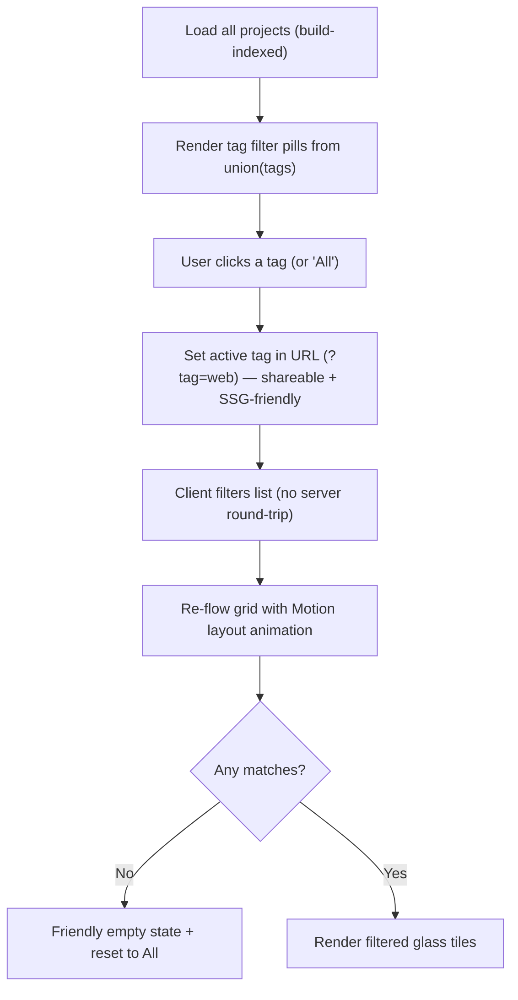

# Page — Projects

Route: `/:lang/projects`. A gallery of work as **glass tiles** floating over an Aero sky, filterable by tag. The page proves north-star #1 through *what* Jeronimo builds and *how* he frames it.

> [!decision] No deep case-study subpages in v1
> v1 has **no** `/:lang/projects/:slug` detail pages. Each project card links **out** to its real artifact (GitHub repo, live demo, write-up) in a new tab (`target="_blank" rel="noopener noreferrer"`). Where a project has its own [[Page — Blog|blog post]], the card may link to that instead. Deep in-site case studies are explicitly deferred — see [[Roadmap & Phases]] and [[Backlog]]. This keeps v1 scope honest and avoids a second content pipeline.

## Layout & wireframe

```
╔════════════════════════════════════════════════════════════╗
║   Projects                                                 ║
║   “Things I’ve made.”  (short intro line)                  ║
║                                                            ║
║   Filter:  [ All ] [ Web ] [ Tooling ] [ Open source ] …   ║  ← gel filter pills
║                                                            ║
║   ┌──────────┐  ┌──────────┐  ┌──────────┐                ║
║   │  cover   │  │  cover   │  │  cover   │                ║
║   │  Title   │  │  Title   │  │  Title   │   glass tiles  ║
║   │  summary │  │  summary │  │  summary │   hover→gloss  ║
║   │ tags ↗   │  │ tags ↗   │  │ tags ↗   │                ║
║   └──────────┘  └──────────┘  └──────────┘                ║
║   ┌──────────┐  ┌──────────┐  …                           ║
╚════════════════════════════════════════════════════════════╝
```

- Responsive grid: 1 col (mobile) → 2 (`md`) → 3 (`lg`). Tiles are uniform height with truncated summaries.
- Cards are **`.glass` panels** (frosted, translucent-white top rim, soft outer + inner-highlight shadow — [[Glass, Gloss & Depth]]) over the page's sky/aurora backdrop.

## Project metadata model

Projects are **local data**, not a CMS — a typed array/JSON or a thin MDX/frontmatter set indexed at build (mirror the [[Blog Content Pipeline]] approach for consistency). Proposed schema:

| Field         | Type                          | Required | Notes                                                        |
| ------------- | ----------------------------- | -------- | ------------------------------------------------------------ |
| `slug`        | string                        | ✓        | Stable id / anchor / future detail-page key                  |
| `title`       | localized string (en/es)      | ✓        | Display name                                                 |
| `summary`     | localized string (en/es)      | ✓        | 1–2 lines, shown on the tile                                 |
| `tags`        | string[]                      | ✓        | Drives the filter (e.g. `web`, `tooling`, `open-source`)     |
| `year`        | number                        | ✓        | For sort + display                                           |
| `role`        | localized string              | ✓        | e.g. "Solo build", "Lead frontend"                           |
| `links`       | `{ label, href, kind }[]`     | ✓        | kind ∈ repo · demo · post · site (≥1; first = primary CTA)   |
| `cover`       | image/gradient ref            | –        | Tile background; fallback = a generated Aero gradient        |
| `stack`       | string[]                      | –        | Tech badges (small gel chips)                                |
| `featured`    | boolean                       | –        | Surfaced on [[Page — Home]] (2–3 max)                        |
| `status`      | `active \| archived \| wip`   | –        | Optional ribbon                                              |

> [!example] One project tile, rendered
> **Aero Portfolio** · 2026 · *Solo build* — "A self-hosted Frutiger Aero developer portfolio." `[react] [vite] [tailwind]` → primary link **Repo ↗**, secondary **Live ↗**.

## Filtering by tag



- **Single-select** tag filter in v1 (multi-select is over-engineering for the project count). "All" is the default.
- Active tag reflected in the **query string** (`?tag=web`) so a filtered view is shareable and the back button works; the page itself is still statically prerendered (filter is client-applied on the full list).
- Grid re-flow animated with **Motion `layout`** (`AnimatePresence` for enter/exit), gated on `prefers-reduced-motion` → instant. [[Motion & Animation]].

## Card interactions & motion

- **Hover/focus**: a specular **gloss sweep** across the tile + slight lift (`translateY` + shadow), per [[Glass, Gloss & Depth]]. Keyboard focus gets the same treatment via `:focus-visible`.
- Entire tile is a link to the **primary** `links[0]`; secondary links are explicit buttons/icons inside (so the card isn't a nested-interactive a11y trap — primary link wraps content, secondary actions are separate `<a>`s with `stopPropagation`). [[Accessibility & SEO]].
- External links: new tab, `rel="noopener noreferrer"`, and a small ↗ glyph so users know they're leaving.

## What a project entry needs (authoring checklist)

- [ ] Title + 1–2 line summary, **both** EN and ES.
- [ ] At least one real link (repo or live), marked with its `kind`.
- [ ] Tags that fit the existing filter vocabulary (don't invent a one-off tag per project).
- [ ] Year + role.
- [ ] A cover image *or* accept the generated Aero-gradient fallback (keep covers visually cohesive — see [[Color & Gradients]]).
- [ ] Decide `featured` (max 2–3 true across all projects).

## Bilingual notes

- `title`/`summary`/`role` are localized fields; the filter renders tag *labels* via translated keys but filters on stable tag *ids*. See [[i18n Architecture]].
- Both locale variants of the page are prerendered ([[Sitemap]]).

## Open questions

- [ ] Sort default: by `year` desc, or a manual `order` field for curation? (Lean curated `featured`/`order`, then year.)
- [ ] Do we ever want multi-tag (AND/OR) filtering? Defer unless project count grows. #todo
- [ ] Reserve `/:lang/projects/:slug` for future case studies — keep slugs stable now so links don't break later.

## See also

- [[Component Visual Library]] — `ProjectTile`, filter `GelPill`, `TechChip`
- [[Glass, Gloss & Depth]] · [[Motion & Animation]] · [[Page — Home]] (featured) · [[Page — Blog]]
