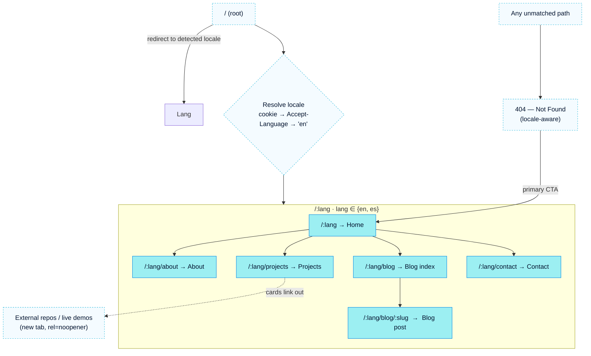

# Sitemap

The information architecture is deliberately **small and dense**: five primary destinations, every one of them locale-prefixed. This is a portfolio, not an app — the IA exists to let a visitor (1) feel who Jeronimo *is*, (2) drift through writing and projects, and (3) reach out. See [[Vision & Purpose]] and [[Audience & Goals]] for the WHY this shape serves.

> [!decision] Locale-first, flat IA
> Every content route lives under a `/:lang` prefix (`/en`, `/es`). There is **no unprefixed canonical page** — the bare `/` only ever *redirects* to a resolved locale. Depth is capped at two meaningful segments (`/:lang/blog/:slug`). Flat IA keeps the [[Navigation & Flows|nav]] trivial and the [[i18n Architecture|i18n]] switcher a pure path-swap. See [[ADR-004 — i18n Library]] and [[ADR-003 — Routing Library]].

## Tree

## URL structure

All routes are SSG-prerendered (`vite-react-ssg`) so each emits real crawlable HTML + per-route `<meta>`/OG. See [[Performance Budget]] and [[Accessibility & SEO]].

| Route pattern             | Page note            | Purpose                                     | Prerendered?           | In primary nav? |
| ------------------------- | -------------------- | ------------------------------------------- | ---------------------- | --------------- |
| `/`                       | —                    | Redirect → `/:lang` (resolved)              | No (redirect/edge)     | —               |
| `/:lang`                  | [[Page — Home]]      | Landing, identity teaser, featured slices   | Yes (×2 locales)       | Yes (Home/logo) |
| `/:lang/about`            | [[Page — About]]     | Jeronimo's story, values, how he works      | Yes (×2)               | Yes             |
| `/:lang/projects`         | [[Page — Projects]]  | Project glass tiles, tag filter             | Yes (×2)               | Yes             |
| `/:lang/blog`             | [[Page — Blog]]      | Writing index (filter by tag)               | Yes (×2)               | Yes             |
| `/:lang/blog/:slug`       | [[Page — Blog]]      | Individual post                             | Yes (one per post×lang)| No (deep link)  |
| `/:lang/contact`          | [[Page — Contact]]   | Real working contact form                   | Yes (×2)               | Yes             |
| `*` (unmatched)           | —                    | 404, locale-aware, CTA back Home            | Yes (per locale)       | No              |

> [!note] Why `lang` is a route param, not a subdomain or query
> A path segment (`/:lang(en|es)`) is the simplest thing that is SSG-friendly, gives clean per-locale OG/canonical tags, and lets the [[Navigation & Flows|switcher]] be a string replace on `pathname`. Subdomains would multiply TLS/[[Domain, DNS & TLS|DNS]] config; query params hurt SEO/sharing. Locked in [[ADR-004 — i18n Library]].

## Canonical, alternate & sitemap.xml

- Each page sets `<link rel="canonical">` to its **own** locale URL.
- Each page emits `<link rel="alternate" hreflang="en|es">` pointing at the sibling-locale URL, plus `hreflang="x-default"` → the English variant.
- A generated `sitemap.xml` (emitted by `vite-react-ssg`) lists **every prerendered locale URL**; `robots.txt` references it. Blog post URLs are added from the [[Blog Content Pipeline]] index at build time.
- 404 returns proper status via the [[VPS Deployment Plan|Caddy]] config (static host rewrites unknown paths to the prerendered 404 doc).

## Slug rules

- **Pages**: fixed English slugs (`about`, `projects`, `blog`, `contact`) in *both* locales. We do **not** translate page slugs (`/es/acerca`) in v1 — it complicates routing, redirects, and sitemap for negligible gain. Revisit if SEO data argues otherwise. #todo
- **Posts**: per-locale slugs are allowed and encouraged (`/en/blog/why-frutiger-aero`, `/es/blog/por-que-frutiger-aero`); the [[Blog Content Pipeline]] maps a post's `en`/`es` variants to each other so the switcher can cross-link. If a post exists in only one language, the switcher falls back to the blog index in the other language (see [[Navigation & Flows]]).

## Open questions

- [ ] Do we want a lightweight `/:lang/uses` or tooling page later? (Keep out of v1 IA — see [[Backlog]].)
- [ ] Should Projects ever gain deep `/:lang/projects/:slug` case-study pages? Explicitly **out of scope for v1** ([[Page — Projects]]); the tree above reserves the namespace conceptually but does not implement it.

## See also

- [[Navigation & Flows]] — how visitors move through this tree
- [[Routing]] · [[i18n Architecture]] — the technical realization
- [[Sitemap]] is referenced by every [[Page — Home|Page]] note
