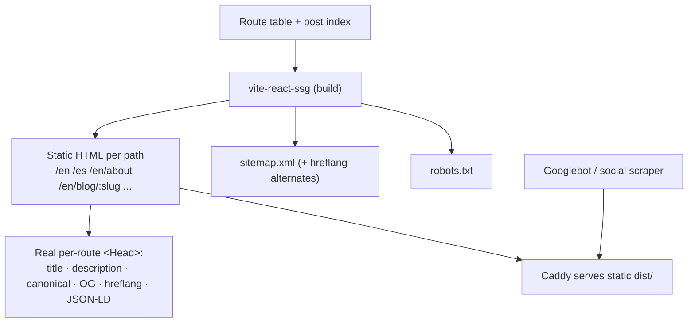

# Accessibility & SEO

A glassy, animated, bilingual SPA has two hard problems: **(A11y)** translucent surfaces and motion can exclude users; **(SEO)** client-rendered routes can be invisible to crawlers. This note solves both with concrete, checkable rules. Targets feed [[Success Criteria]]; perf overlaps live in [[Performance Budget]].

> [!important] Accessibility is part of the craft
> [[Frutiger Aero — Design Language]] explicitly demands: respect `prefers-reduced-motion`, maintain contrast on glass. A beautiful site that excludes keyboard or screen-reader users is, by [[Vision & Purpose]]'s "craft-as-statement" standard, **unfinished**. Lighthouse Accessibility target = **100** ([[Performance Budget]]).

## A11y for a glassy, animated site

### Contrast over glass (the signature risk)

> [!warning] Translucent text fails WCAG
> Text on a `backdrop-filter` panel changes contrast as the background scrolls. Never rely on the blur alone.

- Put a **semi-opaque tint** behind text on glass (e.g. raise the panel fill toward `rgba(...,0.6–0.9)` in the text region) or add a subtle **dark scrim**.
- Verify **≥ 4.5:1** for body text, **≥ 3:1** for large text and UI components — measured against the *worst-case* background the panel can float over.
- A measured `text-shadow` is a legitimate Aero tool for legibility (it's already in the aqua-button recipe) but is **not** a substitute for real contrast.
- The `@supports not (backdrop-filter)` fallback uses an **opaque** fill so text is always readable. See [[Glass, Gloss & Depth]] and [[Performance Budget]].

### Reduced motion
- A global guard: `@media (prefers-reduced-motion: reduce) { *, *::before, *::after { animation-duration: .001ms !important; animation-iteration-count: 1 !important; transition-duration: .001ms !important; } }` as a safety net.
- Component motion routes through `useReducedMotion()` / `lib/motion.ts`: auroras, bubbles, parallax, lens flares → **static**; page transitions → instant ([[Routing]], [[Motion & Animation]]).
- The site must be **fully usable and still beautiful** with motion off — verify in the [[Performance Budget]] checklist.

### Focus states
- **Never** remove outlines without replacing them. Provide a high-contrast, on-brand focus ring (a glowing cyan/aqua `box-shadow` ring) that meets 3:1 against adjacent colors.
- Use `:focus-visible` so the ring shows for keyboard users without cluttering mouse clicks.
- Aqua/gel buttons need a focus ring that survives their glossy gradient — test on the brightest and darkest theme variants.

### Keyboard navigation
- Everything operable by pointer is operable by keyboard, in a logical tab order.
- A **skip-to-content** link (visually hidden until focused) at the top of `RootLayout`.
- The [[i18n Architecture|language switcher]], [[Theming — Light & Dark|theme toggle]], and nav are real `<button>`/`<a>` elements — never click-handlers on `<div>`.
- The **honeypot** field in the contact form is `tabindex="-1"`, `aria-hidden="true"` so keyboard users skip it ([[Contact Backend]]).
- Trap focus in any dialog/menu; restore focus to the trigger on close.

### Semantics
- One `<h1>` per page; logical heading order (no skipping levels) — matters for blog posts ([[Blog Content Pipeline]]).
- Landmarks: `<header> <nav> <main> <footer>`; `<main id="content">` for the skip link.
- Aero decorative layers (aurora, bubbles, grain, lens flare) are `aria-hidden="true"` and `pointer-events:none` — they're scenery, not content.
- Form fields have associated `<label>`s; validation errors use `aria-describedby`; submit status uses an `aria-live="polite"` region ([[Contact Backend]]).

### Alt text
- Every meaningful image has descriptive, **translated** `alt` ([[i18n Architecture]]); decorative images use `alt=""`.
- Aero motif imagery (koi, clouds, droplets) used purely as decoration is `alt=""` / CSS background.

## SEO for an SPA on a VPS

### The crawler problem & the fix

> [!decision] Prerender with SSG, don't rely on client-rendered meta
> `react-helmet`-style client updates run **after** JS — crawlers and social-card scrapers may miss them. **Solution: prerender every route to static HTML with `vite-react-ssg`**, emitting real `<title>`/meta/OG/canonical/hreflang per route via its `<Head>`, plus generated `sitemap.xml` + `robots.txt`. **Vike** is the heavier alternative; React Router v7 can also SSG. This gives crawlable HTML and correct social cards with **no Next.js**.



### Per-route meta (via `lib/seo.ts` + SSG `<Head>`)

- Unique `<title>` and `meta description` per page **and locale**.
- **Open Graph** + **Twitter Card** tags with a per-page image (precomputed OG PNGs for posts — [[Blog Content Pipeline]]).
- `<link rel="canonical">` self-referential per URL.
- Correct `<html lang="en|es">` set at prerender time *and* updated on client navigation ([[Routing]]).

### hreflang for EN/ES

Reciprocal alternates + `x-default` on every page that exists in both locales (full pattern in [[i18n Architecture]]):

```html
<link rel="alternate" hreflang="en" href="https://example.com/en/about" />
<link rel="alternate" hreflang="es" href="https://example.com/es/about" />
<link rel="alternate" hreflang="x-default" href="https://example.com/en/about" />
```
Only emit an alternate when that locale's page actually exists — never point at a 404.

### Sitemap, robots, 404

- `sitemap.xml` with both-locale URLs and `xhtml:link` alternates; per-locale RSS from the blog pipeline.
- `robots.txt` allows crawl + references the sitemap.
- The Aero 404 page returns a real `404` status from Caddy for unknown paths (not a soft 200) so crawlers don't index ghosts ([[Routing]]).

### Structured data
- `Person` JSON-LD on Home/About (Jeronimo as a software developer).
- `BlogPosting` JSON-LD per post (headline, datePublished, author, inLanguage, image).
- `BreadcrumbList` for blog navigation. Generated by `lib/seo.ts`.

## Combined checklist

- [ ] All glass text verified ≥ 4.5:1 against worst-case background (and the no-`backdrop-filter` fallback).
- [ ] `prefers-reduced-motion` removes all decorative animation; site still usable + lovely.
- [ ] Visible `:focus-visible` ring on every interactive element, both themes.
- [ ] Full keyboard pass: skip link, nav, switcher, theme toggle, contact form, blog links.
- [ ] Landmarks + single `<h1>` + ordered headings on every page (incl. posts).
- [ ] Translated `alt` for meaningful images; decorative = `alt=""` / `aria-hidden`.
- [ ] SSG emits real per-route title/description/OG/canonical/hreflang/JSON-LD.
- [ ] `sitemap.xml` + `robots.txt` generated; 404 returns real 404.
- [ ] Lighthouse Accessibility = 100, SEO ≥ 95 in [[CI-CD Pipeline]].
- [ ] Tested with a screen reader (NVDA/VoiceOver) on Home + a post + the contact form.
- [ ] Validate OG cards with a social debugger; Rich Results test for JSON-LD.

## Open questions

- [ ] Confirm `vite-react-ssg` + `@mdx-js/rollup` + React Router v7 compose cleanly for prerender (shared spike with [[Tech Stack]]).
- [ ] Automated a11y in CI (axe-core / Playwright) vs Lighthouse-only — lean on adding axe for regressions.

## See also

- [[Success Criteria]] · [[Performance Budget]] · [[i18n Architecture]] · [[Routing]]
- [[Glass, Gloss & Depth]] · [[Motion & Animation]] · [[Blog Content Pipeline]] · [[Contact Backend]] · [[CI-CD Pipeline]]
