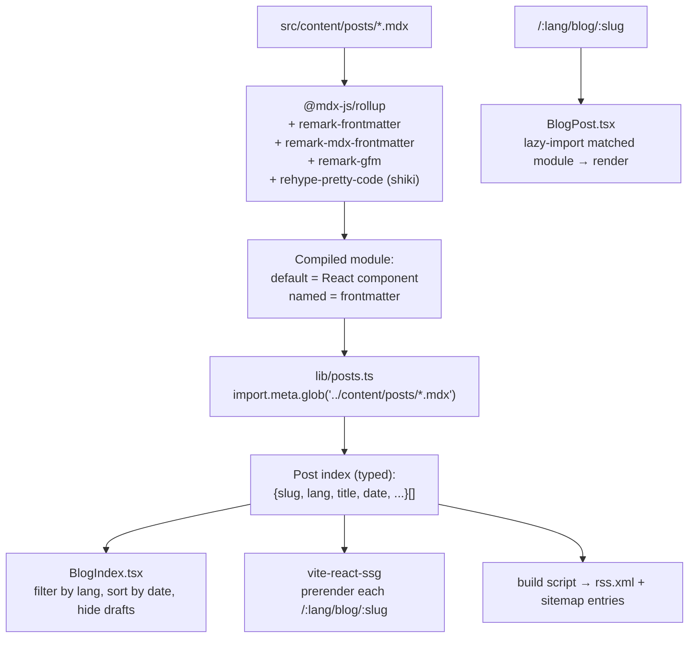

# Blog Content Pipeline

How a dev-authored post travels from a file on disk to a rendered, indexed, crawlable page. **Decision: local MDX + frontmatter, discovered with `import.meta.glob`, compiled through Vite.** Content lives in the repo (no CMS). Rationale/alternatives in [[ADR-005 — Blog Content Source]]; the page itself is [[Page — Blog]].

> [!decision] Local MDX via `@mdx-js/rollup`
> Chosen over plain-Markdown-and-`gray-matter` and over any headless/git CMS. MDX lets posts embed live React components — an interactive bubble demo or a glass card *inside* a post — which is squarely on-brand for a *craft-as-statement* portfolio ([[Vision & Purpose]]). The cost (ESM-only, async plugin import in `vite.config.ts`) is trivial. CMS overhead is unjustified for in-repo dev authoring.

## Authoring model

```text
src/content/posts/
├─ hello-world.en.mdx
├─ hello-world.es.mdx
├─ frutiger-aero-in-css.en.mdx
└─ frutiger-aero-in-css.es.mdx
```

- One file per **post × locale**; the `slug` (filename stem before `.lang`) is shared across locales for switcher parity ([[i18n Architecture]]).
- Every post starts with YAML frontmatter:

```mdx
---
title: "Building glass in CSS"
slug: "frutiger-aero-in-css"
lang: "en"
date: "2026-06-12"
description: "How I built the .glass and .aqua layers."
tags: ["frutiger-aero", "css"]
draft: false
cover: "/og/frutiger-aero-in-css.png"
---

import { GlassPanel } from "../../components/aero/GlassPanel";

# Building glass in CSS

<GlassPanel>Live component, right inside the post.</GlassPanel>
```

## File → page flow



## Indexing with `import.meta.glob`

`lib/posts.ts` builds the index at build time. Frontmatter is needed *eagerly* (cheap) for listing; post **bodies** stay lazy so `BlogIndex` doesn't pull in every post's JS.

```ts
// lib/posts.ts (sketch)
import type { PostFrontmatter, PostMeta } from "../types/mdx";

// Eager: frontmatter only (small) for the index.
const metaModules = import.meta.glob<{ frontmatter: PostFrontmatter }>(
  "../content/posts/*.mdx",
  { eager: true, import: "frontmatter" }
);

// Lazy: full components for the post page.
const bodyModules = import.meta.glob("../content/posts/*.mdx"); // () => Promise<Module>

export const posts: PostMeta[] = Object.entries(metaModules)
  .map(([path, m]) => ({ ...m.frontmatter, path }))
  .filter((p) => import.meta.env.PROD ? !p.draft : true)   // drafts only in dev
  .sort((a, b) => +new Date(b.date) - +new Date(a.date));

export const postsByLocale = (lang: string) => posts.filter((p) => p.lang === lang);

export function loadPostBody(path: string) {
  return bodyModules[path]();   // dynamic import → lazy chunk
}
```

> [!tip] Eager frontmatter, lazy body
> `import.meta.glob(..., { eager: true, import: "frontmatter" })` pulls **only** the named `frontmatter` export at build time. This keeps the index tiny and protects the [[Performance Budget]] — the heavy MDX bodies become separate chunks loaded only when a post is opened.

## Types

`types/mdx.d.ts` makes MDX modules and frontmatter typed end-to-end:

```ts
// types/mdx.d.ts
export interface PostFrontmatter {
  title: string;
  slug: string;
  lang: "en" | "es";
  date: string;            // ISO
  description: string;
  tags: string[];
  draft: boolean;
  cover?: string;          // OG image path
}
export interface PostMeta extends PostFrontmatter { path: string; }

declare module "*.mdx" {
  import type { ComponentType } from "react";
  export const frontmatter: PostFrontmatter;
  const MDXComponent: ComponentType;
  export default MDXComponent;
}
```

A small build-time assertion (or zod parse) validates every post's frontmatter so a typo (`drft: true`) fails the build, not production.

## Draft handling

- `draft: true` posts render in **dev** (so Jeronimo previews them) but are filtered out in **prod** builds and excluded from the index, RSS, sitemap, and SSG output (see the `import.meta.env.PROD` filter above).
- A draft has no prerendered route, so it's effectively unpublished until `draft: false`.

## Syntax highlighting

- **`rehype-pretty-code` backed by Shiki** runs at **build time** → highlighted HTML is baked into the output. Zero client-side highlighter JS, perfect for the [[Performance Budget]].
- Pick **two themes** matching [[Theming — Light & Dark]] (a luminous day theme + a deep ocean/aurora dark theme) and switch via CSS variables so code blocks honor the theme toggle without re-highlighting.
- Code blocks sit on a **glass surface** (`.glass`) but with a solid-enough tint behind text to keep ≥4.5:1 contrast ([[Accessibility & SEO]]).

## Images

- Author images under `public/` or import from `src/assets/` (Vite hashes + optimizes).
- Provide **AVIF/WebP** with width descriptors and explicit `width`/`height` to avoid layout shift (CLS) — see [[Performance Budget]].
- **Every image needs translated `alt`** text in frontmatter or inline; decorative images get `alt=""`. ([[Accessibility & SEO]])
- Post **cover/OG images** are precomputed PNGs at build (Satori/Sharp script) referenced by the `cover` frontmatter field.

## RSS & sitemap

- A build script walks the prod post index and emits **`rss.xml`** (full feed) plus per-locale `rss.en.xml` / `rss.es.xml`.
- Blog routes feed `vite-react-ssg`'s **`sitemap.xml`** generation, with `hreflang` alternates between EN/ES variants that exist ([[i18n Architecture]]).
- Posts emit JSON-LD `BlogPosting` structured data via `lib/seo.ts` ([[Accessibility & SEO]]).

## Rendering a post

`routes/blog/BlogPost.tsx` validates the `:slug` against the index, `loadPostBody(path)`s the matched module, and renders it inside the Aero post layout with a `<MDXProvider>` mapping `h1/h2/a/code/img` to styled components. Unknown slug → 404 ([[Routing]]).

## Open questions

- [ ] Reading-time: compute at build from word count (store in frontmatter-derived meta) vs runtime — lean build-time.
- [ ] Tag pages (`/:lang/blog/tag/:tag`) — backlog, not v1. Flag to [[Backlog]].
- [ ] Do embedded Aero components in posts respect `prefers-reduced-motion`? They **must** — route them through `lib/motion.ts`. ([[Motion & Animation]])

## See also

- [[ADR-005 — Blog Content Source]] · [[Page — Blog]] · [[i18n Architecture]]
- [[Routing]] · [[Accessibility & SEO]] · [[Performance Budget]] · [[Theming — Light & Dark]]
