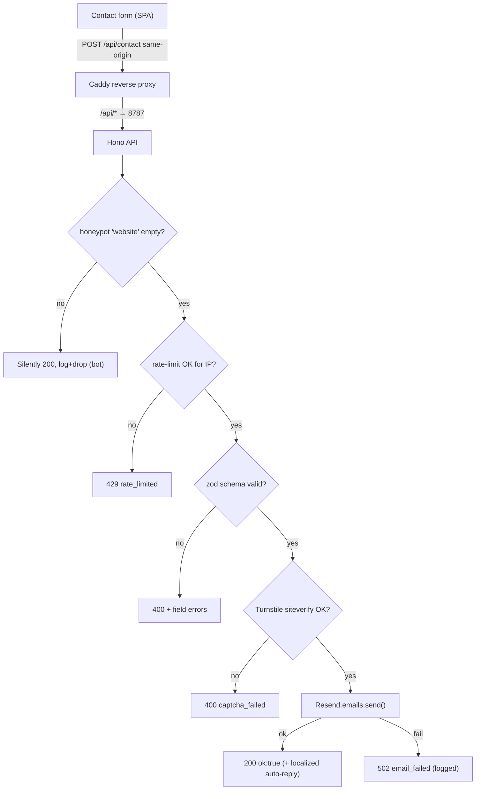

# Contact Backend

A **real, self-hosted** contact form — not a `mailto:` link. **Decision: a tiny Hono API on Node, in its own container, that validates with zod, sends via Resend (SMTP fallback), and is guarded by honeypot + Cloudflare Turnstile + rate-limit.** The SPA calls it **same-origin** through the Caddy reverse proxy. Rationale/alternatives in [[ADR-007 — Contact Form Backend]]; deployment in [[VPS Deployment Plan]]; the form UI is [[Page — Contact]].

> [!decision] Self-hosted Hono → Resend, behind Turnstile
> Jeronimo already runs a VPS ([[ADR-008 — Deployment Target (VPS)]]), so a tiny first-party API keeps contact data on his own box — **no vendor lock-in**, costs nothing, fits the "full control" stance of [[Vision & Purpose]]. Hono is TypeScript-first, ~4–5× faster than Express, with built-in CORS/validation. **Web3Forms** (or Formspree) is the documented fallback if we ever want zero backend.

## Service shape

```text
server/contact-api/
├─ package.json          # hono, @hono/node-server, @hono/zod-validator, zod, resend
├─ src/index.ts          # Hono app: GET /healthz, POST /api/contact
├─ src/email.ts          # Resend send (SMTP fallback via nodemailer)
├─ src/turnstile.ts      # server-side siteverify
├─ src/rateLimit.ts      # IP-based limiter
└─ Dockerfile            # node:slim, runs on $PORT (e.g. 8787)
```

A single deployable, isolated from the SPA build (see [[Project Structure]]). Listens on an internal port; **never** exposed directly — Caddy proxies to it.

## Endpoint contract

`POST /api/contact` — JSON body:

| Field | Type | Rule |
|---|---|---|
| `name` | string | 1–80 chars, trimmed |
| `email` | string | valid email, ≤120 chars |
| `message` | string | 10–4000 chars |
| `website` | string | **honeypot** — must be empty; if filled → silently 200, drop |
| `turnstileToken` | string | required; verified server-side |
| `locale` | `"en" \| "es"` | for localized auto-reply / labels |

Validated with `zod` via `@hono/zod-validator`. Responses: `200 {ok:true}`, `400 {ok:false,errors}`, `429 {ok:false,error:"rate_limited"}`, `502 {ok:false,error:"email_failed"}`.

## Request flow



## Spam defense (layered)

> [!warning] Honeypots alone are no longer enough
> LLM-generated spam fills naive honeypots. The real gate is **Cloudflare Turnstile** (free, privacy-friendly, no puzzle), verified **server-side** via `siteverify`. We layer three cheap defenses:

1. **Honeypot** `website` field — hidden via CSS, `aria-hidden`, `tabindex="-1"`; if filled, return a fake `200` and drop. Catches dumb bots with zero UX cost.
2. **Cloudflare Turnstile** — widget on the form issues a token; the API calls `https://challenges.cloudflare.com/turnstile/v0/siteverify` with the **secret** and the token. Reject on failure.
3. **Rate-limit** — IP-based via `@hono-rate-limiter` (e.g. 5 requests / 10 min / IP). Behind Caddy, read the client IP from the proxy header Caddy sets, not the socket.

## Email delivery

- **Primary: Resend** (`resend` SDK) — clean API, generous free tier, strong deliverability. One verified sending domain + DKIM/SPF/DMARC records (see [[Domain, DNS & TLS]]).
- **Fallback: SMTP via `nodemailer`** — full control if we ever drop Resend, but then *we* own SPF/DKIM/deliverability.
- Send **two** messages: the notification to Jeronimo, and an optional **localized auto-reply** to the sender (EN/ES via `locale`).
- Wrap sends in try/catch → `502` + structured log on failure; **never** leak provider errors to the client.

## Same-origin via reverse proxy

The SPA and API share an origin so the browser sends a **same-origin** request — no CORS preflight, no exposed cross-origin API.

```caddyfile
# Caddyfile (sketch) — see [[VPS Deployment Plan]]
example.com {
  encode zstd gzip
  handle /api/* {
    reverse_proxy contact-api:8787
  }
  handle {
    root * /srv/dist
    try_files {path} /index.html
    file_server
  }
}
```

> [!tip] Why same-origin beats a separate API subdomain
> No CORS config, no preflight latency, and the honeypot/Turnstile flow stays simple. The API container is only reachable through Caddy on the Compose network — it has no public port. This also means [[Performance Budget|INP]] isn't hurt by a cross-origin handshake.

## Env / secrets

Never commit secrets. Inject via Compose env / VPS secret store; the API reads `process.env`:

| Var | Purpose |
|---|---|
| `RESEND_API_KEY` | Email send |
| `CONTACT_TO` | Jeronimo's inbox (`jbetancur@idtsas.com`) |
| `CONTACT_FROM` | Verified Resend sender domain |
| `TURNSTILE_SECRET` | Server-side siteverify |
| `RATE_LIMIT_MAX` / `RATE_LIMIT_WINDOW` | Limiter tuning |
| `PORT` | Internal listen port (e.g. 8787) |

The frontend only needs the **public** `VITE_TURNSTILE_SITE_KEY` (safe to ship). See [[CI-CD Pipeline]] and [[Observability & Backups]] for secret rotation/logging.

## How the SPA calls it

`routes/Contact.tsx` (see [[Page — Contact]]):

1. Render fields + the hidden honeypot + the Turnstile widget.
2. Client-side validate (mirror the zod rules) for instant feedback — but the server re-validates (never trust the client).
3. `fetch("/api/contact", { method: "POST", body: JSON.stringify(...) })`.
4. Map responses to **localized** UI states: success ("Message sent ✓"), field errors (`400`), "too many tries" (`429`), "something went wrong, email me directly" (`502`).
5. Announce status changes via an `aria-live="polite"` region — see [[Accessibility & SEO]].

## Error handling & resilience

- All failures return a friendly, **localized** message; the raw error is logged server-side only.
- Provide a **graceful fallback**: on `502`, surface Jeronimo's email so the user is never stranded.
- `GET /healthz` for Caddy/Compose health checks ([[VPS Deployment Plan]]).
- Set request body size limit (4 KB-ish) to blunt abuse.

## Open questions

- [ ] Persist submissions (SQLite/log) for an audit trail, or fire-and-forget email only? Lean: email + structured log, no DB for v1.
- [ ] Monorepo vs separate repo for `server/contact-api` — affects [[CI-CD Pipeline]]. (Mirror the call in [[Project Structure]].)
- [ ] Turnstile in **invisible** vs **managed** mode — start managed, downgrade to invisible if friction is low.

## See also

- [[ADR-007 — Contact Form Backend]] · [[VPS Deployment Plan]] · [[Page — Contact]]
- [[Domain, DNS & TLS]] · [[CI-CD Pipeline]] · [[Observability & Backups]] · [[Accessibility & SEO]]
