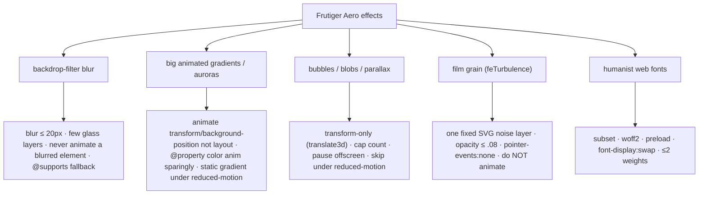

# Performance Budget

A Frutiger Aero site is, by definition, **effects-heavy** — frosted glass, animated auroras, bubbles, grain, gradients. This note sets hard budgets and pairs every Aero risk with a concrete mitigation, so spectacle never costs us Core Web Vitals. Targets feed [[Success Criteria]]; visual techniques come from [[Glass, Gloss & Depth]] and [[Color & Gradients]].

> [!important] Spectacle and speed are both north stars
> [[Vision & Purpose]] makes *delight* co-equal with *identity* — but a janky glassy page reads as **un-crafted**, which betrays the "craft-as-statement" goal. Performance here is an *aesthetic* requirement, not a compromise against it.

## Core Web Vitals targets (2026)

| Metric | Target | Notes |
|---|---|---|
| **LCP** (Largest Contentful Paint) | < 2.5 s | Hero glass panel / heading is the LCP element — keep it cheap |
| **INP** (Interaction to Next Paint) | < 200 ms | The FID successor; main-thread discipline (no heavy JS on interaction) |
| **CLS** (Cumulative Layout Shift) | < 0.1 | Reserve image dims, preload fonts, no layout-shifting blobs |
| **TTFB** | < 0.8 s | Static files from Caddy on the VPS; trivial if assets are small |

## Resource budgets

| Budget | Target | Enforcement |
|---|---|---|
| Initial JS (gzip) | **< 150 KB** | Route-level `lazy()` ([[Routing]]); shell = router + i18n + layout only |
| Initial CSS (gzip) | < 30 KB | Tailwind v4 emits only used utilities; audit the Aero layer |
| Hero/LCP image | < 150 KB | AVIF/WebP, responsive `srcset` |
| Web font payload | < 100 KB | Subset, `woff2`, ≤2 weights, `font-display: swap` |
| Total transfer (first view) | < 600 KB | Lighthouse + a CI bundle-size gate |

> [!note] Lazy everything non-critical
> Every page route, every blog post body, every heavy Aero scene (canvas bubbles, WebGL caustics, lens flare) is a separate chunk. The first paint loads the shell + the route the user landed on — nothing more. See [[Routing]] and [[Blog Content Pipeline]].

## Aero-specific risks → mitigations

### `backdrop-filter` (the biggest risk)
- **GPU-heavy.** Cap blur at **≤ 20px**, limit the *count* of simultaneous glass layers, and **never animate** a blurred element (animating blur forces re-rasterization every frame → INP/jank).
- Provide a **solid fallback** with `@supports not (backdrop-filter: blur(1px)) { .glass { background: rgba(...,0.9); } }` so unsupported/low-power devices get an opaque tint instead of unreadable text.
- Use `will-change` **sparingly** — only on elements that actually animate; leaving it on permanently wastes GPU memory. See [[Glass, Gloss & Depth]].

### Animated gradients / auroras
- Prefer 2–4 absolutely-positioned blurred blobs drifting via `transform`/`background-position` over repainting huge gradients.
- Use registered `@property` color animation **sparingly** (it's lovely but can be expensive).
- Under `prefers-reduced-motion`, collapse to a **static** gradient — no animation. See [[Color & Gradients]] and [[Motion & Animation]].

### Bubbles / blobs / parallax
- Animate **`transform` only** (`translate3d`), never `top`/`left`/`width` (those trigger layout/paint thrash on mobile).
- Cap the live element count; **pause** offscreen elements (IntersectionObserver) and **skip entirely** under reduced-motion.
- Heavy hero scenes are lazy-loaded so they never block LCP.

### Film grain / noise
- One **fixed**, non-animated SVG `feTurbulence` overlay; `opacity ≤ 0.08`, `pointer-events: none`, `mix-blend-mode: overlay`.
- Do **not** animate grain. Exclude from reduced-data contexts. See [[Imagery & Motifs]].

### Fonts
- Humanist faces (Source Sans 3 / Hind / Open Sans per [[Typography]]) — **subset** to used glyphs (incl. ES accents), serve **woff2**, **preload** the LCP weight, `font-display: swap`, keep to **≤ 2 weights**. Prevents FOIT and protects CLS.

## Build & delivery levers

- **Vite 8 / Rolldown** tree-shakes and code-splits; enable Brotli/zstd at Caddy (`encode zstd gzip`).
- **SSG** (`vite-react-ssg`) ships real HTML → fast FCP/LCP without waiting on JS hydration ([[Accessibility & SEO]]).
- **Image strategy:** AVIF→WebP→fallback, explicit `width`/`height`, lazy-load below-the-fold, precomputed OG PNGs (no runtime image gen). ([[Blog Content Pipeline]])
- **Cache headers** at Caddy: long-lived immutable for hashed assets, short for `index.html`.

## Lighthouse goals

> [!tip] Targets, measured in CI
> Run Lighthouse (mobile, throttled) in [[CI-CD Pipeline]] and gate merges on:
> - **Performance ≥ 90**
> - **Accessibility = 100** (mandatory — see [[Accessibility & SEO]])
> - **Best Practices ≥ 95**
> - **SEO ≥ 95**
> Test the **glassiest** page (hero + auroras + grain), not just a bare route — that's where budgets break.

## Verification checklist

- [ ] CI bundle-size gate on initial JS (< 150 KB gzip).
- [ ] Lighthouse CI on Home + a blog post, mobile profile.
- [ ] Manual INP check: open the menu / submit the contact form on a mid-tier phone, confirm < 200 ms.
- [ ] `prefers-reduced-motion` smoke test: all auroras/bubbles/parallax static; page still beautiful.
- [ ] `@supports not (backdrop-filter)` path verified (forced via devtools) — text stays readable.
- [ ] Font preload + `swap` confirmed; no FOIT, CLS < 0.1.

## Open questions

- [ ] Self-host fonts vs Google Fonts CDN — lean **self-host** (privacy, no extra DNS/connection; fits VPS control).
- [ ] WebGL water caustics on the hero — gorgeous but budget-risky. Prototype and measure INP/LCP before committing; gate behind reduced-motion + a static fallback. ([[Imagery & Motifs]])

## See also

- [[Success Criteria]] · [[Frutiger Aero — Design Language]] · [[Glass, Gloss & Depth]]
- [[Color & Gradients]] · [[Motion & Animation]] · [[Typography]] · [[Accessibility & SEO]] · [[CI-CD Pipeline]]
