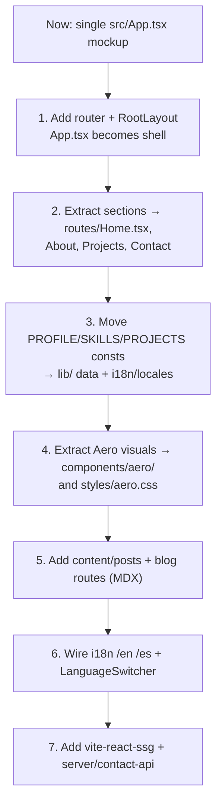

# Project Structure

The proposed `src/` (and `server/`) layout for the **grown** app — how the single-file `src/App.tsx` mockup becomes a bilingual, multi-page, blog-driven Frutiger Aero site. Opinionated and concrete: a developer should be able to scaffold from this directly. Pairs with [[Tech Stack]], [[Routing]], and [[Blog Content Pipeline]].

> [!note] Starting point, not a constraint
> Today the repo is `src/App.tsx` (placeholder mockup), `src/main.tsx`, `src/index.css`, `index.html`. Per the brief this single file is a **starting point to be refactored**, not something to preserve. The tree below is the target.

## Guiding principles

- **Feature-first where it pays, layer-first where it's shared.** Pages/routes are organized by feature; cross-cutting primitives (`ui`, `aero`, `lib`) are shared layers.
- **Separate "neutral UI" from "Aero spectacle."** `components/ui/` = accessible, structural primitives (Button, Field, Dialog). `components/aero/` = the Frutiger Aero visual layer (GlassPanel, AquaButton, AuroraBackground, Bubbles, GrainOverlay). This keeps the [[Component Visual Library]] mapping clean and lets us swap visuals without touching logic.
- **Content is data.** Blog posts (`content/posts/`) and locale messages (`i18n/locales/`) are plain files discovered at build time, not hardcoded.
- **The contact API is isolated.** `server/contact-api/` is its own deployable (own `package.json` / Dockerfile) — see [[Contact Backend]].

## Proposed tree

```text
portfolio/
├─ index.html                  # lang set dynamically; theme-no-flash inline script
├─ vite.config.ts              # @vitejs/plugin-react, @tailwindcss/vite, @mdx-js/rollup, vite-react-ssg
├─ package.json
├─ src/
│  ├─ main.tsx                 # entry → createRoot / ssg entry
│  ├─ App.tsx                  # shell only: providers + <RouterProvider> (no page markup)
│  ├─ routes/                  # route modules (lazy) — see [[Routing]]
│  │  ├─ index.tsx             # route table / createBrowserRouter
│  │  ├─ RootLayout.tsx        # <html lang>, nav, footer, theme + i18n providers, AuroraBackground
│  │  ├─ Home.tsx
│  │  ├─ About.tsx
│  │  ├─ Projects.tsx
│  │  ├─ Contact.tsx
│  │  ├─ blog/
│  │  │  ├─ BlogIndex.tsx      # lists posts for current locale
│  │  │  └─ BlogPost.tsx       # renders one MDX post
│  │  └─ NotFound.tsx          # 404
│  ├─ components/
│  │  ├─ ui/                   # neutral, accessible primitives
│  │  │  ├─ Button.tsx
│  │  │  ├─ Field.tsx
│  │  │  ├─ Dialog.tsx
│  │  │  ├─ ThemeToggle.tsx
│  │  │  └─ LanguageSwitcher.tsx
│  │  └─ aero/                 # Frutiger Aero spectacle layer
│  │     ├─ GlassPanel.tsx
│  │     ├─ AquaButton.tsx
│  │     ├─ AuroraBackground.tsx
│  │     ├─ Bubbles.tsx        # parallax floating bubbles (canvas/SVG)
│  │     ├─ GrainOverlay.tsx
│  │     └─ LensFlare.tsx
│  ├─ content/
│  │  └─ posts/                # dev-authored MDX — see [[Blog Content Pipeline]]
│  │     ├─ hello-world.en.mdx
│  │     ├─ hello-world.es.mdx
│  │     └─ ...
│  ├─ i18n/
│  │  ├─ config.ts             # react-i18next init (or Paraglide setup)
│  │  ├─ index.ts              # useTranslation re-export, helpers
│  │  └─ locales/
│  │     ├─ en/common.json
│  │     ├─ en/home.json
│  │     ├─ es/common.json
│  │     └─ es/home.json
│  ├─ lib/                     # framework-agnostic helpers
│  │  ├─ posts.ts              # import.meta.glob index + types
│  │  ├─ seo.ts                # <Head> helpers, hreflang, OG
│  │  ├─ locale.ts             # detect/persist/switch locale
│  │  └─ motion.ts             # shared variants + reduced-motion guard
│  ├─ styles/
│  │  ├─ index.css             # @import "tailwindcss"; @theme tokens
│  │  ├─ aero.css              # .glass / .aqua / aurora / @property color anims
│  │  └─ grain.css             # feTurbulence noise overlay
│  ├─ types/
│  │  ├─ mdx.d.ts              # *.mdx module + frontmatter types
│  │  └─ env.d.ts
│  └─ assets/                  # static imports (svg, optimized images)
├─ public/                     # favicon.svg, robots.txt, og/ (precomputed)
└─ server/
   └─ contact-api/             # isolated deployable — see [[Contact Backend]]
      ├─ package.json
      ├─ src/index.ts          # Hono app, /api/contact
      └─ Dockerfile
```

> [!tip] Why split `styles/index.css` from `styles/aero.css`?
> `index.css` holds the Tailwind import + `@theme` token registration (consumed by the whole app and by [[Design Tokens]]). `aero.css` is the **bespoke visual layer** — multi-stop gradients, `@property --angle`, `feTurbulence`. Splitting keeps the token surface reviewable and lets us audit Aero CSS for the [[Performance Budget]] `backdrop-filter` discipline in one place.

## Migration path from `src/App.tsx`

The current mockup holds `PROFILE / SKILLS / PROJECTS / NAV` consts plus inline markup. Migrate incrementally so the site is never broken:



- [ ] **Step 1** — install `react-router`, create `routes/index.tsx` + `RootLayout.tsx`; `App.tsx` renders only providers + `<RouterProvider>`. ([[Routing]])
- [ ] **Step 2** — cut the mockup's sections into `Home/About/Projects/Contact` route modules; each becomes lazy-loaded.
- [ ] **Step 3** — relocate the `PROFILE/SKILLS/PROJECTS/NAV` consts into typed `lib/` data and locale JSON; strings move to `i18n/locales`. ([[i18n Architecture]])
- [ ] **Step 4** — pull the dark-neutral + indigo mockup styling toward the Aero token system ([[Design Tokens]]) and extract reusable glass/aqua into `components/aero/`.
- [ ] **Step 5** — stand up `content/posts/` + `blog/BlogIndex.tsx` + `blog/BlogPost.tsx`. ([[Blog Content Pipeline]])
- [ ] **Step 6** — add the locale path prefix and switcher.
- [ ] **Step 7** — layer in SSG + the contact API container.

## Naming conventions

| Kind | Convention | Example |
|---|---|---|
| React components / route modules | `PascalCase.tsx`, one component per file | `GlassPanel.tsx`, `BlogPost.tsx` |
| Hooks | `useX.ts` (camelCase, `use` prefix) | `useReducedMotionGuard.ts` |
| Non-component modules / utils | `camelCase.ts` | `lib/posts.ts`, `lib/seo.ts` |
| MDX posts | `kebab-slug.<lang>.mdx` | `hello-world.en.mdx` |
| Locale namespaces | `<lang>/<namespace>.json` | `en/home.json` |
| CSS | `kebab-case.css` | `aero.css`, `grain.css` |
| Aero CSS classes | `.kebab` semantic names, not utility-ish | `.glass`, `.aqua`, `.aurora` |
| Type-only files | `*.d.ts` in `types/` | `types/mdx.d.ts` |

> [!warning] Keep `ui` and `aero` directories honest
> If a component in `components/ui/` reaches for `backdrop-filter` or a multi-stop gradient, it belongs in `components/aero/`. The contract: a screen reader / keyboard user gets a fully working experience from `ui` alone; `aero` is the gloss on top. This is what makes the [[Accessibility & SEO]] checklist tractable.

## Open questions

- [ ] Monorepo (`server/` in this repo) vs separate API repo — affects [[CI-CD Pipeline]]. Leaning monorepo for v1 (single deploy unit, shared types).
- [ ] Do route modules co-locate their `.test.tsx` and section-specific Aero components, or stay flat? Revisit once the blog exists.

## See also

- [[Tech Stack]] · [[Routing]] · [[i18n Architecture]] · [[Blog Content Pipeline]] · [[Contact Backend]]
- [[Component Visual Library]] · [[Design Tokens]] · [[Accessibility & SEO]]
