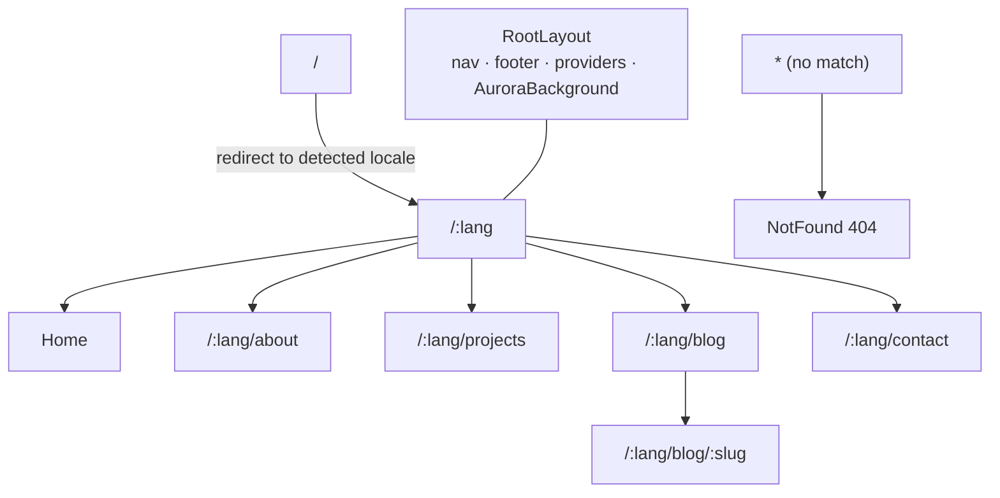
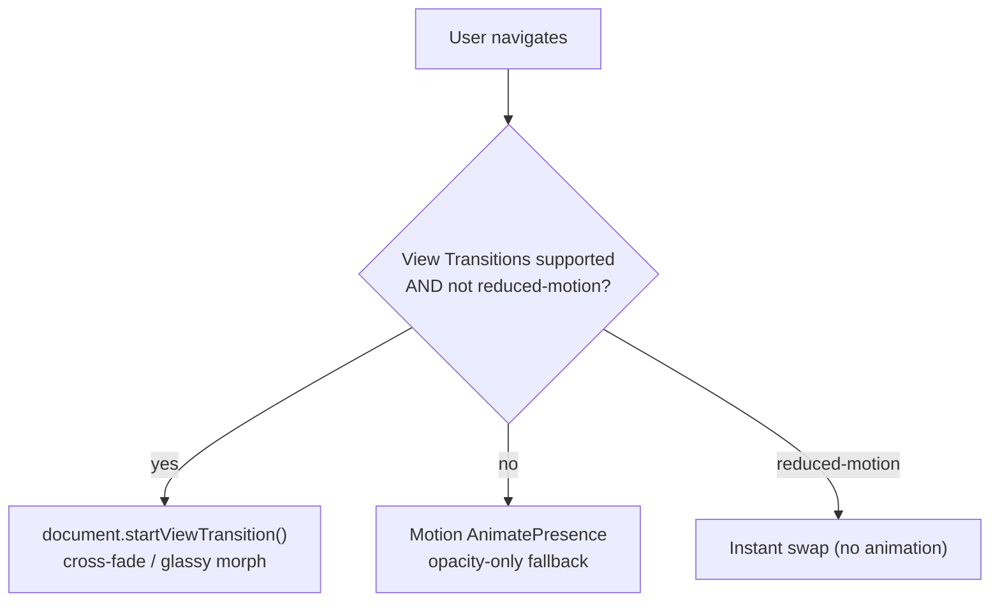

# Routing

Routing architecture for the bilingual, blog-driven SPA. **Decision: React Router v7 in library mode**, with a locale path prefix (`/:lang`), lazy route modules, native View Transitions for page changes, and SSG-friendly route definitions. Full rationale and alternatives in [[ADR-003 — Routing Library]]; the URL map mirrors [[Sitemap]].

> [!decision] React Router v7 (library mode)
> Chosen over TanStack Router. Nested routing makes `/:lang/blog/:slug` trivial, the ecosystem is huge, and there is a clean upgrade path to prerender/SSG **without leaving the library**. TanStack's superior param/search type-safety is a real edge but negligible at this scale (a handful of routes, one dynamic param). See [[ADR-003 — Routing Library]].

## Route table

Every user-facing page is locale-prefixed. `/` (bare root) redirects to the detected/persisted locale — see [[i18n Architecture]].

| Path | Module | Purpose | Notes |
|---|---|---|---|
| `/` | redirect | → `/:lang` | Detect locale (cookie → `navigator.language` → `en`) |
| `/:lang` | `routes/Home.tsx` | Landing / hero | `:lang` ∈ `en \| es` (validated) |
| `/:lang/about` | `routes/About.tsx` | [[Page — About]] | |
| `/:lang/projects` | `routes/Projects.tsx` | [[Page — Projects]] | May link out; no per-project sub-pages in v1 |
| `/:lang/blog` | `routes/blog/BlogIndex.tsx` | Post list for that locale | [[Page — Blog]] |
| `/:lang/blog/:slug` | `routes/blog/BlogPost.tsx` | One MDX post | Slug validated against post index ([[Blog Content Pipeline]]) |
| `/:lang/contact` | `routes/Contact.tsx` | [[Page — Contact]] | Posts to Hono API ([[Contact Backend]]) |
| `*` | `routes/NotFound.tsx` | 404 | Glassy Aero "lost in the clouds" page |



## Route definition shape

A single `createBrowserRouter` in `routes/index.tsx`. The `:lang` segment is owned by `RootLayout`, which sets `<html lang>`, syncs i18n, and wraps every child in the Aero shell.

```tsx
// routes/index.tsx (sketch)
const router = createBrowserRouter([
  { path: "/", loader: () => redirect(`/${detectLocale()}`) },
  {
    path: "/:lang",
    Component: RootLayout,          // validates :lang, sets <html lang>, syncs i18n
    children: [
      { index: true, lazy: () => import("./Home") },
      { path: "about", lazy: () => import("./About") },
      { path: "projects", lazy: () => import("./Projects") },
      { path: "blog", lazy: () => import("./blog/BlogIndex") },
      { path: "blog/:slug", lazy: () => import("./blog/BlogPost") },
      { path: "contact", lazy: () => import("./Contact") },
      { path: "*", lazy: () => import("./NotFound") },
    ],
  },
]);
```

> [!important] `:lang` validation
> `RootLayout` must reject any `:lang` not in `["en","es"]` — otherwise `/foo/blog` 404s as a *language* error rather than a route error. On invalid lang, redirect to `/${defaultLocale}${restOfPath}`. This guard is also where `<html lang={lang}>` and `document.documentElement.lang` get set for [[Accessibility & SEO]] hreflang correctness.

## Code-splitting & lazy loading

- **Every page route uses `lazy: () => import(...)`** so the initial bundle is the shell (router + i18n + layout + Aero background) only. This protects the [[Performance Budget]] JS budget (~<150 KB gzip initial).
- **Blog posts** are MDX modules; `BlogPost.tsx` dynamically imports the matched post module rather than eager-loading all posts. The post *index* (titles/dates/metadata) is eager (small); the post *bodies* are lazy. See [[Blog Content Pipeline]].
- **Heavy Aero scenes** (canvas bubbles, WebGL caustics, lens flares) are lazy + `Suspense`-wrapped and skipped entirely under `prefers-reduced-motion` — they never block first paint.

## Scroll restoration

Use React Router's `<ScrollRestoration />` in `RootLayout` so back/forward restores scroll position, while *new* navigations scroll to top. Exception: **same-page anchor / locale-switch navigations must preserve scroll** — the [[i18n Architecture|language switcher]] swaps only the `:lang` segment and keeps the user where they are. Implement a `getKey` that ignores the `:lang` prefix so an EN↔ES swap is treated as the *same* scroll key.

## Page transitions (View Transitions API)



- React Router v7 supports opting routes into the **View Transitions API** (`<Link viewTransition>` / `useViewTransitionState`). Native, zero-JS, GPU-cheap. Baseline Newly Available (Chrome/Edge 111+, FF 133+, Safari 18+).
- **Fallback:** where unsupported, Motion's `AnimatePresence` does an opacity-only cross-fade.
- **Reduced motion:** when `prefers-reduced-motion: reduce`, **all** transitions collapse to an instant swap — gated through the shared guard in `lib/motion.ts`. This is mandatory per [[Frutiger Aero — Design Language]] and [[Accessibility & SEO]]. See [[Motion & Animation]].

> [!tip] Name view-transition elements deliberately
> Give the hero panel and the post title a stable `view-transition-name` so a card on `/blog` morphs into the post header on `/blog/:slug` — a signature Aero "liquid glass" moment, on-brand for [[Vision & Purpose]]. Keep named transitions few to stay within the [[Performance Budget]].

## 404 handling

The `*` catch-all renders a deliberately *delightful* Aero 404 (drifting bubbles, "lost in the clouds", a gel button back to `/:lang`). It still returns a soft 404 semantically (and a real `404` status from the SSG/Caddy layer for crawlers — see [[Accessibility & SEO]]).

## SSG interaction

`vite-react-ssg` consumes the same route definitions to **prerender** each static path (`/en`, `/es`, `/en/about`, every `/en/blog/:slug`, …) into real HTML. Dynamic blog paths come from the post index ([[Blog Content Pipeline]]). This is what makes the SPA crawlable; details in [[Accessibility & SEO]] and [[Performance Budget]].

## Open questions

- [ ] Trailing-slash policy (`/en/` vs `/en`) — pick one and enforce at Caddy + canonical tags.
- [ ] Should `/projects` deep-links to external case studies open in-tab or new-tab? (UX, not routing — flag to [[Navigation & Flows]].)

## See also

- [[ADR-003 — Routing Library]] · [[Sitemap]] · [[Navigation & Flows]]
- [[i18n Architecture]] · [[Blog Content Pipeline]] · [[Motion & Animation]] · [[Accessibility & SEO]]
