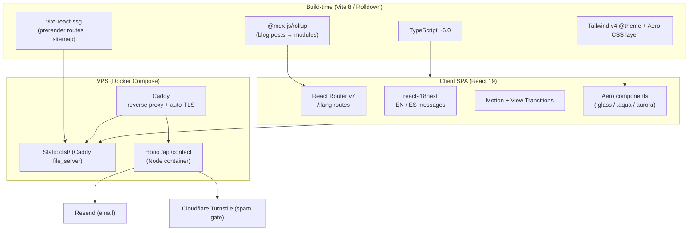

# Tech Stack

The definitive map of every technology in this portfolio — what is **committed today**, what is **planned**, and *why* each piece earns its place. This note is the hub: every row links to the [[ADR Index|ADR]] that decided it. Ground truth for versions is `package.json`; design rationale is grounded in the [[Frutiger Aero — Design Language]] brief and the 2026 tooling digest.

> [!important] North stars override convenience
> Per [[Vision & Purpose]], this site optimizes for **identity expression** + **Frutiger Aero spectacle**, not recruiter scan-speed. Every tool below is judged on whether it lets us ship a *beautiful, glassy, performant* artifact — see [[Success Criteria]] and [[Performance Budget]].

## Current stack (committed — do not contradict)

These are the exact versions in `package.json` as of 2026-06-15. The repo is a clean React 19 + Vite 8 + Tailwind v4 starter with a single-file mockup in `src/App.tsx`.

| Layer | Tool | Version | What it does | Why / decision |
|---|---|---|---|---|
| UI runtime | React | `^19.2.6` | Component model, concurrent rendering, `use()`/Actions | Industry default, already in repo. See [[ADR-001 — Framework & Build Tool]] |
| DOM bindings | react-dom | `^19.2.6` | React → DOM renderer | Pairs with React 19 |
| Build / dev server | Vite | `^8.0.12` | Rolldown (Rust) bundler, HMR, ESM dev server | 10–30× faster builds vs esbuild-era; native plugin API for MDX + SSG. [[ADR-001 — Framework & Build Tool]] |
| React plugin | @vitejs/plugin-react | `^6.0.1` | Fast Refresh, JSX transform | Required for React + Vite |
| Language | TypeScript | `~6.0.2` | Strict typing, project references (`tsc -b`) | Stricter `--strict` defaults in TS 6; catches Aero CSS-prop typos early |
| Styling engine | Tailwind CSS | `^4.3.1` | Utility CSS, CSS-first `@theme` | v4 = no `tailwind.config.js`; tokens live in `index.css`. [[ADR-002 — Styling Approach]] |
| Tailwind/Vite glue | @tailwindcss/vite | `^4.3.1` | First-party Vite plugin for Tailwind v4 | Replaces PostCSS pipeline |
| Lint | ESLint | `^10.3.0` (flat config) | Static analysis | `eslint.config.js` flat config |
| Lint (TS) | typescript-eslint | `^8.59.2` | TS-aware rules | Pairs with ESLint 10 |
| Lint (React) | eslint-plugin-react-hooks `^7.1.1`, eslint-plugin-react-refresh `^0.5.2` | — | Hooks + Fast Refresh rules | Catches stale-closure / HMR bugs |
| Commit hygiene | Husky `^9.1.7` + commitlint `^21` + commitizen `^4.3.2` | — | Conventional Commits enforced by `commit-msg` hook | Commit via `npm run commit`. [[Tooling Notes]] |

> [!note] Tailwind v4 CSS-first config
> There is **no** `tailwind.config.js`. Design tokens are registered in `src/index.css` with `@import "tailwindcss";` then `@theme { --font-sans: ...; --color-sky: ...; }`. The [[Design Tokens]] note owns the canonical token list; the Aero utility layer (`.glass`, `.aqua`, aurora backgrounds) lives in a hand-rolled CSS layer per [[ADR-002 — Styling Approach]].

## Planned additions (not yet installed)

Everything below is *decided in principle* (see linked ADRs) but **not in `package.json` yet**. Install order roughly follows the [[Roadmap & Phases]].

| Concern | Recommended | Package(s) | Alternative | ADR |
|---|---|---|---|---|
| Routing | **React Router v7** (library mode) | `react-router` (~v7.8+) | TanStack Router | [[ADR-003 — Routing Library]] / [[Routing]] |
| i18n | **react-i18next** (pragmatic) | `i18next`, `react-i18next`, `i18next-browser-languagedetector` | Paraglide JS (inlang) — type-safe, tree-shaken | [[ADR-004 — i18n Library]] / [[i18n Architecture]] |
| Blog content | **Local MDX** | `@mdx-js/rollup`, `remark-frontmatter`, `remark-mdx-frontmatter`, `remark-gfm`, `rehype-pretty-code`/`shiki` | Markdown + `gray-matter` | [[ADR-005 — Blog Content Source]] / [[Blog Content Pipeline]] |
| Animation | **Motion** + native View Transitions | `motion` (v12+) | GSAP v3 (scroll storytelling) | [[ADR-006 — Animation Library]] / [[Motion & Animation]] |
| Contact API | **Hono** (self-hosted) → Resend | `hono`, `@hono/node-server`, `@hono/zod-validator`, `zod`, `resend`, `@hono-rate-limiter` | Web3Forms (no backend) | [[ADR-007 — Contact Form Backend]] / [[Contact Backend]] |
| SEO / prerender | **vite-react-ssg** | `vite-react-ssg` | Vike (vite-plugin-ssr successor) | [[Accessibility & SEO]] |
| Deploy | Docker multi-stage + **Caddy** + Compose | — | Coolify (PaaS-on-VPS) | [[ADR-008 — Deployment Target (VPS)]] / [[VPS Deployment Plan]] |
| Theming | CSS custom props + Tailwind `dark:` variant | — | — | [[ADR-009 — Theming Strategy]] / [[Theming — Light & Dark]] |

> [!decision] react-i18next vs Paraglide
> The project brief recommends **react-i18next** as the pragmatic default (mature ecosystem) while the tooling digest argues **Paraglide JS** wins on bundle size and type-safety for a 2-locale static site. We default to **react-i18next** for ecosystem maturity but treat the choice as *revisitable* — see the live comparison in [[i18n Architecture]] and [[ADR-004 — i18n Library]]. If the [[Performance Budget]] proves tight, Paraglide is the escape hatch.

## Architecture layers

The layering principle: **build-time does as much as possible** (typed routes, prerendered HTML, compiled MDX, tree-shaken CSS) so the **runtime stays small** (see [[Performance Budget]] JS budget). The only persistent server process is the Hono contact API — everything else is static files served by Caddy.

## What each piece buys us (rationale, not just facts)

- **Vite 8 / Rolldown** — the Rust bundler makes the dev loop instant even with heavy Aero CSS and many MDX posts; its plugin pipeline is what lets MDX, SSG, and Tailwind v4 coexist without ejecting.
- **Tailwind v4 + hand-rolled Aero layer** — utilities handle layout/spacing/responsive; the *glassmorphism, aqua gloss, auroras, grain* live in a deliberate CSS component layer because they are too bespoke (multi-stop gradients, `@property` color animation, `feTurbulence`) for utilities alone. See [[Glass, Gloss & Depth]] and [[Color & Gradients]].
- **React Router v7** — nested routing makes `/:lang/blog/:slug` trivial and gives a clean upgrade path to prerender without leaving the library. [[Routing]].
- **MDX** — lets blog posts embed live Aero components (an interactive bubble demo inside a post), which is squarely on-brand for a *craft-as-statement* portfolio. [[Blog Content Pipeline]].
- **Motion** — declarative spring micro-interactions with built-in `useReducedMotion()`, the accessibility gate the [[Frutiger Aero — Design Language]] brief demands.
- **Hono + Resend + Turnstile** — a tiny first-party API keeps contact data on Jeronimo's own VPS (no vendor lock-in), with a real spam gate. [[Contact Backend]].

## Open questions

- [ ] Lock react-i18next vs Paraglide before i18n implementation starts — gate on [[Performance Budget]] headroom.
- [ ] Confirm `vite-react-ssg` composes cleanly with `@mdx-js/rollup` + React Router v7 (prototype spike).
- [ ] Decide whether the contact API ships in the same repo (monorepo `server/`) or a sibling repo — see [[Project Structure]] and [[CI-CD Pipeline]].

## See also

- [[Project Structure]] · [[Routing]] · [[i18n Architecture]] · [[Blog Content Pipeline]] · [[Contact Backend]] · [[Performance Budget]] · [[Accessibility & SEO]]
- [[ADR Index]] · [[Roadmap & Phases]] · [[VPS Deployment Plan]]
