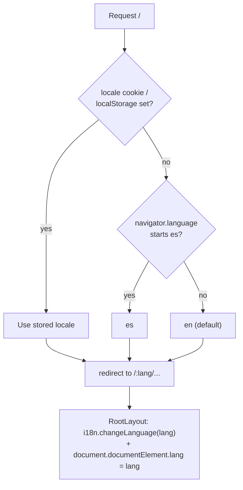

# i18n Architecture

The site is **bilingual English / Spanish** (a chosen v1 feature). This note designs the locale strategy: path-prefix routes, default detection, the language switcher, persistence, `<html lang>`, message file layout, translated blog posts, and SEO hreflang. Library decision lives in [[ADR-004 — i18n Library]]; routing mechanics in [[Routing]].

> [!decision] react-i18next (pragmatic default) — Paraglide as the escape hatch
> **react-i18next** is the recommended default: the most-installed React i18n stack, richest ecosystem (pluralization, interpolation, lazy namespace loading, browser language detection). Its costs — runtime weight (~205–422 KB unminified ecosystem footprint) and type-safety via manual declaration merging — are acceptable for a 2-locale site.
>
> **Paraglide JS (inlang)** is the modern alternative: compile-time, tree-shaken (~47–144 KB), every key a typed function, Vite-native, zero-runtime. If the [[Performance Budget]] gets tight or we want end-to-end type-safe messages, **switch to Paraglide**. Full comparison: [[ADR-004 — i18n Library]].

| Criterion | react-i18next | Paraglide JS |
|---|---|---|
| Bundle | runtime-heavy | compile-time, tree-shaken (smaller) |
| Type-safety | manual declaration merge | every message a typed fn |
| Ecosystem | largest | smaller, growing |
| Pluralization/ICU | mature | supported |
| Setup ceremony | low | low–medium (compiler step) |
| Fit for 2-locale static site | good | **excellent** |
| Verdict | **default** | **revisit if perf/types matter** |

## Locale strategy



- **Path prefix is the source of truth.** Every page is `/:lang/...` (see [[Routing]]). The URL — not a global state blob — determines the active language, so links, shares, and crawlers all carry the locale. `en` is the default; both locales are first-class.
- **Detection order:** persisted choice (cookie/localStorage) → `navigator.language` → `en` fallback. Detection only runs on the bare-root redirect; once inside `/:lang`, the prefix wins.
- **Persistence:** when the user switches, write the choice to `localStorage` **and** a cookie. The cookie matters for SSG/Caddy so a future server redirect can honor the preference without JS. Use `i18next-browser-languagedetector` configured with the cookie + localStorage order (or equivalent in Paraglide).
- **`<html lang>`:** `RootLayout` sets `document.documentElement.lang = lang` on every `:lang` change — required for screen readers and hreflang ([[Accessibility & SEO]]).

## Language switcher

The switcher does **not** reset the route — it swaps only the `:lang` segment of the *current* pathname and re-navigates, preserving the rest (including blog slug) and scroll position.

```text
/en/blog/hello-world   →  click ES  →  /es/blog/hello-world
/en/projects           →  click ES  →  /es/projects
```

> [!important] Slug parity for blog posts
> Swapping `/en/blog/:slug` ↔ `/es/blog/:slug` only works if both locale variants share a slug (or we maintain a slug map). We keep **slug parity**: `hello-world.en.mdx` and `hello-world.es.mdx` share the slug `hello-world`. If an ES translation doesn't exist yet, the switcher falls back to `/es/blog` (the index) rather than 404-ing. See [[Blog Content Pipeline]].

Implementation lives in `components/ui/LanguageSwitcher.tsx` with helpers in `lib/locale.ts` (see [[Project Structure]]).

## Message file layout

UI strings live as namespaced JSON under `src/i18n/locales/`. Namespaces are split by surface so route-level code-splitting can lazy-load only what a page needs.

```text
src/i18n/locales/
├─ en/
│  ├─ common.json      # nav, footer, buttons, aria-labels
│  ├─ home.json
│  ├─ about.json
│  ├─ projects.json
│  ├─ blog.json        # index labels: "Read more", dates, tags
│  └─ contact.json     # form labels, validation, success/error
└─ es/   (mirror of en/)
```

- **Keys are semantic, not English text:** `contact.form.submit`, not `"Send"`. Prevents drift when copy changes.
- **Interpolation/plurals** use the library's ICU-ish syntax: `blog.readingTime` → `"{{count}} min read"` / `"{{count}} min de lectura"`.
- **`aria-label`s and alt text are translated too** — they live in `common.json`. This is a hard requirement for [[Accessibility & SEO]].
- A tiny CI check (or lint rule) verifies **EN and ES key sets match** so no key is missing in one locale.

## Translating blog posts

Posts are **fully separate MDX files per locale**, not inline-translated:

```text
src/content/posts/hello-world.en.mdx
src/content/posts/hello-world.es.mdx
```

Each carries frontmatter (`title`, `date`, `lang`, `slug`, `description`, `og`). The post index (`lib/posts.ts`) groups by `slug` and filters by the active `lang`, so `/es/blog` lists only ES posts and the switcher can find the sibling. Untranslated posts simply don't appear in the other locale's index. Full pipeline in [[Blog Content Pipeline]].

## SEO: hreflang & canonical

For every prerendered page, emit reciprocal `hreflang` links plus `x-default`, and a self-canonical:

```html
<link rel="alternate" hreflang="en" href="https://example.com/en/about" />
<link rel="alternate" hreflang="es" href="https://example.com/es/about" />
<link rel="alternate" hreflang="x-default" href="https://example.com/en/about" />
<link rel="canonical" href="https://example.com/en/about" />
```

- Generated by `lib/seo.ts` and rendered through the SSG `<Head>` so crawlers see real tags ([[Accessibility & SEO]]).
- For blog posts, only emit the alternate for a locale **if that locale's variant exists** — never point hreflang at a 404.
- The `sitemap.xml` lists both locale URLs with `xhtml:link` alternates.

## Open questions

- [ ] Date/number formatting: use native `Intl.DateTimeFormat(lang)` (zero-dep) rather than a library — confirm both EN/ES render acceptably for blog dates.
- [ ] Lock react-i18next vs Paraglide before implementation — gate on [[Performance Budget]]. ([[ADR-004 — i18n Library]])
- [ ] Do we localize the **slug** itself (e.g. `/es/blog/hola-mundo`)? Default: **no** (shared slug) for switcher simplicity; revisit if SEO in ES wants localized slugs.

## See also

- [[ADR-004 — i18n Library]] · [[Routing]] · [[Blog Content Pipeline]]
- [[Accessibility & SEO]] · [[Project Structure]] · [[Performance Budget]]
