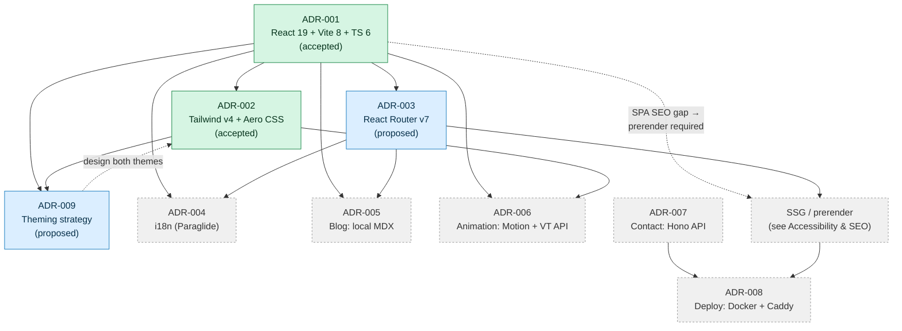

# ADR Index

The index of every **Architecture Decision Record** for Jeronimo's portfolio. An ADR captures one decision, the context that forced it, the options weighed, and the consequences we accept. ADRs are *append-only history*: we don't delete them, we supersede them.

> [!important]
> This portfolio is **craft-as-statement**, not a conversion funnel (see [[Vision & Purpose]]). Every decision here is judged against two co-equal north stars — **express identity** and **Frutiger Aero delight** — and against the [[Performance Budget]] / [[Accessibility & SEO]] guardrails. When a decision trades one off, the ADR says so out loud.

## How we use ADRs here

> [!decision]
> One decision per note. Status moves `proposed → accepted` (or `rejected`/`superseded`). We never rewrite a decided ADR's body to reflect a later change of mind — we write a *new* ADR that supersedes it and link both ways. This keeps the reasoning trail honest for a future self.

- **When to write one:** any choice that is expensive to reverse, shapes the architecture, or that future-me will ask "why did we do it *this* way?" — frameworks, routing, styling, i18n, content pipeline, animation, backend, deploy, theming.
- **When *not* to:** reversible, local, or obvious calls (file naming, a single utility, copy wording). Those live in the relevant `04 — Tech & Architecture` note, not here.
- **Shape:** every ADR follows [[ADR-000 — Template]] — Status · Context · Decision Drivers · Options (table) · Decision Tree (Mermaid) · Decision · Consequences · Links. Every ADR MUST carry at least one Mermaid diagram.
- **Statuses:** `proposed` (leaning, not built), `accepted` (committed / often already in repo), `rejected` (considered and declined), `superseded` (replaced by a newer ADR — link it).
- **Numbering:** zero-padded, monotonic, never reused. `ADR-000` is the template and is not a real decision.
- **Authority:** the ADR is the source of truth for *why*; the matching architecture note (e.g. [[Routing]], [[Theming — Light & Dark]]) is the source of truth for *how*. Keep them consistent.

## Register

| ID | Decision | Status | Summary |
|----|----------|--------|---------|
| [[ADR-000 — Template]] | ADR template | `accepted` | The reusable shape every other ADR follows. Not a real decision. |
| [[ADR-001 — Framework & Build Tool]] | React 19 + Vite 8 + TS 6 | `accepted` | Client-rendered React SPA on the Rolldown-powered Vite 8 toolchain, strict TS 6. Already in the repo. SEO gap is real and pushed to a build-time prerender (SSG) tracked in [[Accessibility & SEO]]. |
| [[ADR-002 — Styling Approach]] | Tailwind v4 + hand-rolled Aero CSS layer | `accepted` | Tailwind v4 CSS-first `@theme` for layout/utility velocity, plus a bespoke `.glass` / `.gel-button` / aurora component layer for the Frutiger Aero signature. No `tailwind.config.js`. |
| [[ADR-003 — Routing Library]] | React Router v7 (vs TanStack Router) | `proposed` | React Router v7 in library mode for `/:lang/blog/:slug` bilingual routing; TanStack Router considered for type-safety but rejected on ecosystem/upgrade-path grounds. |
| [[ADR-009 — Theming Strategy]] | CSS custom properties + Tailwind dark variant | `proposed` | Token-driven dual Aero themes (luminous "day/sky" + deep "ocean/aurora"), system default, persisted toggle, anti-FOUC inline head script. |

> [!note]
> ADR-004 ([[ADR-004 — i18n Library]]), ADR-005 ([[ADR-005 — Blog Content Source]]), ADR-006 ([[ADR-006 — Animation Library]]), ADR-007 ([[ADR-007 — Contact Form Backend]]) and ADR-008 ([[ADR-008 — Deployment Target (VPS)]]) are owned by other authoring clusters. This cluster (`author:adr-core`) owns 000, 001, 002, 003 and 009.

## How the decisions depend on each other

The framework choice is the root; everything else either builds on it or is constrained by it. The SEO gap from ADR-001 is what forces a prerender step and ripples into routing.

## Next actions

- [ ] Promote [[ADR-003 — Routing Library]] from `proposed` to `accepted` once the first `/:lang/blog/:slug` route is wired and confirmed against the [[i18n Architecture]].
- [ ] Confirm the prerender/SSG approach (vite-react-ssg vs Vike vs RR v7 prerender) in [[Accessibility & SEO]] — it is the open dependency dangling off [[ADR-001 — Framework & Build Tool]].
- [ ] Decide [[ADR-009 — Theming Strategy]] final status after the anti-FOUC inline script is implemented and verified against a real first paint.
- [ ] Keep this register in sync whenever any ADR's status changes.

## See also

- [[Tech Stack]] · [[Project Structure]] · [[Principles & Constraints]] · [[Success Criteria]]
- [[Performance Budget]] · [[Accessibility & SEO]]
- [[Roadmap & Phases]] · [[Definition of Done]]
