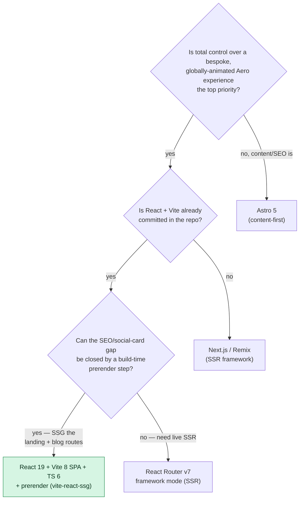

# ADR-001 — Framework & Build Tool

## Status

`accepted` — already committed to the repo (`react` & `react-dom` `^19.2.6`, `vite` `^8.0.12`, `@vitejs/plugin-react` `^6.0.1`, `typescript` `~6.0.2`). This ADR records the *why* after the fact; it is foundational and the root dependency of every other ADR in [[ADR Index]]. #decision

## Context

The portfolio is a **craft-as-statement** personal site (see [[Vision & Purpose]]), not a recruiter funnel. It needs to render a heavily bespoke, animated Frutiger Aero experience (glass, auroras, water motifs, gel controls), a bilingual EN/ES blog, a theme toggle, and a working contact form against a self-hosted VPS. The repo already ships a React 19 + Vite 8 + TS 6 toolchain (single `src/App.tsx` mockup, `@tailwindcss/vite`, ESLint 10 flat config, Husky + commitlint). The decision is whether to keep this client-rendered **React SPA on Vite**, or migrate to a meta-framework (Next.js / Remix) or a content-first framework (Astro).

Relevant 2026 facts (from the tooling digest):
- **Vite 8.0.x** ships the Rolldown (Rust) bundler — 10–30× faster builds, `@vitejs/plugin-react` v6.
- **React 19.2** is stable (Actions, `use`, improved Suspense).
- **Tailwind v4** is CSS-first and Vite-native, targeting Chrome 111+/Safari 16.4+/FF 128+ — already the styling baseline in [[ADR-002 — Styling Approach]].
- **TS 6** has stricter `--strict` defaults and faster project builds.

> [!important]
> The honest tension: a **plain Vite SPA renders an empty HTML shell**. Crawlers and social-card scrapers may see nothing meaningful, and `react-helmet`-style client-only meta updates are unreliable for OG/Twitter cards. For a public, content-bearing site with a blog this is a real SEO/social cost — see the mitigation below and [[Accessibility & SEO]].

## Decision drivers

1. **Maximum control over a bespoke animated experience** — this is craft-as-statement; we must not fight a framework's conventions to land glass/aurora/water motifs and custom motion.
2. **Already in the repo** — React 19 + Vite 8 + TS 6 is committed; switching has a real migration cost and zero added identity/delight value.
3. **Build speed & DX** — fast HMR and builds keep the iteration loop tight for a visually fiddly site (Vite 8 / Rolldown excels here).
4. **Stays on the [[Performance Budget]]** — small JS, route-level lazy loading, tiny Tailwind CSS.
5. **SEO/social cards for the blog** — a content site must be crawlable and produce correct OG cards. (This is the one driver the SPA does *not* satisfy natively → mitigated, not ignored.)
6. **No vendor lock-in / self-host friendliness** — output must be plain static assets servable by Caddy/nginx on the VPS ([[ADR-008 — Deployment Target (VPS)]]).

## Options considered

| Option | Pros | Cons | Verdict |
|--------|------|------|---------|
| **A — React 19 + Vite 8 SPA + TS 6** | Already in repo; total rendering control; fastest HMR/builds (Rolldown); plain static `dist/` → trivial self-host; no framework opinions to fight | Empty-shell SPA → weak SEO & social cards by default; client-only meta; needs a separate prerender step | ✅ **chosen** — control + zero migration; SEO handled by build-time prerender |
| B — Next.js 15 (App Router) | First-class SSR/SSG, metadata API, image optim, OG image route | Heavy; React Server Components + framework conventions fight our hand-rolled animation/glass layer; Node server or adapter to self-host; opinionated routing collides with our `/:lang` plan; overkill for a portfolio | ❌ rejected — too much framework for a bespoke 5-page site; lock-in vs plain static |
| C — Astro 5 | Excellent for content/blog; ships ~zero JS; great SEO/SSG out of the box; islands for interactivity | Islands model awkward for a *globally* animated, themed, motion-heavy app shell; we'd fight it to make the whole page a living Aero scene; would mean leaving the committed React/Vite setup | ❌ rejected — content-first model conflicts with experience-first goal |
| D — Remix / React Router v7 framework mode | SSR + nested routing + data APIs in one; good SEO | Requires a running Node server (more VPS ops); heavier than this SPA needs; we still get RR's routing in library mode without the server (see [[ADR-003 — Routing Library]]) | ❌ rejected for now — keep RR as a *library*, not a framework; revisit if SSR becomes necessary |

## Decision tree

## Decision

> [!decision]
> We will build the portfolio as a **client-rendered React 19 SPA on Vite 8 with TypeScript 6 (strict)** — the toolchain already in the repo. This maximizes control over the bespoke Frutiger Aero experience, keeps the iteration loop fast (Rolldown), and emits plain static assets that the VPS can serve directly. The SPA's inherent SEO/social-card weakness is **explicitly accepted and mitigated by a build-time prerender (SSG) step**, not by adopting a heavier meta-framework.

## Consequences

**Positive**
- Zero migration cost — we keep building on what's committed.
- Unconstrained rendering: the entire viewport can be a living Aero scene with our own motion layer ([[ADR-006 — Animation Library]]) and glass/gel CSS ([[ADR-002 — Styling Approach]]).
- Fast HMR/builds keep visual iteration cheap; tiny static output suits [[ADR-008 — Deployment Target (VPS)]].
- React Router v7 can run as a *library* over this SPA ([[ADR-003 — Routing Library]]) and can later add prerender without a framework rewrite.

**Negative / costs we accept**
- A naked Vite SPA serves an empty `
` — crawlers and OG/Twitter scrapers see no content; per-route `<title>`/meta set client-side are unreliable for social cards.
- No built-in image optimization, metadata API, or OG-image generation — we provide these ourselves.
- INP/LCP risk from a heavy animated shell if we are not disciplined ([[Performance Budget]]).

**Mitigations**
- **Prerender / SSG every landing + blog route at build time** (recommended: `vite-react-ssg`; alternatives Vike or RR v7 prerender), emitting real per-route `<title>`/`<meta>`/OG/Twitter/canonical tags, plus generated `sitemap.xml` and `robots.txt`. This is the load-bearing mitigation — owned by [[Accessibility & SEO]].
- **Precompute static per-post OG PNGs at build** (Satori/Sharp), referenced from MDX frontmatter ([[Blog Content Pipeline]]).
- **Route-level `lazy()` + code-splitting** and a strict JS budget (~<150 KB gzip initial) to protect LCP/INP ([[Performance Budget]]).
- **Gate all motion** behind `prefers-reduced-motion` ([[Motion & Animation]], [[ADR-006 — Animation Library]]).

**Revisit when**
- We need genuinely dynamic, per-request server rendering (auth'd content, live data) — then promote to **React Router v7 framework mode (SSR)**, a near-in-place upgrade since RR is already the router.
- The prerender story proves insufficient for social cards / crawlers in practice.

## Links

- [[ADR Index]] · [[ADR-000 — Template]]
- [[Tech Stack]] · [[Project Structure]] · [[Performance Budget]]
- [[Accessibility & SEO]] — owns the prerender/SSG mitigation
- [[ADR-002 — Styling Approach]] · [[ADR-003 — Routing Library]]
- Vite 8 / Rolldown, React 19.2, TS 6 (per 2026 tooling digest)
