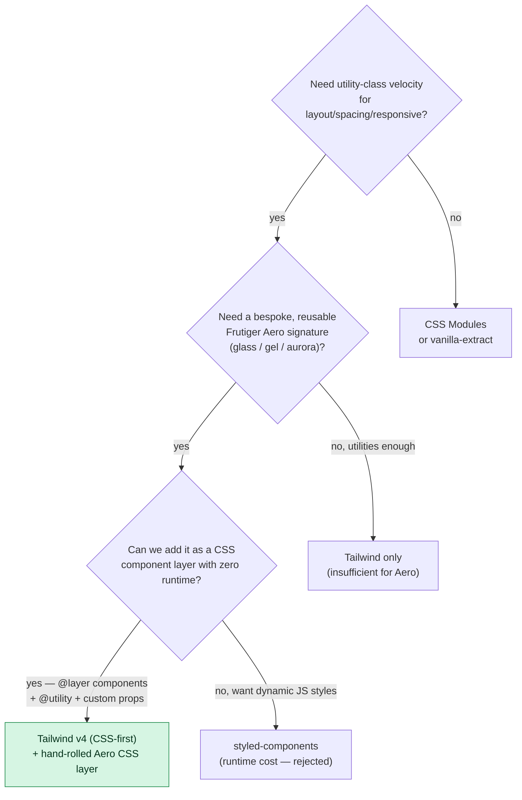

# ADR-002 — Styling Approach

## Status

`accepted` — already in the repo: Tailwind CSS `^4.3.1` via `@tailwindcss/vite`, CSS uses `@import "tailwindcss";` with `@theme { --font-sans: … }` (Tailwind v4 CSS-first config — **no `tailwind.config.js`**). This ADR records the decision and defines how the bespoke Frutiger Aero CSS layer coexists with Tailwind. #decision #design

## Context

The site must deliver a **disciplined Frutiger Aero design language** (see [[Frutiger Aero — Design Language]]): frosted glass, aqua/gel buttons, animated auroras, water/bubble motifs, soft glows, film grain. None of that is "utility CSS" — it is bespoke, multi-layer, pseudo-element-heavy, gradient-and-filter work. At the same time, the *scaffolding* of the site (layout, spacing, flex/grid, responsive breakpoints, color application) wants the velocity of a utility framework. Tailwind v4 is already committed.

So this is not "Tailwind *or* hand-written CSS" — it is "Tailwind *for the scaffolding* **and** a hand-rolled Aero component layer *for the signature*." The decision is to formalize that split and reject the all-in alternatives (CSS-in-JS, CSS Modules, etc.) that would either fight Tailwind or add a runtime we don't want on the [[Performance Budget]].

Tailwind v4 facts that shape this (per digest):
- CSS-first: tokens register in CSS via `@theme { --backdrop-blur-glass: 14px; }`, no JS config file.
- Vite-native through `@tailwindcss/vite`; tiny generated CSS; targets Chrome 111+/Safari 16.4+/FF 128+.
- Arbitrary values (`backdrop-blur-[14px]`, `bg-white/10`) cover most glass needs; `@utility` / `@layer components` cover the rest.

## Decision drivers

1. **Frutiger Aero fidelity** — the glass/gel/aurora signature must be first-class and reusable, not a pile of one-off arbitrary values.
2. **Already committed** — Tailwind v4 CSS-first is in the repo; keep it.
3. **Zero style runtime** — no CSS-in-JS runtime cost; protect INP/LCP ([[Performance Budget]]).
4. **Token-driven theming** — the same custom properties must power both Aero themes ([[ADR-009 — Theming Strategy]], [[Design Tokens]]) and Tailwind's `dark:` variant.
5. **Authoring velocity** for layout/spacing/responsive without naming a thousand classes.

## Options considered

| Option | Pros | Cons | Verdict |
|--------|------|------|---------|
| **A — Tailwind v4 (CSS-first) + hand-rolled Aero CSS layer** | Utility velocity for scaffolding; bespoke `.glass`/`.gel-button`/aurora as reusable components; zero runtime; tokens shared between custom props, Tailwind theme, and `dark:`; already in repo | Two mental models (utilities + components) — needs a clear boundary convention | ✅ **chosen** |
| B — CSS Modules only | Scoped, plain CSS, zero runtime | Loses utility velocity; verbose for layout; re-implements what Tailwind gives free; abandons committed setup | ❌ rejected |
| C — vanilla-extract | Type-safe styles, zero runtime, themeable contracts | Build-time ceremony; another DSL to learn; redundant with Tailwind v4's CSS-first tokens; abandons committed setup | ❌ rejected |
| D — styled-components / Emotion (CSS-in-JS) | Co-located, dynamic styles | **Runtime cost** + SSR/prerender friction with [[ADR-001 — Framework & Build Tool]]; fights Tailwind; against [[Performance Budget]] | ❌ rejected — runtime + prerender friction |
| E — UnoCSS | Faster engine, flexible presets | Marginal gain over Tailwind v4; would mean ripping out the committed Tailwind setup for no identity/delight benefit | ❌ rejected — no payoff for the swap |

## Decision tree



## Decision

> [!decision]
> We will style with **Tailwind v4 (CSS-first `@theme`) for layout, spacing, responsive and color application**, plus a **hand-rolled Frutiger Aero CSS layer** (`@layer components` / `@utility`) that owns the signature surfaces — `.glass`, `.gel-button`, aurora/blob backgrounds, grain, glows. There is **no `tailwind.config.js`**: all tokens live in CSS via `@theme` and plain custom properties, so they feed Tailwind, the bespoke layer, and the `dark:` variant from one source.

## How the two coexist

> [!example]
> Tailwind does the boring layout; the Aero layer does the magic. A button is `class="gel-button px-6 py-3 text-sm font-medium"` — `gel-button` from our layer, the rest Tailwind utilities.

```css
/* src/index.css */
@import "tailwindcss";

/* 1) Tokens: one source of truth — feeds Tailwind theme + custom layer + dark variant */
@theme {
  --font-sans: "Source Sans 3", "Hind", "Open Sans", system-ui, "Segoe UI", sans-serif;
  --backdrop-blur-glass: 14px;        /* cap ≤20px for GPU cost (Performance Budget) */
  --color-aero-sky:   #6fd7ec;
  --color-aero-scooter: #35bcde;
  --color-aero-deep:  #0689e4;
  --color-aero-leaf:  #71ab23;
  --color-aero-sun:   #fbb905;
}

/* 2) The bespoke Frutiger Aero layer — reusable signature components */
@layer components {
  .glass {
    background: rgba(255,255,255,0.12);
    -webkit-backdrop-filter: blur(var(--backdrop-blur-glass)) saturate(160%);
    backdrop-filter: blur(var(--backdrop-blur-glass)) saturate(160%);
    border: 1px solid rgba(255,255,255,0.25);
    border-radius: 16px;
    box-shadow: 0 8px 32px rgba(0,0,0,0.10),
                inset 0 1px 0 rgba(255,255,255,0.4); /* top highlight rim */
  }
  .gel-button { /* aqua/gel: multi-stop gradient + inset highlight/shadow + ::before sheen */
    position: relative;
    background: linear-gradient(180deg,#bfeaff 0%,#5cb8f5 48%,#1f8fe0 52%,#3aa6ee 100%);
    border-radius: 999px; color:#fff; text-shadow:0 1px 1px rgba(0,30,70,0.6);
    box-shadow: inset 0 1px 1px rgba(255,255,255,0.9),
                inset 0 -6px 12px rgba(0,40,90,0.45),
                0 6px 16px rgba(20,110,200,0.45);
  }
  .gel-button::before {
    content:""; position:absolute; inset:2px 2px 50% 2px; border-radius:999px;
    background:linear-gradient(180deg,rgba(255,255,255,0.85),rgba(255,255,255,0));
  }
}

/* 3) Graceful fallback when backdrop-filter is unsupported (Performance & a11y) */
@supports not (backdrop-filter: blur(1px)) {
  .glass { background: rgba(244,251,255,0.92); }
}
```

> [!tip]
> **The boundary rule** (so we don't get two ways to do everything):
> - Reach for a **Tailwind utility** for layout, spacing, sizing, flex/grid, responsive, and applying a token color.
> - Reach for the **Aero CSS layer** when it involves blur, multi-stop gradients, gloss pseudo-elements, glows, grain, or anything that defines the *look* — and make it a named component so it is reused, not copy-pasted.
> - Register any value used 3+ times as a token in `@theme`, not as a repeated arbitrary value.

## Consequences

**Positive**
- The Frutiger Aero signature is centralized, named, and reusable — catalogued in [[Component Visual Library]] and [[Glass, Gloss & Depth]].
- Single token source ([[Design Tokens]]) drives Tailwind, the bespoke layer, and the `dark:` variant — wired straight into [[ADR-009 — Theming Strategy]].
- Zero style runtime; tiny generated CSS — stays inside the [[Performance Budget]].
- No `tailwind.config.js` to maintain; everything is CSS the browser can read.

**Negative / costs we accept**
- Two authoring models (utilities + components) require discipline; without the boundary rule it drifts into inconsistency.
- `backdrop-filter` is GPU-heavy — must cap blur ≤20px, limit simultaneous glass layers, avoid animating blurred elements, and ship a `@supports` solid fallback ([[Performance Budget]]).
- Contrast over translucent glass can fail WCAG — text needs a tint/scrim/text-shadow and ≥4.5:1 verification ([[Accessibility & SEO]]).

**Mitigations**
- Codify the boundary rule above; enforce in review.
- Bake performance/contrast caps into the `.glass`/`.gel-button` definitions and the [[Component Visual Library]].

**Revisit when**
- The bespoke layer grows large or dynamic enough that a typed/scoped solution (vanilla-extract) would meaningfully reduce error — unlikely at this scale.

## Links

- [[ADR Index]] · [[ADR-000 — Template]] · [[ADR-001 — Framework & Build Tool]]
- [[Design Tokens]] — the single token source
- [[Glass, Gloss & Depth]] · [[Component Visual Library]] · [[Frutiger Aero — Design Language]]
- [[ADR-009 — Theming Strategy]] — consumes the same tokens for dual themes
- [[Performance Budget]] · [[Accessibility & SEO]]
