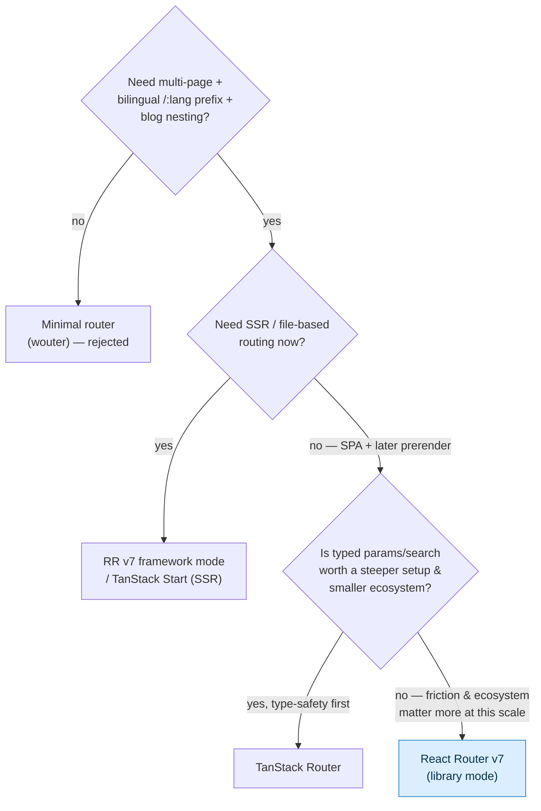

# ADR-003 — Routing Library

## Status

`proposed` — leaning **React Router v7 in library mode**, not yet wired. Promote to `accepted` once the first `/:lang/blog/:slug` route renders and is confirmed against [[i18n Architecture]] and [[Routing]]. Depends on [[ADR-001 — Framework & Build Tool]]. #decision

## Context

A plain Vite SPA ([[ADR-001 — Framework & Build Tool]]) has no router. We need one because the site is multi-page and bilingual:

- **Pages:** [[Page — Home]], [[Page — About]], [[Page — Projects]], [[Page — Blog]] (index + per-post), [[Page — Contact]].
- **Bilingual path-prefix routing:** `/en/...` and `/es/...`, with `/` redirecting to a detected locale, and a language switcher that swaps the `:lang` segment while preserving the rest of the path (`/en/blog/x` ↔ `/es/blog/x`). This is the strategy in [[i18n Architecture]].
- **Blog routing:** `/:lang/blog` (index) and `/:lang/blog/:slug` (post), driven by MDX frontmatter ([[Blog Content Pipeline]]).
- **Future prerender:** the SEO mitigation from [[ADR-001 — Framework & Build Tool]] needs the router to enumerate routes for static generation ([[Accessibility & SEO]]).

The choice is between **React Router v7** (mature, library-or-framework) and **TanStack Router** (best-in-class param/search type-safety, newer/smaller ecosystem). File-based routing via a framework (TanStack Start / RR framework mode) is heavier than this SPA needs.

2026 facts (per digest): React Router v7 ~7.8+ runs in **library mode** (no server) with mature nested routing/loaders/devtools and a path to SSG/SSR without leaving. TanStack Router ~1.131+ gives typed params/search but has a steeper setup and smaller ecosystem.

## Decision drivers

1. **Bilingual `/:lang` prefix + blog nesting must be trivial** — nested routes with a `lang` param are the core shape.
2. **Lowest friction at this scale** — a 5-page bilingual SPA; we don't want router ceremony.
3. **Upgrade path to prerender/SSR** without changing libraries — protects the [[ADR-001 — Framework & Build Tool]] SEO mitigation.
4. **Ecosystem & longevity** — docs, examples, devtools, hiring-of-future-self familiarity.
5. **Type-safety on params/search** — nice-to-have, but small surface here (`:lang`, `:slug`).

## Options considered

| Option | Pros | Cons | Verdict |
|--------|------|------|---------|
| **A — React Router v7 (library mode)** | Battle-tested; effortless nested `/:lang/blog/:slug`; huge ecosystem + devtools; in-place upgrade to RR framework mode (SSR) or prerender later; loaders/data APIs available | Param type-safety is manual/weaker than TanStack; framework mode would add a server we don't want yet | ✅ **chosen (proposed)** — lowest friction, best upgrade path |
| B — TanStack Router | Best-in-class typed params & search-param validation; first-class search-state | Newer, smaller ecosystem; steeper setup; type-safety gap is negligible for `:lang`/`:slug`; less obvious prerender story for this SPA | ❌ rejected — type-safety win doesn't justify the friction/ecosystem cost here |
| C — File-based (TanStack Start / RR framework mode) | Convention-driven routes; SSR/SSG built in | Heavier than a 5-page SPA needs; pulls in a server runtime, adding VPS ops ([[ADR-008 — Deployment Target (VPS)]]); over-engineered for now | ❌ rejected — revisit only if we adopt SSR |
| D — Hand-rolled / `wouter` (tiny) | Minimal bytes | Re-implements nested routing, redirects, data loading we'd want; no devtools; false economy for a bilingual blog | ❌ rejected — too little structure |

## Decision tree



## Decision

> [!decision]
> We will use **React Router v7 in library mode** as the SPA router. It makes the bilingual `/:lang/blog/:slug` nested structure trivial, carries the largest ecosystem and best devtools, and offers an in-place upgrade to prerender or full SSR (framework mode) if the SEO mitigation in [[ADR-001 — Framework & Build Tool]] needs it. The param type-safety advantage of TanStack Router is real but negligible across our tiny param surface (`:lang`, `:slug`) and not worth the added setup/ecosystem cost.

## Route model (sketch)

> [!example]
> Concrete shape — owned in full by [[Routing]].

```text
/                       → redirect to /{detectedLang}
/:lang                  → <LangLayout> (validates lang ∈ {en,es}, sets locale)
  index                 → Home
  /about                → About
  /projects             → Projects
  /blog                 → Blog index (lists posts for :lang from MDX frontmatter)
  /blog/:slug           → Blog post
  /contact              → Contact
*                       → 404 (localized)
```

- The `<LangLayout>` route reads `:lang`, validates it against `{en,es}`, redirects unknown values to the default, and drives `setLocale()` for [[i18n Architecture]].
- The **language switcher** swaps only the `:lang` segment of the current `pathname` and re-navigates, preserving `:slug` so a reader stays on the same post.
- The route table is the **enumeration source** for build-time prerender/SSG ([[Accessibility & SEO]]).

## Consequences

**Positive**
- Bilingual nesting and the slug-preserving language switch fall out naturally from nested routes + a `lang` param.
- Mature loaders/devtools/docs; familiar to future-me.
- No server today; clean upgrade to prerender or SSR later without a library swap — protects [[ADR-001 — Framework & Build Tool]].

**Negative / costs we accept**
- Manual/weaker param typing vs TanStack — mitigated by a small typed helper that validates `:lang`/`:slug` at the layout boundary.
- Some bundle weight vs a micro-router — acceptable within the [[Performance Budget]] with route-level `lazy()`.

**Mitigations**
- A `useTypedParams`/guard at `<LangLayout>` to recover type-safety where it matters.
- Lazy-load route components so the router doesn't bloat the initial JS.

**Revisit when**
- We adopt SSR (auth'd/dynamic content) → move RR v7 to **framework mode** in place.
- The blog grows complex search/filter state where TanStack's typed search-params would pay off.

## Links

- [[ADR Index]] · [[ADR-000 — Template]] · [[ADR-001 — Framework & Build Tool]]
- [[Routing]] — owns the full route table & guards
- [[i18n Architecture]] — `/:lang` strategy & switcher
- [[Page — Blog]] · [[Blog Content Pipeline]] · [[Accessibility & SEO]]
