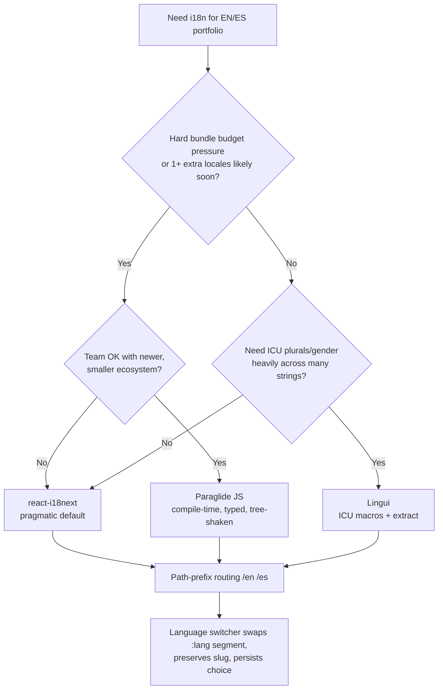

# ADR-004 — i18n Library

> [!decision] Decision (PROPOSED)
> Adopt **react-i18next** as the pragmatic default for the bilingual EN/ES site, with a **path-prefix locale strategy** (`/en`, `/es`). Treat **Paraglide JS (inlang)** as the strong modern, type-safe, zero-runtime alternative we will benchmark before locking in. **Lingui** is a documented runner-up. Status remains #proposed until the [[Routing]] shape and bundle budget are validated against [[Performance Budget]].

## Context

The site is bilingual — English and Spanish — and content lives in the repo (dev-authored). We need:

- UI-string translation (nav, buttons, form labels, ARIA text, the [[Component Visual Library]] chrome).
- A **locale-aware routing** scheme that cooperates with React Router v7 (see [[ADR-003 — Routing Library]]) and the multi-locale [[Page — Blog]].
- A **language switcher** that swaps locale while preserving the current route/slug.
- Persisted user choice (localStorage + a sensible default from `navigator.language`).
- No conflict with the [[Blog Content Pipeline]], where blog *content* is translated at the file level (`slug.en.mdx` / `slug.es.mdx`) rather than through the i18n catalog. The i18n library owns **chrome strings only**, not long-form post bodies.

Only **two locales** with a dev who hand-writes both. That low locale count materially changes the calculus: heavyweight runtime machinery buys little, and the perf delta between options is small in absolute terms.

## Decision drivers

- **#perf — bundle weight.** Per the research digest: react-i18next ships ~205–422 KB of runtime+catalogs territory; Paraglide compiles to ~47–144 KB tree-shaken typed functions. Matters against the ~<150 KB initial JS budget in [[Performance Budget]].
- **Type safety.** Paraglide makes every message a typed function (compile-time key checking); react-i18next needs manual declaration merging to type keys.
- **Ecosystem & maturity.** react-i18next is the most-installed React i18n library — plugins (language detector, ICU, backend loaders), docs, Stack Overflow depth.
- **DX & ceremony.** How much wiring to add a string, a plural, an interpolation.
- **Routing fit.** Must integrate cleanly with the `/:lang(en|es)` param in [[Routing]] and survive [[ADR-008 — Deployment Target (VPS)]] prerendering (SSG) without hydration mismatch.
- **Future-proofing.** If locales grow (pt, fr) or we add ICU plurals/gender, which scales better.

## Options

| Option | Model | Bundle | Type safety | Ecosystem | Ceremony | SSG fit | Verdict |
|---|---|---|---|---|---|---|---|
| **react-i18next** | Runtime catalogs + hooks | Heaviest (~205–422 KB band) | Manual (declaration merge) | Largest, richest plugins | Low–medium | Good (init per render) | **Recommended (pragmatic)** |
| **Paraglide JS (inlang)** | Compile-time, tree-shaken typed fns | Lightest (~47–144 KB) | Best (every key typed) | Smaller, newer, Vite-native | Low | Excellent (zero runtime) | **Strong alt — benchmark first** |
| **Lingui** | Compile-time + ICU macros | Small | Good | Medium | Medium-high (macros/extract step) | Good | Runner-up |

> [!note] Why not just take Paraglide if it's lighter and typed?
> It is genuinely attractive and may win. We default to react-i18next because (a) the absolute bundle difference at **2 locales of chrome strings** is small, (b) its ecosystem de-risks edge cases (language detection, ICU plurals, lazy namespace loading), and (c) the team familiarity tax is near-zero. The decision is intentionally **reversible** — both share the same path-prefix routing contract, so swapping libraries does not touch the URL scheme or the switcher UX. We will spike both and measure before marking #decided.

## Decision tree

## Locale-routing consequences

See [[i18n Architecture]] and [[Routing]] for the canonical spec; the decision implies:

- **URL shape:** path-prefix `/:lang(en|es)/...`. `/` redirects to the detected/persisted locale (default `en`). Every route nests under the lang segment, including [[Page — Blog]] (`/:lang/blog/:slug`).
- **Switcher behavior:** swap only the `:lang` segment of the current pathname (`/en/blog/x` ↔ `/es/blog/x`) and re-navigate, preserving slug + scroll where possible. Persist the new choice.
- **Detection & persistence:** first visit → `navigator.language` → fallback `en`; thereafter read localStorage. With react-i18next, `i18next-browser-languagedetector` covers this; with Paraglide we wire a tiny effect from the `:lang` param to `setLocale()`.
- **SSG/prerender:** under [[ADR-008 — Deployment Target (VPS)]] we prerender both locale trees. The active locale **must be derivable from the URL** (the `:lang` param) so prerendered HTML is correct per route and there is no hydration flash. This is a hard constraint that both libraries satisfy via the path prefix.
- **Content vs chrome split:** i18n catalog = chrome only. Blog bodies are per-locale MDX files (see [[Blog Content Pipeline]] / [[ADR-005 — Blog Content Source]]). Missing-translation fallback for chrome → `en`.
- **`<html lang>` + SEO:** set `lang`/`dir` per locale and emit `hreflang` alternate links (see [[Accessibility & SEO]]).

> [!warning] #risk — hydration mismatch
> If locale is read from localStorage at render time instead of from the URL, prerendered HTML (always built for a fixed locale) will mismatch client hydration and flash/relayout. **Mitigation:** locale is *URL-derived*; localStorage only seeds the initial redirect at `/`.

> [!tip] Keep keys flat and namespaced
> Use dotted/namespaced keys (`nav.about`, `contact.submit`) so the same structure ports cleanly between react-i18next JSON and Paraglide messages if we switch. Avoid sentence-as-key.

## Consequences

- **Positive:** lowest-friction path to bilingual UI; mature detection/plural tooling; reversible via shared routing contract.
- **Negative:** larger runtime than the compile-time options; manual key typing unless we add codegen.
- **Follow-on:** a spike comparing real gzipped bundle + DX on a 3-screen slice; outcome flips this to #decided (and possibly to Paraglide).

## Open questions

- [ ] Do we ever expect a 3rd locale? If "likely," Paraglide's tree-shaking advantage compounds — revisit driver weights.
- [ ] ICU plural/number/date needs in chrome strings? If broad, re-weight toward Lingui/ICU.
- [ ] Translation workflow: hand-edited JSON/messages in-repo, or an inlang/Fink editor? (inlang tooling favors Paraglide.)

## Next actions

- [ ] Spike react-i18next vs Paraglide on a 3-screen slice; measure gzipped delta against [[Performance Budget]].
- [ ] Lock the path-prefix contract in [[Routing]] and [[i18n Architecture]] regardless of library.
- [ ] Decide chrome-vs-content boundary with [[ADR-005 — Blog Content Source]].

## See also

- [[i18n Architecture]] · [[Routing]] · [[ADR-003 — Routing Library]] · [[ADR-005 — Blog Content Source]] · [[Performance Budget]] · [[Accessibility & SEO]] · [[ADR Index]]
