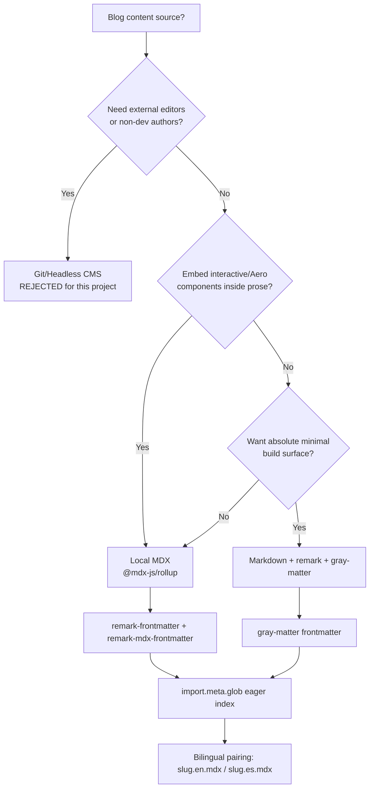

# ADR-005 — Blog Content Source

> [!decision] Decision (PROPOSED)
> Author blog posts as **local MDX files** compiled through Vite with **`@mdx-js/rollup`** + `remark-frontmatter` + `remark-mdx-frontmatter`, discovered via `import.meta.glob('./posts/**/*.mdx', { eager: true })`. Per-locale variants as `slug.en.mdx` / `slug.es.mdx`. **Plain Markdown + remark + gray-matter** is the lighter fallback; a **git/headless CMS** is rejected as overhead. Status #proposed pending the MDX-component contract in [[Blog Content Pipeline]].

## Context

The portfolio is a **personal, dev-authored artifact** (see [[Vision & Purpose]]) — not a multi-author publication. Posts live in the repo, are written by Jeronimo, and ship via the same CI as the app. Two forces shape the choice:

1. **Frutiger Aero spectacle.** Posts should be able to embed glassy callouts, gel buttons, aurora dividers, bubble figures — the [[Component Visual Library]] *inside prose*. That argues for **JSX-in-Markdown** (MDX), not inert HTML.
2. **Bilingualism.** EN/ES is a file-level concern: each post is two authored files, not one file machine-translated. The content source must make per-locale discovery + pairing trivial and cooperate with the path-prefix routing from [[ADR-004 — i18n Library]].

Frontmatter (title, date, lang, slug, description, tags, og) must feed routing, per-route `<meta>`/OG, and the bilingual index/filter on [[Page — Blog]].

## Decision drivers

- **Aero components in posts.** First-class ability to drop interactive/glassy components into prose → MDX.
- **In-repo, dev-authored.** No external editing surface needed; content is versioned with code. Rejects CMS overhead.
- **Vite-native build.** Compiles through the existing Vite 8 pipeline; no parallel toolchain.
- **Bilingual discovery.** `import.meta.glob` auto-indexes; the `.en.mdx`/`.es.mdx` naming pairs locales without a manifest.
- **SSG/SEO.** Each post must prerender to static HTML with correct per-post `<meta>`/OG (see [[ADR-008 — Deployment Target (VPS)]] and [[Accessibility & SEO]]); frontmatter is the source of truth.
- **Code blocks.** Syntax highlighting (Shiki/`rehype-pretty-code`) + GFM.
- **Complexity budget.** MDX is ESM-only and needs an async plugin import in `vite.config.ts`; acceptable, but noted.

## Options

| Option | JSX in content | Frontmatter | Discovery | Build cost | Bilingual ergonomics | Verdict |
|---|---|---|---|---|---|---|
| **Local MDX (`@mdx-js/rollup`)** | Yes (Aero components) | `remark-frontmatter` + `remark-mdx-frontmatter` | `import.meta.glob` eager | ESM-only, async plugin import | Excellent (`slug.en.mdx`/`slug.es.mdx`) | **Recommended** |
| **Markdown + remark + gray-matter** | No (HTML only) | `gray-matter` parse | `import.meta.glob` | Lightest | Good | Fallback if MDX overkill |
| **Git / headless CMS** | Depends | CMS schema | API/fetch | Heaviest (infra) | Editor-friendly, dev-overkill | **Rejected** |

> [!note] Why MDX over plain Markdown
> The decider is the [[Frutiger Aero — Design Language]] goal: prose should be able to *be* spectacle — a `<GelCallout>`, an `<AuroraDivider>`, a live `<BubbleFigure>`. Plain Markdown forces raw HTML and loses the component library. The ESM-only/async-import wrinkle is a one-time `vite.config.ts` cost. If a post never needs components, it still authors fine as MDX.

> [!warning] #risk — MDX is ESM-only & needs async config
> `@mdx-js/rollup` must be added via an async `defineConfig` (dynamic `import()`), and the plugin order matters (MDX before React). Mis-ordering breaks Fast Refresh. **Mitigation:** lock plugin order + a smoke test post in CI.

## Decision tree

## Pipeline shape (decision implications)

Canonical detail lives in [[Blog Content Pipeline]]; the decision implies:

- **Location & naming:** `src/content/posts/<slug>.<lang>.mdx`. The `<lang>` segment makes locale pairing a filename concern.
- **Index:** `import.meta.glob('./posts/**/*.mdx', { eager: true })` builds a typed post index at build time. Derive `{ slug, lang, title, date, description, tags, og }` from exported frontmatter.
- **Frontmatter schema (validated):** `title`, `date` (ISO), `lang` (`en|es`), `slug`, `description`, `tags[]`, `ogImage?`. Validate with `zod` at index build; fail the build on bad frontmatter.
- **Bilingual filtering:** [[Page — Blog]] lists posts for the active `:lang`; a post available in both shows a "read in other language" affordance that swaps to the paired slug (consistent with the [[ADR-004 — i18n Library]] switcher).
- **Rendering plugins:** `remark-gfm` + `rehype-pretty-code`/Shiki for code; map MDX elements to the [[Component Visual Library]] (`h1..h3`, `a`, `blockquote`→glass callout, `pre`→glossy code panel).
- **SSG/OG:** prerender each post route; emit per-post `<meta>`/OG from frontmatter; precompute static OG PNGs at build (Satori/Sharp) referenced by `ogImage` — see [[Accessibility & SEO]].
- **Components in posts:** expose a curated MDX `components` map + a `<MDXProvider>`/components prop so posts can use Aero pieces without per-file imports.

> [!tip] Keep authored translations honest
> Because EN/ES are separate files, slugs can legitimately differ per locale — store the *pairing* in frontmatter (`altSlug`/`translationKey`) rather than assuming a shared slug, so the switcher resolves the counterpart reliably.

## Consequences

- **Positive:** prose-as-spectacle; content versioned with code; zero CMS infra; clean bilingual discovery; SSG-friendly meta.
- **Negative:** ESM-only async Vite config + plugin-order sensitivity; authors must mind a small component contract; no WYSIWYG.
- **Follow-on:** define the `zod` frontmatter schema and the MDX components map in [[Blog Content Pipeline]]; wire OG generation into [[CI-CD Pipeline]].

## Open questions

- [ ] Shared slug across locales, or per-locale slugs with an explicit `translationKey`?
- [ ] Reading-time/excerpt: compute at build from MDX AST or from frontmatter?
- [ ] Draft handling — `draft: true` frontmatter excluded from prod index?

## Next actions

- [ ] Add `@mdx-js/rollup` + remark/rehype plugins to `vite.config.ts` (async, correct order) and ship one smoke-test post.
- [ ] Define + validate frontmatter `zod` schema; build the `import.meta.glob` index module.
- [ ] Specify the curated MDX components map against [[Component Visual Library]].

## See also

- [[Blog Content Pipeline]] · [[Page — Blog]] · [[i18n Architecture]] · [[ADR-004 — i18n Library]] · [[Component Visual Library]] · [[Accessibility & SEO]] · [[ADR Index]]
