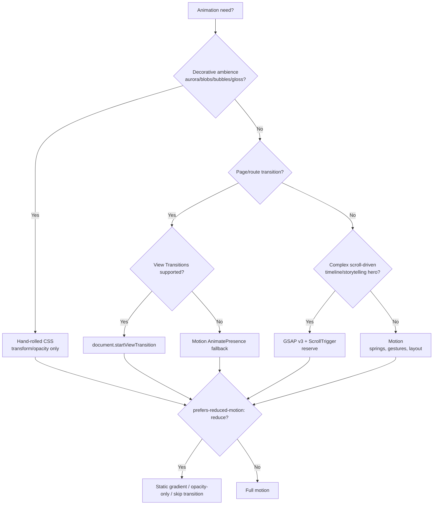

# ADR-006 — Animation Library

> [!decision] Decision (PROPOSED)
> Use a **layered** motion stack: **Motion** (the `motion` package, framer-motion's successor) for React component micro-interactions + `AnimatePresence` exits; **hand-rolled CSS** for the Frutiger Aero glass/gloss/aurora/bubble ambience; and the native **View Transitions API** (`document.startViewTransition`) for route changes where supported, with Motion as the fallback. **GSAP** is held in reserve for a single scroll-driven hero if we build one. **CSS-only** is the graceful-degradation floor. Everything gates on `prefers-reduced-motion`. Status #proposed pending the [[Performance Budget]] check.

## Context

Motion is a **co-equal north star** with identity (see [[Vision & Purpose]]): the site must *delight* via Frutiger Aero spectacle — auroras, drifting bubbles/blobs, glossy hover sheens, lens-flare accents, spring micro-interactions, smooth page transitions (see [[Frutiger Aero — Design Language]] and [[Motion & Animation]]). Simultaneously it must stay **performant and accessible**: INP < 200ms, low JS, and a real reduced-motion path (see [[Performance Budget]] and [[Accessibility & SEO]]).

The tension: ambient Aero effects are mostly **decorative + continuous** (best as CSS, cheap on the GPU when transform/opacity-only), while UI feedback is **stateful + interactive** (best as a React-aware library that understands mount/unmount, layout, and reduced-motion).

## Decision drivers

- **Spectacle ceiling.** Can it deliver springy, layered, Aero-grade motion without feeling canned.
- **#perf — JS weight & main-thread.** Per digest: Motion ~34–46 KB, GSAP core ~23 KB, CSS/View Transitions ~0 KB. Animate `transform`/`opacity` only; never blur-animate glass.
- **Reduced-motion ergonomics.** Motion ships `useReducedMotion()`; CSS gates via media query; View Transitions can be disabled per the same media query. Must be one coherent switch.
- **React integration.** Mount/exit (`AnimatePresence`), layout animations, gesture/hover state — native to Motion, awkward in raw CSS.
- **Page transitions.** View Transitions API is Baseline Newly Available (Chrome/Edge 111+, FF 133+, Safari 18+, same-document); zero JS where supported.
- **Complexity ceiling.** GSAP wins for imperative scroll timelines/ScrollTrigger storytelling; overkill for buttons.

## Options

| Option | JS cost | Best at | Reduced-motion | React fit | Verdict |
|---|---|---|---|---|---|
| **Motion (`motion` v12+)** | ~34–46 KB | Springs, gestures, `AnimatePresence`, layout | `useReducedMotion()` | Native | **Recommended (interactions)** |
| **CSS (hand-rolled)** | ~0 KB | Aurora/blobs/bubbles/gloss ambience | `@media (prefers-reduced-motion)` | Manual | **Recommended (ambience)** |
| **View Transitions API** | ~0 KB | Route/page transitions | Same media query | Wrap navigations | **Recommended (page transitions, progressive)** |
| **GSAP v3 (now fully free)** | ~23 KB core (+ plugins) | Imperative scroll timelines | Manual gate | Adapter/refs | **Reserve — only if scroll-hero** |

> [!note] Why a layered stack, not one library
> No single tool is best across decorative ambience, interactive feedback, and page transitions. The cheapest correct answer is **CSS for the always-on Aero scenery** (no JS, GPU-friendly), **Motion for the stateful React bits**, and the **platform's View Transitions** for navigation. This keeps the JS budget low while maximizing spectacle.

> [!warning] #risk — animating expensive properties
> `backdrop-filter`/`blur` are GPU-heavy; **never animate blur or the glass blur radius**, and don't animate layout props. Animate `transform`/`opacity` only; promote with `will-change` sparingly. Large blurred blobs can paint-thrash on mobile — keep counts low and transform-driven. See [[Glass, Gloss & Depth]] and [[Performance Budget]].

> [!important] #a11y — one reduced-motion switch
> All three layers must honor the *same* `prefers-reduced-motion: reduce` signal. CSS auroras/blobs/parallax collapse to a **static gradient**; Motion components collapse to **opacity-only or instant** via `useReducedMotion()`; View Transitions are **skipped** (plain navigation). Provide a static fallback, never just "less" motion.

## Decision tree

## Consequences

- **Positive:** maximal Aero spectacle at a minimal, mostly-zero JS cost; idiomatic React motion; platform-native page transitions with a clean fallback; a single coherent reduced-motion contract.
- **Negative:** three mental models to keep consistent (CSS tokens vs Motion variants vs VT names); View Transitions cross-browser gaps need the Motion fallback path tested; GSAP, if added, is a second animation runtime to justify.
- **Budget:** baseline JS for motion stays ~Motion-sized (~34–46 KB) unless a scroll-hero pulls in GSAP; ambience is free. Validate against [[Performance Budget]].

## Open questions

- [ ] Do we want a scroll-driven hero strong enough to justify GSAP, or can `animation-timeline: scroll()` (pure CSS) cover it?
- [ ] View Transitions for *cross-document* (MPA/SSG) navigation vs same-document SPA — confirm against the [[Routing]] model and FF support.
- [ ] Spring tokens: centralize Motion transition presets in [[Design Tokens]] so CSS easing and Motion springs feel like one system.

## Next actions

- [ ] Add `motion`; build a reduced-motion-aware `<Reveal>`/`<HoverGel>` primitive set.
- [ ] Implement CSS aurora/blob/bubble layers (transform/opacity only) with a static reduced-motion fallback.
- [ ] Wrap route navigations in `startViewTransition` with a Motion `AnimatePresence` fallback; test on Safari/Firefox.
- [ ] Spike a scroll-hero with CSS scroll timelines before reaching for GSAP.

## See also

- [[Motion & Animation]] · [[Frutiger Aero — Design Language]] · [[Glass, Gloss & Depth]] · [[Design Tokens]] · [[Performance Budget]] · [[Accessibility & SEO]] · [[ADR Index]]
