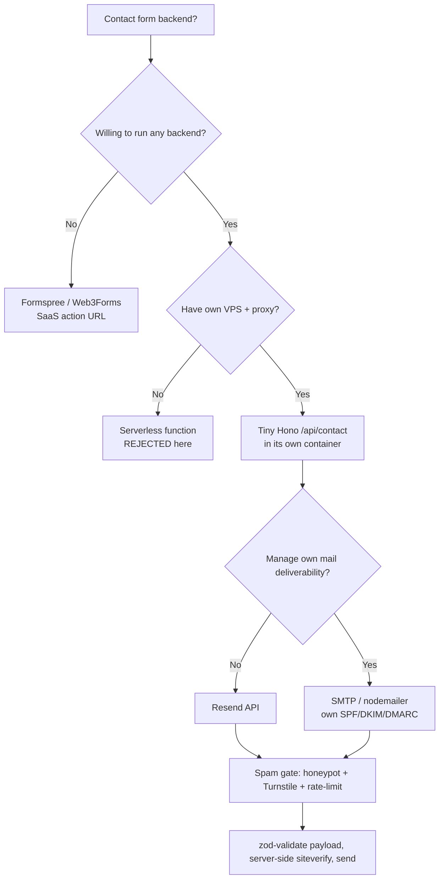

# ADR-007 — Contact Form Backend

> [!decision] Decision (PROPOSED)
> Self-host a tiny **Hono (v4) `/api/contact`** service on Node, in its own container alongside the static site, that **validates** (`zod` via `@hono/zod-validator`) and **emails** via **Resend** (SMTP/`nodemailer` as the no-vendor fallback). Guard it with **honeypot field + Cloudflare Turnstile (server-side `siteverify`) + IP rate-limiting**. **Formspree/Web3Forms** is the documented no-backend escape hatch; a generic serverless function is rejected (we already run a VPS). Status #proposed pending [[Contact Backend]] schema + [[VPS Deployment Plan]] wiring.

## Context

The roadmap mandates a **real, working, self-hosted contact form** — not `mailto:`, not a SaaS embed (see [[Vision & Purpose]] and [[Page — Contact]]). Jeronimo controls his **own VPS** (Docker, reverse proxy, can run a small service), and a stated principle is **no vendor lock-in** (see [[Principles & Constraints]]). So the form should post to a first-party endpoint we own.

The hard part isn't sending mail — it's **spam**. In 2026, honeypots alone are weak because spam is LLM-generated; a real CAPTCHA/anti-bot gate plus rate-limiting is required. The endpoint is a public POST and must be defended accordingly.

## Decision drivers

- **Own VPS, no lock-in.** We already run the box (see [[ADR-008 — Deployment Target (VPS)]]); a first-party API keeps data first-party and costs nothing extra.
- **#security — spam & abuse.** Public POST → needs layered defense: honeypot + Turnstile + rate-limit + payload validation.
- **TypeScript-first & light.** Hono is TS-native, ~4–5x faster than Express, ships CORS + validation; pairs with `zod`. Express is the heavier legacy alt.
- **Deliverability.** Resend gives clean API + good deliverability on a generous free tier; raw SMTP/`nodemailer` gives full control but you own SPF/DKIM/DMARC and reputation.
- **Ops footprint.** Must slot into Docker Compose behind the Caddy reverse proxy from [[ADR-008 — Deployment Target (VPS)]] with minimal new surface.
- **Fallback exists.** If we ever want zero backend, swap the form action to Web3Forms/Formspree without touching the UI contract.

## Options

| Option | Hosting | Lock-in | Spam control | Deliverability | TS/DX | Verdict |
|---|---|---|---|---|---|---|
| **Hono `/api/contact` → Resend** | Own VPS container | None (portable) | Honeypot + Turnstile + rate-limit (ours) | Resend-managed | Excellent (`zod`) | **Recommended** |
| Hono → SMTP/`nodemailer` | Own VPS container | None | Same (ours) | You own SPF/DKIM/reputation | Excellent | Fallback if avoiding Resend |
| **Formspree / Web3Forms** | SaaS | High | Provider CAPTCHA (reCAPTCHA/hCaptcha) | Provider-managed | None (just an action URL) | Escape hatch (no backend) |
| Generic serverless fn | Cloud provider | Medium–high | DIY | DIY/provider | Good | **Rejected — VPS already present** |

> [!note] Why Hono + Resend over the SaaS forms
> The owner runs a VPS and prizes no lock-in, so a ~one-file Hono service that we control beats renting a form endpoint — same effort once Compose/Caddy exist, with first-party data and no per-submission quotas. Resend handles the one genuinely hard ops problem (deliverability) without us managing DKIM at day one; we can swap to self-hosted SMTP later because the send is behind our own interface.

## Decision tree

## Security consequences

Canonical detail in [[Contact Backend]]; the decision implies a defense-in-depth posture:

- **Honeypot field.** Hidden input bots fill; reject silently (200, no send) if non-empty. Cheap first filter, but **not sufficient alone** in the LLM-spam era.
- **Cloudflare Turnstile.** Real anti-bot gate. Client widget → token → **server-side `siteverify`** in the Hono handler before any send. This is the primary gate.
- **Rate-limiting.** IP-based (`@hono-rate-limiter`) — e.g. small per-minute + per-hour caps; return 429. Behind the reverse proxy, read the real client IP from the proxy header (configure Caddy to set it; see [[ADR-008 — Deployment Target (VPS)]]).
- **Validation.** `zod`/`@hono/zod-validator` on name/email/message: type, length caps, email shape; reject oversized/garbage payloads early. Strip/escape before templating the email to avoid header/HTML injection.
- **CORS.** Restrict to the site origin(s) (both locales); Hono's CORS middleware.
- **Secrets.** `RESEND_API_KEY`, `TURNSTILE_SECRET` injected as container env via the [[CI-CD Pipeline]]; never in the repo/bundle. The Turnstile **site key** is public (client); the **secret key** is server-only.
- **No data retention by default.** Email-and-forget; if we later log, scrub PII and set retention (see [[Observability & Backups]]).
- **HTTPS only.** TLS terminated by Caddy (auto-LE) per [[ADR-008 — Deployment Target (VPS)]].

> [!warning] #risk — real client IP behind the proxy
> Rate-limiting on the wrong IP (the proxy's) defeats itself or blocks everyone. **Mitigation:** Caddy sets a trusted forwarded-for header; Hono trusts it only from the proxy. Validate this in staging.

> [!important] #security — server-side verify is mandatory
> Turnstile/honeypot checks **must** run on the server before sending. A client-only check is trivially bypassed by posting directly to `/api/contact`.

## Consequences

- **Positive:** first-party, no lock-in, no per-submission quotas, strong layered anti-spam, TS end-to-end, fits the existing Compose/Caddy stack.
- **Negative:** one more container + secrets to manage; Resend is still a third-party dependency for delivery (mitigated by the SMTP fallback path); Turnstile ties us to Cloudflare (swappable for hCaptcha).
- **Follow-on:** define the request/response schema + email template in [[Contact Backend]]; add the service to Compose + Caddy routing in [[VPS Deployment Plan]]; inject secrets in [[CI-CD Pipeline]].

## Open questions

- [ ] Resend from day one, or stand up self-hosted SMTP (SPF/DKIM/DMARC) immediately for full independence?
- [ ] Turnstile vs hCaptcha — both privacy-friendly; Turnstile chosen for free + clean DX. Confirm.
- [ ] Store submissions (audit) or pure email-and-forget? Affects [[Observability & Backups]].
- [ ] Autoresponder/confirmation email to the sender?

## Next actions

- [ ] Scaffold Hono `/api/contact`: `zod` validation, honeypot, Turnstile `siteverify`, `@hono-rate-limiter`, CORS to site origins.
- [ ] Wire Resend send + a tested email template; add SMTP fallback behind the same interface.
- [ ] Add the API container to Compose; route `/api/*` via Caddy; pass real client IP; inject secrets in CI.
- [ ] Build the [[Page — Contact]] form with the Turnstile widget + honeypot + graceful error/success states.

## See also

- [[Contact Backend]] · [[Page — Contact]] · [[VPS Deployment Plan]] · [[CI-CD Pipeline]] · [[ADR-008 — Deployment Target (VPS)]] · [[Observability & Backups]] · [[Principles & Constraints]] · [[ADR Index]]
