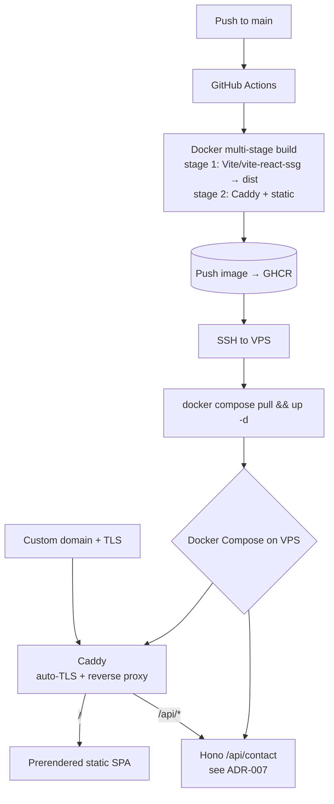
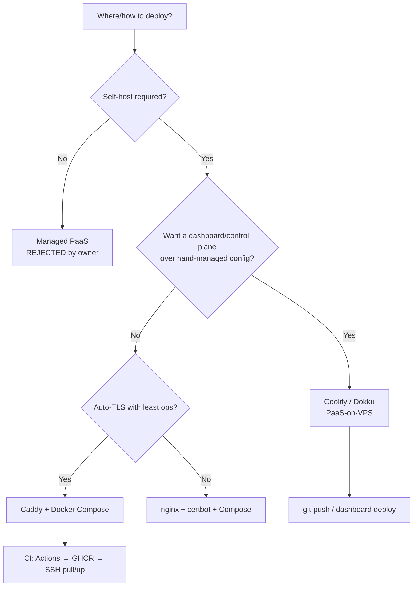

# ADR-008 — Deployment Target (VPS)

> [!decision] Decision (PROPOSED)
> Self-host on Jeronimo's **own VPS** with **Docker multi-stage** images (Vite build → static `dist` served by **Caddy**), orchestrated by **Docker Compose** (web/Caddy + the Hono contact API from [[ADR-007 — Contact Form Backend]]). **Caddy** is the reverse proxy and provides **automatic Let's Encrypt TLS**. CI/CD is **GitHub Actions → build image → push to GHCR → SSH `docker compose pull && up -d`** on the VPS. **Coolify/Dokku** (PaaS-on-VPS) is the documented easy-mode alternative; **managed hosts (Vercel/Netlify) are REJECTED** per owner direction. Status #proposed pending [[VPS Deployment Plan]].

## Context

The owner mandates **self-hosting on his own VPS, "to the net," with full control and no vendor lock-in** (see [[Vision & Purpose]] and [[Principles & Constraints]]). The deployment must serve a prerendered static SPA (SSG via `vite-react-ssg` — see [[Accessibility & SEO]]) **and** reverse-proxy the dynamic Hono `/api/contact` service from [[ADR-007 — Contact Form Backend]], all under a custom domain with TLS (see [[Domain, DNS & TLS]]).

This means the question is *how* to run on the VPS, not *whether* — managed platforms are out of scope by decision. The trade is between **raw Compose + Caddy** (minimal, hands-on) and a **PaaS-on-VPS** (Coolify/Dokku — dashboard convenience at a RAM/complexity cost).

## Decision drivers

- **Control & no lock-in.** Hard requirement. Everything must be portable Docker + plain config we own.
- **Auto-TLS with least ops.** Caddy provisions/renews Let's Encrypt certs from a one-line Caddyfile — strictly less ops than nginx + certbot (manual renew/cron).
- **One proxy, two backends.** Same Caddy instance serves static `dist` and reverse-proxies `/api/*` to Hono — single TLS terminator, single config.
- **Image size & build hygiene.** Multi-stage (Node build stage → tiny static-serve stage) keeps images small; build off-server in CI, not on the box.
- **Resource footprint.** Raw Compose + Caddy ≈ ~3 containers; Coolify idles at ~0.5–1.2 GB RAM and ~6–10 containers — meaningful on a small VPS.
- **CI/CD simplicity.** Build/push in Actions, pull on the VPS over SSH — cleaner and more reproducible than building on-server.
- **Zero-downtime.** Static swaps are atomic; Compose rolling restart (`--no-deps`) or two replicas behind Caddy for the API.

## Options

| Option | Lock-in | TLS | Ops effort | RAM/footprint | Control | Verdict |
|---|---|---|---|---|---|---|
| **Docker multi-stage + Caddy + Compose** | None | Auto (Caddy/LE) | Low–medium (hands-on) | Lean (~3 containers) | Maximal | **Recommended** |
| nginx + certbot + Compose | None | Manual (certbot/cron) | Medium–high | Lean | Maximal | More moving parts, no TLS win |
| **Coolify / Dokploy / Dokku** (PaaS-on-VPS) | Low | Auto (Traefik/LE) | Lowest (dashboard) | Heavier (Coolify ~0.5–1.2 GB, 6–10 containers) | High | Easy-mode alternative |
| Vercel / Netlify (managed) | High | Auto | Lowest | N/A | Low | **REJECTED (owner)** |

> [!note] Why Caddy over nginx+certbot
> Both can serve static + reverse-proxy. The deciding factor is **automatic TLS**: Caddy obtains and renews Let's Encrypt certs with a one-line Caddyfile and no cron, removing the most error-prone bit of self-hosting. nginx is fine but adds certbot + renewal plumbing for no functional gain here.

> [!tip] Easy-mode exit: Coolify
> If hands-on Compose ever feels like too much, **Coolify** gives a Heroku-like dashboard (Traefik + auto-LE, git-push deploys) on the same VPS — at a RAM/complexity cost. It's the sanctioned fallback, not the default, because it adds containers and a control plane we'd otherwise own as plain files.

## Architecture & deploy flow

## Decision tree

## CI/CD consequences

Canonical detail in [[CI-CD Pipeline]]; the decision implies:

- **Build off-server:** GitHub Actions runs `tsc -b && vite build` (with `vite-react-ssg` prerender), builds the multi-stage image, pushes to **GHCR**.
- **Deploy over SSH:** Actions SSHes to the VPS and runs `docker compose pull && docker compose up -d` — the VPS only *pulls* tagged images; it never builds. Reproducible, fast, small attack surface.
- **Secrets:** GHCR auth, SSH key, and runtime secrets (`RESEND_API_KEY`, `TURNSTILE_SECRET` from [[ADR-007 — Contact Form Backend]]) live in Actions/host env, never in the repo.
- **Zero-downtime:** static content swaps are atomic; for the API, Compose rolling restart (`--no-deps`) or two replicas behind Caddy. Pin image tags (commit SHA) for instant rollback.
- **Conventional Commits** already gate the repo; tag images from the commit/SHA so a deploy maps to a known commit.

## Consequences

- **Positive:** total control, no lock-in, automatic TLS, single proxy for static + API, small footprint, reproducible CI/CD, trivial rollback via image tags.
- **Negative:** we own uptime, OS patching, backups, and the SSH deploy path (security-sensitive); more hands-on than a managed host or Coolify dashboard.
- **Follow-on:** write the `Dockerfile` (multi-stage) + `Caddyfile` + `compose.yaml`; provision domain/DNS in [[Domain, DNS & TLS]]; set up backups/monitoring in [[Observability & Backups]].

## Open questions

- [ ] Single-node Compose now vs room to scale later (Swarm/k3s)? Single node is right for v1.
- [ ] Caddy native binary vs container — container chosen for parity/portability; confirm.
- [ ] Staging environment on the same VPS (subdomain) or local-only preview?
- [ ] Health checks + auto-restart policy for the API container.

## Next actions

- [ ] Author multi-stage `Dockerfile` (Vite/`vite-react-ssg` build → Caddy static serve).
- [ ] Write `Caddyfile` (auto-TLS, `/` → static, `/api/*` → Hono, real client IP header) and `compose.yaml` (web + api).
- [ ] Build the GitHub Actions workflow: build → push GHCR → SSH `compose pull && up -d`; store secrets.
- [ ] Provision VPS, domain, DNS, firewall; document in [[VPS Deployment Plan]] and [[Domain, DNS & TLS]].

## See also

- [[VPS Deployment Plan]] · [[CI-CD Pipeline]] · [[Domain, DNS & TLS]] · [[Observability & Backups]] · [[ADR-007 — Contact Form Backend]] · [[Principles & Constraints]] · [[ADR Index]]
