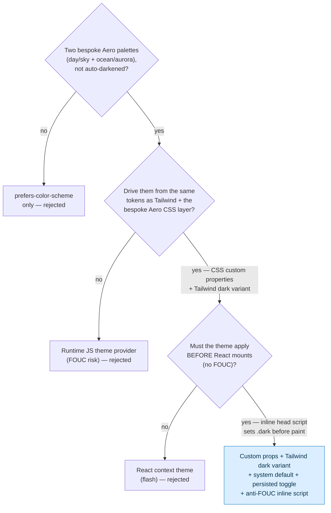

# ADR-009 — Theming Strategy

## Status

`proposed` — design is settled; promote to `accepted` once the anti-FOUC inline head script is implemented and verified against a real first paint. Builds on [[ADR-002 — Styling Approach]]. #decision #design #theming

## Context

Frutiger Aero is intrinsically **bright and glossy**, but the roadmap commits to a light/dark toggle ([[Theming — Light & Dark]]). Rather than a dim "dark mode" that fights the aesthetic, we design **two first-class Aero themes**:

- **Day / Sky (light):** luminous sky→cyan→lime, glossy whites — sky `#6FD7EC`, scooter `#35BCDE`, deep `#0689E4`, leaf `#71AB23`, cloud `#F4FBFF`, sun accent `#FBB905`.
- **Ocean / Aurora (dark):** deep ocean with aurora glows — abyss `#02132E`, deep `#003C78`, ocean `#0064B4`, teal glow `#13C2C2`, aurora green `#4ADE80`, violet `#7C5CFF`, cyan rim `#6FD7EC`.

Constraints:
- The styling layer is **Tailwind v4 + a bespoke Aero CSS layer driven by custom properties** ([[ADR-002 — Styling Approach]]) — themes must flow through those same tokens, not a parallel system.
- **Default from `prefers-color-scheme`**, but a **user toggle overrides and persists**.
- **No theme flash (FOUC):** the SPA shell from [[ADR-001 — Framework & Build Tool]] hydrates after first paint, so the theme class must be applied *before* React mounts.
- Glass/aurora must keep **WCAG contrast** in both themes ([[Accessibility & SEO]]).

## Decision drivers

1. **One token source for both themes** — custom properties feed Tailwind, the `dark:` variant, and the bespoke `.glass`/`.gel-button` layer ([[Design Tokens]], [[ADR-002 — Styling Approach]]).
2. **No FOUC** — wrong-theme flash on load is unacceptable for a craft-statement site.
3. **System default + persisted user override** — respect the OS, let the user choose, remember the choice.
4. **Both themes are *designed*, not auto-derived** — dark is "ocean/aurora", not algorithmically-darkened light ([[Color & Gradients]]).
5. **Accessible in both modes** — contrast over translucent glass holds ≥4.5:1.

## Options considered

| Option | Pros | Cons | Verdict |
|--------|------|------|---------|
| **A — CSS custom properties + Tailwind `dark:` variant, `.dark` class on `<html>`, system default + persisted toggle + inline anti-FOUC script** | One token source for Tailwind + bespoke Aero layer; class toggle is instant & themeable; inline head script kills FOUC; both themes hand-designed | Requires a small inline script before React; two palettes to maintain | ✅ **chosen (proposed)** |
| B — `prefers-color-scheme` only (no toggle) | Simplest; no JS; no persistence | No user override; can't honor a deliberate choice; roadmap wants a toggle | ❌ rejected — no user control |
| C — `color-scheme` + CSS `light-dark()` function only | Native, terse, no class needed | Can't express two *bespoke* Aero palettes well; harder to drive the bespoke gradient/aurora layer; weaker override control | ❌ rejected — too constrained for designed dual themes |
| D — JS theme provider / context (e.g. a runtime theming lib) holding theme in React state | Ergonomic in components | Theme lives *after* hydration → FOUC; runtime cost; redundant with CSS custom properties | ❌ rejected — reintroduces the flash we must avoid |

## Decision tree



## Decision

> [!decision]
> We will theme with **CSS custom properties** as the single token source, exposed to Tailwind v4's **`dark:` variant** via a **`.dark` class on `<html>`**. The **default comes from `prefers-color-scheme`**; a **user toggle overrides it and persists in `localStorage`**. A tiny **inline `<head>` script applies the correct theme class before React mounts** to eliminate FOUC. Both themes are **hand-designed Aero palettes** — luminous "day/sky" (light) and deep "ocean/aurora" (dark) — sharing structure but not auto-derived. The full palettes live in [[Color & Gradients]] and [[Theming — Light & Dark]].

## Implementation sketch

> [!example]
> Three pieces: (1) anti-FOUC head script, (2) token sets per theme, (3) a persisted toggle.

**1) Anti-FOUC inline script — in `index.html`, before the app bundle, runs synchronously:**

```html
<script>
  (function () {
    try {
      var stored = localStorage.getItem("theme"); // "light" | "dark" | null
      var system = matchMedia("(prefers-color-scheme: dark)").matches ? "dark" : "light";
      var theme = stored || system;
      document.documentElement.classList.toggle("dark", theme === "dark");
      document.documentElement.style.colorScheme = theme; // native form controls/scrollbars
    } catch (e) {}
  })();
</script>
```

**2) Token sets — same custom-property names, two palettes (extends the [[ADR-002 — Styling Approach]] `@theme` block):**

```css
:root {                      /* Day / Sky (light) — the default */
  --bg:        #f4fbff;
  --surface:   rgba(255,255,255,0.12);   /* glass fill */
  --text:      #06324a;
  --accent:    #0689e4;
  --aurora-a:  #6fd7ec; --aurora-b: #71ab23; --aurora-c: #0689e4;
}
.dark {                      /* Ocean / Aurora (dark) */
  --bg:        #02132e;
  --surface:   rgba(12,40,80,0.28);
  --text:      #d8f0ff;
  --accent:    #13c2c2;
  --aurora-a:  #13c2c2; --aurora-b: #4ade80; --aurora-c: #7c5cff;
}
/* The bespoke .glass / .gel-button / aurora layer reads var(--surface), var(--aurora-*), etc.
   Tailwind utilities reach the same values; dark: variants flip via the .dark class. */
```

**3) Toggle (React) — flips the class and persists; no FOUC because the head script already ran:**

```ts
function setTheme(next: "light" | "dark") {
  const root = document.documentElement;
  root.classList.toggle("dark", next === "dark");
  root.style.colorScheme = next;
  localStorage.setItem("theme", next);
}
```

> [!tip]
> Offer a third "system" state that *clears* `localStorage.theme` and re-reads `prefers-color-scheme`, plus a `matchMedia` listener so a live OS theme change is honored while the user is on "system".

## Consequences

**Positive**
- One token source powers Tailwind, the `dark:` variant, and the bespoke Aero layer — no parallel theming system ([[ADR-002 — Styling Approach]], [[Design Tokens]]).
- No FOUC: theme is correct on the very first paint.
- Both themes are intentional Aero scenes, reinforcing identity + delight rather than a dull dark mode.
- `color-scheme` keeps native controls/scrollbars on-theme.

**Negative / costs we accept**
- A small inline script in `index.html` (must stay tiny and synchronous; allow it in the CSP).
- Two palettes to design and maintain; every new surface needs both ([[Color & Gradients]]).
- Glass contrast must be re-verified per theme — translucent fills behave differently over light vs dark backgrounds ([[Accessibility & SEO]]).

**Mitigations**
- Keep the head script <1 KB and CSP-allowed; never let it grow logic.
- Gate motion/aurora animation behind `prefers-reduced-motion` regardless of theme ([[Motion & Animation]]).
- Add per-theme contrast checks to the [[Definition of Done]] for any new glass surface.

**Revisit when**
- We add more than two themes (e.g. a seasonal "sunset" palette) — the class-based system scales to `[data-theme]` values cleanly.
- CSP rules forbid inline scripts — move the anti-FOUC snippet to a hashed/nonce'd inline or a render-blocking external script.

## Links

- [[ADR Index]] · [[ADR-000 — Template]] · [[ADR-002 — Styling Approach]]
- [[Theming — Light & Dark]] — owns the full theme spec
- [[Design Tokens]] · [[Color & Gradients]]
- [[Accessibility & SEO]] · [[Motion & Animation]] · [[Definition of Done]]
