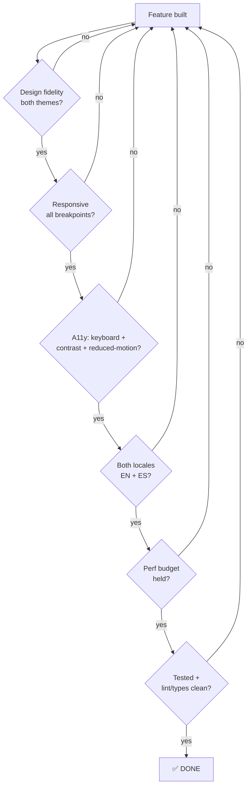

# Definition of Done

"Done" is not a feeling — it's a **gate**. This note defines the exact, checkable conditions a unit of work must satisfy before it can leave [[Now · Next · Later]] and before the site can launch. It operationalizes [[Success Criteria]] against the concrete budgets in [[Performance Budget]] and [[Accessibility & SEO]].

> [!important]
> Two non-negotiables thread through every checklist, straight from [[Vision & Purpose]]: the work must **express Jeronimo's identity** and **delight via Frutiger Aero** — *and* never trade the accessibility/perf floor to do it. A feature that's fast and accessible but soulless is **not done**; spectacle that breaks contrast or motion-safety is **not done** either.

## The Done flow

---

## Per-feature Definition of Done

A feature/component/page is **done** when **all** apply:

### Design fidelity
- [ ] Matches the [[Frutiger Aero — Design Language]] intent — glass/gloss/depth used per [[Glass, Gloss & Depth]], not as random decoration.
- [ ] Renders correctly in **both** the light "day/sky" and dark "ocean/aurora" themes ([[Theming — Light & Dark]]) — designed, not just recolored.
- [ ] Uses [[Design Tokens]] (colors, radii, blur, shadows, font stack) — **no magic hex values** in components.
- [ ] Reuses [[Component Visual Library]] primitives (`.glass`, `.gel-button`/`.aqua`, cards) rather than re-inventing them.

### Responsive
- [ ] Works mobile → desktop with no overflow, no layout shift, no broken glass at any breakpoint.
- [ ] Touch targets ≥44px; hover-only affordances have a non-hover equivalent.

### Accessibility (see [[Accessibility & SEO]])
- [ ] **Keyboard:** fully operable, visible focus rings, logical tab order, no traps; skip-link reaches main.
- [ ] **Contrast:** text over glass ≥ **4.5:1** (use a semi-opaque tint/scrim or text-shadow) — verified, not eyeballed.
- [ ] **Reduced motion:** every animation collapses to opacity-only or instant under `prefers-reduced-motion: reduce` (`useReducedMotion()` / media query).
- [ ] Semantic HTML + correct ARIA only where native semantics fall short; landmarks present.
- [ ] Form fields (where relevant) have labels + programmatically-associated, announced errors.

### Internationalization
- [ ] All user-facing strings resolve in **both EN and ES** via [[i18n Architecture]] (Paraglide) — **zero hardcoded copy** in components.
- [ ] Locale-prefixed route (`/:lang/...`) resolves and the language switcher round-trips without losing context (slug/scroll).

### Performance (see [[Performance Budget]])
- [ ] No regression to LCP < 2.5s, **INP < 200ms**, CLS < 0.1; initial JS stays < ~150 KB gzip.
- [ ] `backdrop-filter` blur ≤20px, glass layers limited, blurred elements not animated; `@supports not` solid fallback present.
- [ ] Heavy/optional effects are lazy-loaded and use `transform`/`opacity` (not layout-thrashing props).

### Quality
- [ ] `tsc -b` clean under TS 6 strict; `npm run lint` clean.
- [ ] Tested (component/behavior + a manual pass in both themes, both locales, with reduced-motion toggled).
- [ ] Committed via Conventional Commits (`npm run commit`) — commit-msg hook passes.

> [!todo]
> Per-PR self-check: paste the six gate questions from the Done flow above and answer each before merging.

---

## Per-content (blog post) Definition of Done

A blog post is **done** when:
- [ ] `slug.en.mdx` **and** `slug.es.mdx` exist with complete frontmatter (title/date/lang/slug/description/og) per [[Blog Content Pipeline]].
- [ ] Renders under both `/en/blog/:slug` and `/es/blog/:slug`; code blocks highlighted; images have alt text.
- [ ] Has a precomputed OG image and correct per-route `<meta>`/OG/Twitter tags (crawler sees real HTML via prerender).
- [ ] Appears in the locale-filtered [[Page — Blog]] index and the sitemap.

---

## Launch Definition of Done

The site is **launched** when, in addition to every feature being individually done:

> [!decision]
> **Launch gate — all must be true** (maps to [[Success Criteria]]). #decision

- [ ] All core pages live: [[Page — Home]], [[Page — About]], [[Page — Projects]], [[Page — Blog]], [[Page — Contact]] — both themes, both locales.
- [ ] Contact form sends a real email end-to-end; spam guards (honeypot + Turnstile + rate-limit) verified rejecting bad input ([[Contact Backend]]).
- [ ] **Prerendered** (`vite-react-ssg`): crawlable HTML, per-route meta/OG, `sitemap.xml` + `robots.txt` emitted ([[Accessibility & SEO]]).
- [ ] Deployed to the VPS over HTTPS with valid auto-TLS; `git push` to `main` deploys with no manual SSH ([[VPS Deployment Plan]], [[CI-CD Pipeline]]).
- [ ] Custom domain resolves with correct DNS + TLS ([[Domain, DNS & TLS]]).
- [ ] [[Performance Budget]] met on a real mobile profile; **Lighthouse a11y ≥ 95**, no critical axe violations.
- [ ] Reduced-motion path verified across the whole site (nothing essential conveyed by motion alone).
- [ ] Social cards (OG/Twitter) preview correctly for the home page and at least one blog post.
- [ ] Basic [[Observability & Backups]] in place (logs/uptime + a backup story).
- [ ] The **identity + delight** test: a first-time visitor feels *who Jeronimo is* and is *delighted* within the first screen — sign-off against [[Vision & Purpose]] and [[Developer Identity]].

## Open questions

> [!question]
> - Do we want an automated Lighthouse/axe check in [[CI-CD Pipeline]] as a hard merge gate, or a manual pre-launch pass? Leaning toward CI gate on a11y + Vitals. #todo
> - Minimum browser matrix for the a11y/contrast sign-off (Tailwind v4 already targets Chrome 111+/Safari 16.4+/FF 128+)? #todo

## See also

- [[Success Criteria]] — the "what good looks like" this gate enforces
- [[Performance Budget]] — the numeric perf thresholds
- [[Accessibility & SEO]] — the a11y + crawlability thresholds
- [[Roadmap & Phases]] — every phase exits through this gate
