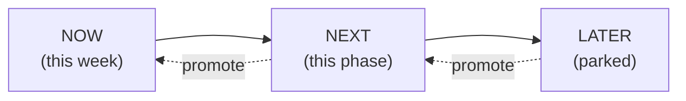

# Now · Next · Later

A **living triage board**. *Now* = what's on the bench this week. *Next* = the rest of the current phase. *Later* = parked until its phase arrives (full grab-bag lives in [[Backlog]]). Re-sort this note constantly; it is the working face of [[Roadmap & Phases]].

> [!tip]
> Rule of thumb: keep **Now** to ≤3 items. If it grows, something belongs in **Next**. Drag items up only when the one above ships.

---

## 🟢 Now — Phase 0 Foundation, immediate

> [!important]
> These are the **very first concrete steps** of the whole project. Do them in order.

- [ ] **① Scaffold the folder structure** per [[Project Structure]] — create `src/routes/`, `src/components/`, `src/lib/`, `src/styles/`, `src/content/posts/`. *(first step)*
- [ ] **② Lift mockup data out of `App.tsx`** — move `PROFILE`/`SKILLS`/`PROJECTS`/`NAV` into typed modules under `src/lib/data/`. Delete the placeholder layout. *(second step)*
- [ ] **③ Author the [[Design Tokens]] in `@theme`** — color ramps (sky/day + ocean/aurora), `--font-sans` (`"Source Sans 3"…`), radii, `--backdrop-blur-glass`, shadows. Nothing styled yet; just the token vocabulary. *(third step)*

## 🔵 Next — rest of Phase 0

- [ ] Wire **React Router v7** (library mode), `/:lang/...` shape + `/`→locale redirect, root layout route — see [[Routing]].
- [ ] Build the **layout shell**: header/nav, footer, `<Outlet/>`, skip-link, landmark roles (semantics first, glass later).
- [ ] **Theming scaffold** per [[Theming — Light & Dark]]: CSS custom props, Tailwind `dark` variant, inline anti-FOUC head script, `localStorage` persistence from `prefers-color-scheme`.
- [ ] Verify gates: `npm run lint`, `tsc -b`, `npm run build` all green; commit via `npm run commit`.

→ **Phase 0 exit** unlocks Phase 1. Gate defined in [[Roadmap & Phases]] and [[Definition of Done]].

## ⚪ Later — queued by phase

### Phase 1 · Core pages + Aero design system
- [ ] Hand-roll `.glass` + `.gel-button`/`.aqua` + beveled cards → [[Component Visual Library]], [[Glass, Gloss & Depth]].
- [ ] Animated aurora/mesh background + drifting blobs + film-grain overlay → [[Imagery & Motifs]], [[Color & Gradients]].
- [ ] [[Page — Home]] hero (signature spectacle), [[Page — About]], [[Page — Projects]].

### Phase 2 · Blog + i18n
- [ ] MDX pipeline (`@mdx-js/rollup` + frontmatter + `import.meta.glob`) → [[Blog Content Pipeline]].
- [ ] [[Page — Blog]] index + `/:lang/blog/:slug` post route.
- [ ] Paraglide JS i18n + language switcher (swap `:lang` segment, keep slug) → [[i18n Architecture]].

### Phase 3 · Contact backend + motion
- [ ] Hono `/api/contact` → Resend, honeypot + Turnstile + rate-limit → [[Contact Backend]].
- [ ] [[Page — Contact]] form with accessible validation + states.
- [ ] Motion layer (`motion` + View Transitions), all reduced-motion-gated → [[Motion & Animation]].

### Phase 4 · Ship + harden
- [ ] `vite-react-ssg` prerender + OG images + sitemap/robots → [[Accessibility & SEO]].
- [ ] Docker + Caddy + Compose, GitHub Actions → GHCR → SSH → [[VPS Deployment Plan]], [[CI-CD Pipeline]].
- [ ] [[Domain, DNS & TLS]], [[Observability & Backups]], hit [[Performance Budget]].

### Phase 5 · Delight (all optional)
- [ ] Cherry-pick from [[Backlog]] — bubbles, koi cursor, konami code, weather-reactive sky, sound.

---

## Parking lot (needs a decision before promoting)

> [!question]
> - GitHub + LinkedIn URLs are still **TBD** — needed for [[Page — Home]] / [[Page — About]] footer links. #todo
> - Custom domain name not yet chosen — blocks [[Domain, DNS & TLS]]. #todo
> - Confirm Resend vs raw SMTP for [[Contact Backend]] (digest recommends Resend). #decision

## See also

- [[Roadmap & Phases]] — the phase definitions these items map to
- [[Backlog]] — the full idea pool that feeds *Later*
- [[Definition of Done]] — when each promoted item is allowed to leave the board
