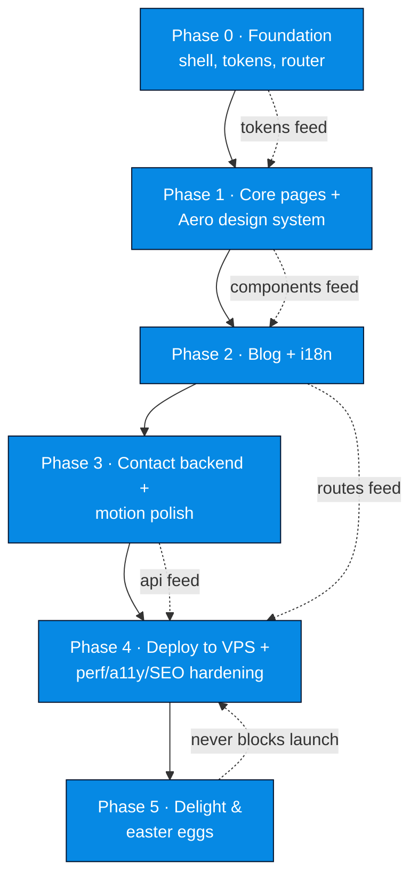
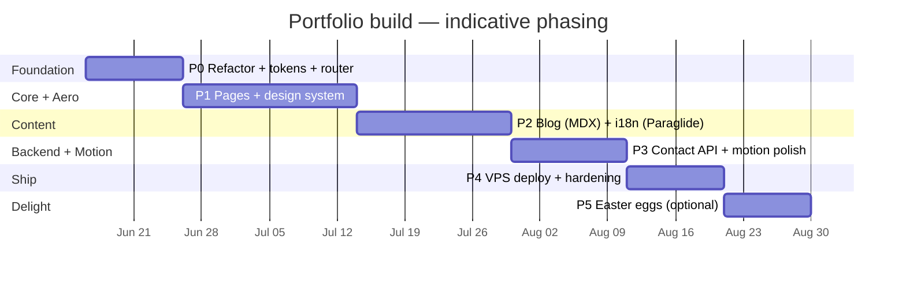

# Roadmap & Phases

The build is sequenced so that **structure precedes spectacle**: get a clean, typed, routable shell standing before pouring on the Frutiger Aero glass, then layer content (blog + i18n), then the backend and motion, then ship, then delight. Each phase ends on a hard **exit criterion** — no phase is "done" because it feels done; it's done because the gate passes. Definition of "done" per deliverable lives in [[Definition of Done]].

> [!important]
> Two co-equal north stars govern every phase: **express Jeronimo's identity** and **delight via Frutiger Aero spectacle** (see [[Vision & Purpose]] and [[Developer Identity]]). A phase that ships function but no soul has not actually shipped. Conversely, spectacle that breaks [[Accessibility & SEO]] budgets gets cut.

## Sequencing principle

## Timeline (indicative, solo dev, part-time)

> [!note]
> Durations are deliberately soft — this is a personal craft project, not a sprint commitment. The **order** is the contract; the dates are a sketch.

---

## Phase 0 — Foundation

**Goal.** Replace the single-file `src/App.tsx` mockup with a typed, routable, themeable shell. Nothing pretty yet — but everything load-bearing is in place so later phases never have to re-architect.

**Deliverables.**
- [ ] Refactor `src/App.tsx` placeholder into a real structure per [[Project Structure]] (`routes/`, `components/`, `lib/`, `styles/`, `content/`). Lift `PROFILE`/`SKILLS`/`PROJECTS`/`NAV` consts into typed data modules.
- [ ] Install and wire **React Router v7** (library mode) per [[Routing]]: `/:lang/...` shape, redirect `/` → detected locale, a root layout route hosting the shell.
- [ ] Author the **[[Design Tokens]]** layer in CSS-first Tailwind v4 `@theme` — color ramps (sky/day + ocean/aurora), radii, blur tokens (`--backdrop-blur-glass`), shadows, font stack (`"Source Sans 3","Hind","Open Sans",system-ui,"Segoe UI",sans-serif`). See [[Color & Gradients]] and [[Typography]].
- [ ] **Theming scaffold** per [[Theming — Light & Dark]]: CSS custom props, Tailwind `dark` variant, inline head script to kill FOUC, `localStorage` persistence defaulting from `prefers-color-scheme`.
- [ ] **Layout shell**: header/nav + footer + `<Outlet/>`, skip-link, landmark roles. No glass styling yet — just correct semantics.
- [ ] Confirm lint/typecheck/commit hooks still green (`npm run lint`, `tsc -b`, `npm run commit`).

**Exit criteria.**
- `npm run build` passes; `tsc -b` clean under TS 6 strict.
- Navigating to `/`, `/en`, `/es` resolves; theme toggle persists across reload with **no flash**.
- Zero references to the old mockup layout remain; data lives in typed modules.

> [!decision]
> Do the **router + theming + tokens together** in P0 even though it's tempting to defer routing until the blog exists. Retrofitting locale-prefixed routing after pages are built is the single most expensive mistake available here. #decision

---

## Phase 1 — Core pages + Aero design system

**Goal.** Build the **[[Component Visual Library]]** (the real Frutiger Aero CSS layer) and render the core static pages with it: [[Page — Home]], [[Page — About]], [[Page — Projects]]. This is where the site first *looks like itself*.

**Deliverables.**
- [ ] Hand-rolled Aero utility/component CSS layer per [[Glass, Gloss & Depth]]: `.glass` (semi-transparent fill + `backdrop-filter: blur() saturate()` with `-webkit-` prefix + `@supports` fallback), `.aqua`/`.gel-button` (multi-stop vertical gradient + inset top highlight + bottom sheen pseudo-element), beveled cards.
- [ ] **Background system** per [[Imagery & Motifs]] + [[Color & Gradients]]: animated aurora/mesh gradient (registered `@property` color custom props), 2–4 blurred drifting blobs, optional film-grain overlay (inline `feTurbulence` SVG data-URI, opacity ≤0.08, `pointer-events:none`).
- [ ] [[Page — Home]] hero — the signature spectacle moment; sky→cyan→lime gradient, glass nav, gel CTA.
- [ ] [[Page — About]] — identity-forward, [[Developer Identity]] made visible.
- [ ] [[Page — Projects]] — glass project cards (may link out; no per-project sub-pages in v1).
- [ ] Responsive at all breakpoints; both light "day/sky" and dark "ocean/aurora" themes designed, not just recolored.

**Exit criteria.**
- All three core pages render in **both themes** and **both locale shells** (copy can be EN-only placeholder until P2) without contrast failures over glass (≥4.5:1 — scrim/text-shadow as needed).
- `.glass`/`.gel-button` documented in [[Component Visual Library]] with usage examples.
- Backdrop-filter has a solid `@supports not` fallback; blur capped ≤20px.

> [!tip]
> Build the design system as **real reusable components/utilities**, not page-local one-offs. The blog (P2) and contact form (P3) must reuse the exact same `.glass`/`.gel-button`/card primitives.

---

## Phase 2 — Blog + i18n

**Goal.** Stand up the dev-authored blog and make the whole site genuinely bilingual EN/ES.

**Deliverables.**
- [ ] **Blog pipeline** per [[Blog Content Pipeline]] and [[ADR-005 — Blog Content Source]]: local **MDX** via `@mdx-js/rollup` + `remark-frontmatter` + `remark-mdx-frontmatter`, indexed with `import.meta.glob('./content/posts/*.mdx', { eager: true })`. `remark-gfm` + `rehype-pretty-code`/`shiki` for code blocks.
- [ ] Frontmatter schema (title/date/lang/slug/description/og) drives routing + meta + locale filtering. Per-locale variants as `slug.en.mdx` / `slug.es.mdx`.
- [ ] [[Page — Blog]] index (filtered by active locale) + post route `/:lang/blog/:slug`.
- [ ] **i18n** per [[i18n Architecture]] and [[ADR-004 — i18n Library]]: **Paraglide JS (inlang)** — compile-time, tree-shaken, typed messages; `:lang` route param drives `setLocale()`; choice persisted; language switcher swaps the `:lang` segment of the current path (`/en/blog/x` ↔ `/es/blog/x`) preserving slug.
- [ ] Translate all chrome (nav, footer, page copy) for EN + ES.

**Exit criteria.**
- A post written in `slug.en.mdx` + `slug.es.mdx` appears under both `/en/blog/...` and `/es/blog/...`; switcher round-trips without losing the slug.
- All UI strings resolve in both locales; no hardcoded English in components.
- Blog index respects active locale; code blocks render highlighted.

---

## Phase 3 — Contact backend + motion polish

**Goal.** A **real** working contact form (not mailto), plus the motion layer that makes the whole thing feel alive.

**Deliverables.**
- [ ] **Contact API** per [[Contact Backend]] and [[ADR-007 — Contact Form Backend]]: tiny **Hono** (Node) `/api/contact` in its own container, `zod`/`@hono/zod-validator` validation, **Resend** for email, guarded by **honeypot + Cloudflare Turnstile** (server-side `siteverify`) + IP rate-limiting.
- [ ] [[Page — Contact]] form: gel submit button, glass panel, inline validation, success/error states, Turnstile widget, accessible labels/errors.
- [ ] **Motion layer** per [[Motion & Animation]] and [[ADR-006 — Animation Library]]: **Motion** (`motion` pkg) for micro-interactions + `AnimatePresence`; native **View Transitions API** for route changes with Motion fallback. Hover/scroll micro-interactions on cards/buttons.
- [ ] **All motion gated** behind `useReducedMotion()` / `@media (prefers-reduced-motion: reduce)` → collapse to opacity-only or instant.

**Exit criteria.**
- A real submission lands an email via Resend; spam path (honeypot + failed Turnstile) is rejected server-side; rate-limit trips on abuse.
- Every animation has a reduced-motion fallback verified by toggling the OS setting.
- Form is fully keyboard-operable with announced errors.

---

## Phase 4 — Deploy to VPS + perf/a11y/SEO hardening

**Goal.** Ship it "to the net" on Jeronimo's own VPS, then harden against the [[Performance Budget]] and [[Accessibility & SEO]] gates.

**Deliverables.**
- [ ] **Prerender for SEO** per [[Accessibility & SEO]]: **`vite-react-ssg`** to statically render landing pages + every blog post, emitting per-route `<meta>`/OG/Twitter tags, `sitemap.xml`, `robots.txt`. Precompute static per-post OG PNGs at build.
- [ ] **Deploy** per [[VPS Deployment Plan]], [[ADR-008 — Deployment Target (VPS)]]: Docker multi-stage (Vite build → static `dist` served by **Caddy**) + Hono API container via **Docker Compose**; Caddy auto-TLS + reverse proxy.
- [ ] **CI/CD** per [[CI-CD Pipeline]]: GitHub Actions → build image → **GHCR** → SSH `docker compose pull && up -d`.
- [ ] [[Domain, DNS & TLS]]: custom domain, DNS, automatic Let's Encrypt via Caddy.
- [ ] [[Observability & Backups]]: basic logging/uptime + a backup story.
- [ ] Hit [[Performance Budget]]: LCP < 2.5s, **INP < 200ms**, CLS < 0.1, initial JS < ~150 KB gzip (route-level `lazy()`).
- [ ] Pass [[Accessibility & SEO]]: keyboard, contrast over glass, reduced-motion, landmarks, crawlable HTML.

**Exit criteria.**
- Production URL serves over HTTPS with valid TLS; a `git push` to `main` deploys without manual SSH steps.
- Core Web Vitals budget met on a real mobile profile; Lighthouse a11y ≥ 95.
- Social cards (OG/Twitter) render correctly for home + a blog post (crawler sees real HTML).

> [!warning]
> SPA meta injected client-side is invisible to many crawlers/social scrapers — that's why **prerender (`vite-react-ssg`) is a P4 deliverable, not optional polish**. #risk

---

## Phase 5 — Delight & easter eggs

**Goal.** The "drenched in spectacle" payload. Pure joy, fully optional, **never blocks launch**.

**Deliverables (pick from [[Backlog]]).**
- [ ] Interactive parallax bubbles / pointer-reactive blobs.
- [ ] Koi / fish cursor companion or trailing caustics.
- [ ] Konami-code easter egg (theme flip, hidden scene, or god-rays burst).
- [ ] Weather-reactive sky (time-of-day or live weather tinting the aurora).
- [ ] Optional ambient sound toggle (off by default).

**Exit criteria.**
- Each delight respects `prefers-reduced-motion` and does not regress the [[Performance Budget]] or [[Accessibility & SEO]] gates.
- Every effect is independently toggleable / lazily loaded so it can never break the core experience.

---

## Cross-phase invariants

> [!note]
> These hold in **every** phase, checked at each exit gate:
> - TS 6 strict clean, ESLint clean, Conventional Commits (`npm run commit`).
> - `prefers-reduced-motion` honored for anything that moves.
> - Contrast ≥4.5:1 maintained over all glass surfaces.
> - No regression against [[Success Criteria]] or [[Definition of Done]].

## Next actions

- [ ] Kick off Phase 0 — see the marked first steps in [[Now · Next · Later]].
- [ ] Lock [[Design Tokens]] values before writing the first `.glass` utility.

## See also

- [[Now · Next · Later]] — live triage of what to do right now
- [[Backlog]] — uncommitted ideas + delight concepts
- [[Definition of Done]] — the per-feature and launch gates
- [[Roadmap & Phases]] feeds from [[Success Criteria]] and the [[ADR Index]]
