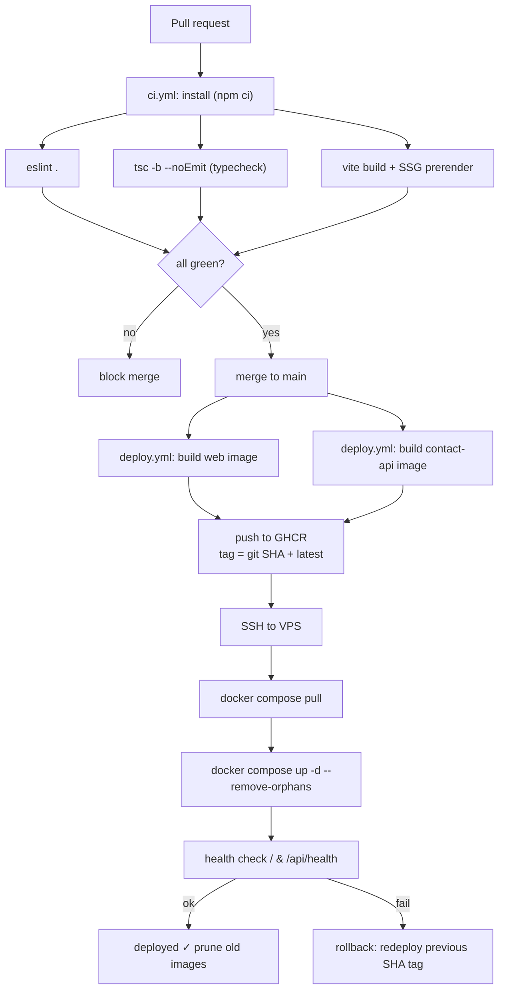

# CI-CD Pipeline

GitHub Actions pipeline for a bilingual, prerendered React 19 / Vite 8 portfolio self-hosted on a VPS. **PRs gate on lint + typecheck + build.** Merges to `main` build two container images (`web`, `contact-api`), push them to **GHCR**, and deploy via **SSH `docker compose pull && up -d`** on the VPS. Build-in-CI / pull-on-server keeps the box lean and the build reproducible.

> [!decision] Build in CI, pull on the VPS
> The VPS **never builds**. CI builds images, tags them with the commit SHA, pushes to GHCR, then SSHes in to `docker compose pull && up -d`. This is cleaner than building on-server (no Node toolchain on the box, deterministic builds, instant rollback by re-pulling a prior SHA tag). See [[ADR-008 — Deployment Target (VPS)]] and the runtime topology in [[VPS Deployment Plan]].

---

## Pipeline overview



---

## Commit-message / Husky context

This repo enforces **Conventional Commits** locally (Husky 9 + commitlint `config-conventional`, commit-msg hook; author via `npm run commit` / commitizen). The CI does **not** re-run Husky hooks (they're local git hooks) but the pipeline relies on the convention in two ways:

- **PR titles** are linted to Conventional Commits so squash-merge subjects stay clean (use a `commitlint`/PR-title action or branch protection requiring the title pattern).
- Clean conventional history is the input for **automatic changelog / version tagging** later (e.g. `release-please` or `semantic-release`) if we choose to add releases. Not in v1 scope; tracked as a backlog item.

> [!tip] Keep CI fast: cache `~/.npm` (or use `actions/setup-node` with `cache: npm`) and the Docker layer cache (GHA cache or registry cache) so unchanged deps don't reinstall and unchanged layers don't rebuild. Vite 8's Rolldown bundler already makes the build itself fast.

---

## `ci.yml` — PR gate

```yaml
name: ci
on:
  pull_request:
    branches: [main]
concurrency:
  group: ci-${{ github.ref }}
  cancel-in-progress: true

jobs:
  verify:
    runs-on: ubuntu-latest
    steps:
      - uses: actions/checkout@v4
      - uses: actions/setup-node@v4
        with:
          node-version: 22
          cache: npm
      - run: npm ci
      - run: npm run lint                 # eslint .
      - run: npx tsc -b --noEmit          # typecheck (strict TS 6)
      - run: npm run build                # tsc -b && vite build (+ SSG)
      # Optional: upload dist as artifact for preview / inspection
```

> [!note] `npm run build` already runs `tsc -b` then `vite build`; the explicit `tsc -b --noEmit` is a cheap fast-fail so a type error surfaces before the (slightly longer) full build. Drop one if you want a single step.

---

## `deploy.yml` — build, push, deploy on `main`

```yaml
name: deploy
on:
  push:
    branches: [main]
concurrency:
  group: deploy-production   # never two deploys at once
  cancel-in-progress: false

permissions:
  contents: read
  packages: write            # push to GHCR

jobs:
  build-and-push:
    runs-on: ubuntu-latest
    outputs:
      tag: ${{ steps.meta.outputs.sha }}
    steps:
      - uses: actions/checkout@v4
      - uses: docker/setup-buildx-action@v3
      - uses: docker/login-action@v3
        with:
          registry: ghcr.io
          username: ${{ github.actor }}
          password: ${{ secrets.GITHUB_TOKEN }}
      - id: meta
        run: echo "sha=${GITHUB_SHA::12}" >> "$GITHUB_OUTPUT"

      - uses: docker/build-push-action@v6      # web (Vite -> Caddy static)
        with:
          context: .
          file: ./Dockerfile
          target: web
          push: true
          tags: |
            ghcr.io/jeronimo/portfolio-web:${{ steps.meta.outputs.sha }}
            ghcr.io/jeronimo/portfolio-web:latest
          cache-from: type=gha
          cache-to: type=gha,mode=max

      - uses: docker/build-push-action@v6      # contact-api (Hono)
        with:
          context: ./contact-api
          push: true
          tags: |
            ghcr.io/jeronimo/portfolio-contact-api:${{ steps.meta.outputs.sha }}
            ghcr.io/jeronimo/portfolio-contact-api:latest
          cache-from: type=gha
          cache-to: type=gha,mode=max

  deploy:
    needs: build-and-push
    runs-on: ubuntu-latest
    steps:
      - name: Deploy over SSH
        uses: appleboy/ssh-action@v1
        with:
          host: ${{ secrets.VPS_HOST }}
          username: ${{ secrets.VPS_USER }}
          key: ${{ secrets.SSH_DEPLOY_KEY }}
          script: |
            set -euo pipefail
            cd /srv/portfolio
            export IMAGE_TAG=${{ needs.build-and-push.outputs.tag }}
            echo "IMAGE_TAG=$IMAGE_TAG" > .env.deploy   # consumed by compose
            docker compose pull
            docker compose up -d --remove-orphans
            # Health gate
            for i in $(seq 1 15); do
              curl -fsS https://jeronimo.dev/ >/dev/null \
                && curl -fsS https://jeronimo.dev/api/health >/dev/null \
                && exit 0
              sleep 2
            done
            echo "Health check failed" >&2; exit 1
            docker image prune -f
```

> [!warning] `concurrency: group: deploy-production` with `cancel-in-progress: false` serializes deploys so two pushes can't race the same Compose project. The health-gate `exit 1` fails the job loudly — pair it with a notification (see [[Observability & Backups]]).

---

## Zero-ish-downtime restart

- **Static `web`:** Compose recreates the container; Caddy keeps proxying the old one until the new one accepts connections. For a static file server the swap is effectively atomic — visitors don't notice.
- **`contact-api`:** a sub-second gap on recreate is acceptable for a contact form. If we want true zero-downtime later, run **two `contact-api` replicas** behind Caddy's load balancing and recreate them one at a time (`--no-deps` rolling), so one always serves.
- **Caddy itself** rarely restarts (config changes only); `caddy reload` is graceful and config-only changes don't drop connections.

---

## Rollback

Because every image is tagged with its commit SHA, rollback is **re-pulling a known-good tag** — no rebuild.

```bash
# On the VPS (or via a manual workflow_dispatch input)
cd /srv/portfolio
export IMAGE_TAG=<previous-good-sha>
docker compose pull && docker compose up -d
```

- [ ] Add a `workflow_dispatch` input `image_tag` to `deploy.yml` so a rollback is a one-click "Run workflow" with a prior SHA — no SSH needed.
- [ ] Keep at least the last ~5 SHA-tagged images in GHCR (retention policy) so rollback targets exist; `docker image prune -f` on the box only removes dangling layers, not tagged images.

> [!important] **Migrations / breaking changes:** the contact-api is stateless (no DB), so rollback is safe. If a data store is ever added, gate rollback on backward-compatible schema — note it in [[Definition of Done]].

---

## Secrets used by CI

| GitHub Secret | Purpose |
|---|---|
| `GITHUB_TOKEN` (auto) | Push images to GHCR. |
| `SSH_DEPLOY_KEY` | Private key for the `deploy` user on the VPS. |
| `VPS_HOST` / `VPS_USER` | SSH target. |
| `RESEND_API_KEY`, `TURNSTILE_SECRET`, `MAIL_TO` | Refreshed into `/srv/portfolio/.env` if CI manages env (otherwise set once on the box). |

See secrets handling in [[VPS Deployment Plan]].

---

## Open questions

- [ ] Adopt `release-please`/`semantic-release` for changelog + version tags now, or defer past v1? (Conventional Commits are already enforced, so the input exists.)
- [ ] Preview deployments per-PR (ephemeral subdomain) — worth the VPS overhead, or skip for a solo portfolio?
- [ ] Wire the health-gate failure to a [[Observability & Backups]] alert (e.g. Uptime Kuma / ntfy) so a bad deploy pages immediately.

## See also

- [[VPS Deployment Plan]] — Dockerfiles, compose, Caddyfile the pipeline targets.
- [[Observability & Backups]] · [[ADR-008 — Deployment Target (VPS)]] · [[Tech Stack]] · [[Definition of Done]]
