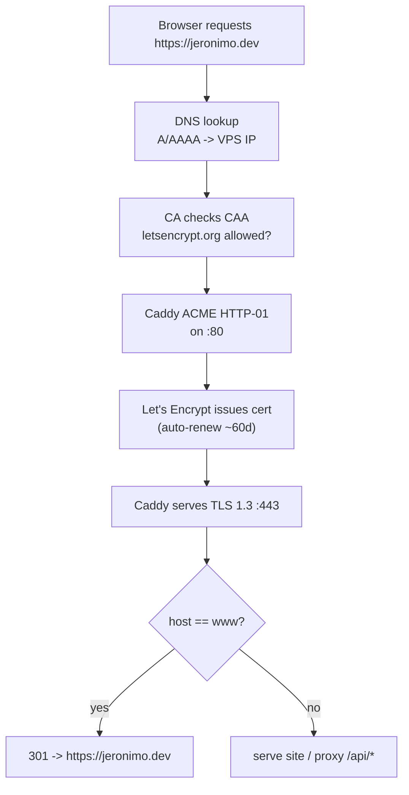

# Domain, DNS & TLS

Everything that makes the site reachable at a real name with a green padlock, and lets the contact form's email land in inboxes (not spam). The runtime assumes a single apex domain with `www` redirecting to it, TLS auto-provisioned by **Caddy** (see [[VPS Deployment Plan]]).

> [!decision] One apex, www → apex, Caddy auto-TLS
> Serve the canonical site at the **apex** (`jeronimo.dev`); redirect `www` → apex with a 301. Let **Caddy obtain + renew Let's Encrypt certs automatically** for both names — no certbot, no cron. This was the deciding ergonomic factor for Caddy over nginx in [[ADR-008 — Deployment Target (VPS)]].

---

## 1. Choosing the domain

> [!question] Decide before anything else — DNS, certs, and email all key off the chosen name.

- [ ] **Personal name vs brand?** This is an identity artifact, not a job-hunt funnel — a personal-name domain (`jeronimobetancur.dev`, `jbetancur.dev`, `jeronimo.dev`) fits the "craft-as-statement" purpose better than a clever brand.
- [ ] **TLD:** `.dev` (Google-run, **HSTS-preloaded at the TLD level → HTTPS mandatory**, perfect for a developer) > `.com` (universal, safe) > `.me`/`.io` (fine, pricier). `.dev` being preload-forced means you can't accidentally serve plaintext — good.
- [ ] **Registrar:** pick one with **free DNS, registrar-lock, 2FA, and at-cost renewals** (Cloudflare Registrar, Porkbun, Namecheap). Avoid registrars that upsell privacy — WHOIS privacy should be free.
- [ ] **DNS host:** Cloudflare is the pragmatic default (fast anycast DNS, free). **If you use Cloudflare DNS, keep records "DNS only" (grey-cloud), NOT proxied** while Caddy does TLS — an orange-cloud proxy interferes with Caddy's HTTP-01 ACME challenge and adds a second TLS layer you don't control.

---

## 2. DNS records

Assuming apex `jeronimo.dev`, VPS IPv4 `203.0.113.10` and IPv6 `2001:db8::10`, and email sent via **Resend** (see [[Contact Backend]]). Replace with real values.

| Type | Name | Value | TTL | Purpose |
|---|---|---|---|---|
| `A` | `@` (apex) | `203.0.113.10` | 300→3600 | Site IPv4. |
| `AAAA` | `@` | `2001:db8::10` | 300→3600 | Site IPv6 (set if VPS has one; else omit). |
| `A` | `www` | `203.0.113.10` | 3600 | www → same box; Caddy redirects to apex. |
| `AAAA` | `www` | `2001:db8::10` | 3600 | www IPv6. |
| `CAA` | `@` | `0 issue "letsencrypt.org"` | 3600 | Only Let's Encrypt may issue certs. |
| `CAA` | `@` | `0 iodef "mailto:jbetancur@idtsas.com"` | 3600 | Report violations. |
| `TXT` | `@` | `v=spf1 include:_spf.resend.com -all` | 3600 | SPF — authorize Resend to send. |
| `TXT` | `resend._domainkey` | *(DKIM key from Resend dashboard)* | 3600 | DKIM signing. |
| `TXT` | `_dmarc` | `v=DMARC1; p=quarantine; rua=mailto:jbetancur@idtsas.com` | 3600 | DMARC policy + reports. |
| `MX` | `@` | *(only if you want to RECEIVE mail at the domain)* | 3600 | Not needed just to send. |

> [!tip] Use a **short TTL (300s)** for the `A`/`AAAA` records during initial setup so a wrong IP or a VPS migration propagates fast; raise to 3600 once stable. The exact SPF `include:` and DKIM selector come from the Resend dashboard — the values above are the canonical Resend pattern, confirm in the panel.

> [!warning] **CAA must allow `letsencrypt.org`.** If you set a CAA record that omits it, Caddy's cert issuance silently fails and the site is unreachable over HTTPS. Add the CAA only after confirming the issuer.

---

## 3. Resolution + TLS flow



- Caddy uses **HTTP-01** by default (needs `:80` reachable — UFW already allows it). DNS-01 is only needed for wildcard certs, which we don't.
- Renewal is automatic at ~⅓ cert lifetime; certs + ACME account persist in the `caddy_data` volume (backed up — see [[Observability & Backups]]).

---

## 4. www / apex redirect + HSTS

Implemented in the edge Caddyfile (full sketch in [[VPS Deployment Plan]]):

```caddyfile
jeronimo.dev, www.jeronimo.dev {
    @www host www.jeronimo.dev
    redir @www https://jeronimo.dev{uri} permanent   # 301 www -> apex
    header Strict-Transport-Security "max-age=31536000; includeSubDomains; preload"
    # ...reverse_proxy to web / contact-api...
}
```

> [!important] **HSTS rollout order — do not preload prematurely.**
> 1. Ship `max-age=300` first; confirm HTTPS works on every path and subdomain.
> 2. Raise to `max-age=31536000`.
> 3. Only then add `includeSubDomains; preload` and submit to hstspreload.org.
>
> Preload is **near-irreversible** — every subdomain must be HTTPS forever. For a `.dev` TLD the apex is already preload-forced, but `includeSubDomains` still commits any future subdomain. Be deliberate.

---

## 5. Email deliverability for the contact form

The contact form emails *you* via Resend (see [[Contact Backend]]). Even server-to-self mail needs auth records or it lands in spam.

- [ ] **Verify the sending domain in Resend** → it gives you the exact SPF `include`, a DKIM `TXT` (`resend._domainkey`), and optionally a `MX`/`return-path` for bounces.
- [ ] **SPF:** one `TXT` at apex, `-all` (hard fail) once you're sure Resend is the only sender. Never have two SPF records — merge includes into one.
- [ ] **DKIM:** publish Resend's selector key verbatim. This is the strongest deliverability signal.
- [ ] **DMARC:** start `p=none` to collect `rua` reports, then tighten to `p=quarantine` (table above) once SPF+DKIM align.
- [ ] **From/Reply-To:** send `From: noreply@jeronimo.dev` (verified domain), set `Reply-To` to the submitter's address so you can reply directly. Never spoof the visitor's address in `From` — it'll fail their domain's DMARC.

> [!note] No `MX` is required to *send*. Only add `MX` if you also want to *receive* mail at `@jeronimo.dev` (e.g. a forwarding/inbox service). For v1 the form just sends out.

---

## Setup checklist

- [ ] Buy domain; enable registrar-lock + 2FA; confirm free WHOIS privacy.
- [ ] Point nameservers at chosen DNS host (Cloudflare etc.).
- [ ] Add `A` (+`AAAA`) for apex and `www`, **DNS-only / grey-cloud**.
- [ ] Add `CAA` allowing `letsencrypt.org` + `iodef` mailto.
- [ ] Bring up Caddy; confirm cert issues for apex **and** www (`curl -vI https://...`).
- [ ] Verify `www → apex` 301 works.
- [ ] Verify Resend sending domain → publish SPF, DKIM, DMARC `TXT`.
- [ ] Send a test contact message; check it lands in inbox (run through mail-tester.com).
- [ ] Roll HSTS up in stages; submit preload only when fully HTTPS-stable.
- [ ] Lower then raise TTLs once IPs are confirmed stable.

## Open questions

- [ ] Final domain + TLD choice (owner decision).
- [ ] Will the domain also receive email (needs `MX`), or send-only?
- [ ] Use Cloudflare proxy (orange-cloud) for DDoS/caching later, accepting that Caddy then uses a Cloudflare origin cert / Cloudflare TLS instead of issuing its own?

## See also

- [[VPS Deployment Plan]] — where the Caddyfile + redirect live.
- [[Contact Backend]] — the Resend integration these mail records authorize.
- [[Observability & Backups]] · [[ADR-008 — Deployment Target (VPS)]]
