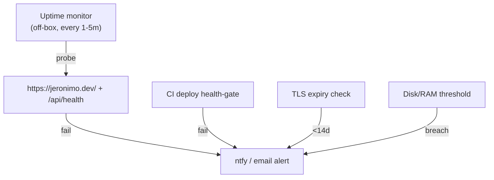
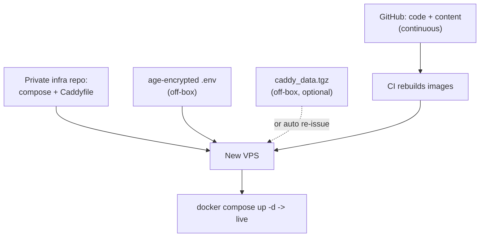

# Observability & Backups

Keeping the self-hosted portfolio **alive, observable, recoverable, and hardened** without enterprise overhead. The whole point of self-hosting (see [[ADR-008 — Deployment Target (VPS)]]) is control — that control includes *noticing when it breaks* and *getting it back*. Stays lightweight: the box runs ~3 containers (see [[VPS Deployment Plan]]).

> [!important] What is actually stateful here?
> Almost nothing. **Site content and all config live in git.** The only on-disk state worth protecting is: (1) the **`caddy_data` volume** (TLS certs + ACME account), and (2) the **`/srv/portfolio/.env`** secrets file. The `contact-api` is stateless (no DB). So backups are tiny and recovery is mostly "re-clone, re-deploy."

---

## 1. Uptime monitoring (does the world see it?)

- [ ] **External uptime check** — the non-negotiable. An off-box probe of `https://jeronimo.dev/` and `https://jeronimo.dev/api/health` every 1–5 min, alerting on failure. If the VPS itself dies, an on-box monitor can't tell you.
  - **Self-hosted:** [Uptime Kuma](https://github.com/louislam/uptime-kuma) (one container, beautiful, push/pull + status page) — but ideally run it on a *different* host so it survives this VPS dying.
  - **Hosted free:** UptimeRobot / Better Stack free tier — simplest, off-box by design.
- [ ] Add a real `/api/health` endpoint to the Hono service (see [[Contact Backend]]) returning `200 {ok:true}` — cheap liveness signal the [[CI-CD Pipeline]] deploy gate also uses.
- [ ] **Alert channel:** [ntfy](https://ntfy.sh) (push to phone, self-hostable) or email/Telegram. Wire the CI deploy health-gate failure here too.
- [ ] **Cert-expiry alert:** Caddy auto-renews, but monitor cert expiry as a backstop (Uptime Kuma has a TLS-expiry monitor). Renewal failures are the most likely silent outage.



---

## 2. Logs

- **Caddy access + error logs** are the primary signal (every request, TLS handshakes, ACME renewals, proxy errors to the API). Configure JSON logs in the Caddyfile and let Docker capture stdout.
- **`contact-api` logs** — log submissions (without PII beyond what's needed), Turnstile verify results, Resend send success/failure. Structured (JSON) so they're greppable.
- **Docker log rotation** is essential or logs eat the disk. Set it globally in `/etc/docker/daemon.json`:

```json
{
  "log-driver": "json-file",
  "log-opts": { "max-size": "10m", "max-file": "3" }
}
```

- [ ] `docker compose logs -f --tail=200 caddy contact-api` is the day-to-day debugging command.
- [ ] **Optional aggregation:** if grep-over-SSH gets old, add **Grafana Loki + Promtail** (or Grafana Alloy) in a container — lightweight, queryable. Skip until the manual approach actually hurts; a solo portfolio rarely needs it.

> [!tip] Caddy's structured logs make it trivial to spot a spike of `/api/contact` 4xx/429 (spam being rate-limited — working as intended) vs 5xx (the API is broken). Watch the ratio.

---

## 3. Basic metrics

- [ ] **Host metrics** — disk, RAM, CPU, load. The cheapest win: `node_exporter` + a tiny Prometheus + Grafana, OR just **Netdata** (single container, gorgeous real-time dashboard, near-zero config) for a one-box setup.
- [ ] **Alert on the boring killers:** disk > 80% (Docker images/logs creep), RAM pressure (`backdrop-filter`-heavy build is client-side, but the box is small), and container restart loops.
- [ ] `docker stats` for a quick eyeball; `docker system df` to watch image/volume bloat (the [[CI-CD Pipeline]] prunes dangling layers, but check periodically).

> [!note] Don't over-instrument a portfolio. Netdata-or-nothing is a defensible v1: it covers host health + per-container stats with one container and no scrape config. Add Prometheus/Grafana only if you want history/alerting beyond thresholds.

---

## 4. Error tracking (optional)

- The site is **mostly static + prerendered** (see [[VPS Deployment Plan]]), so client-side error volume is low — but client JS errors are otherwise invisible to you.
- [ ] **Client + server errors:** self-hosted [GlitchTip](https://glitchtip.com) (Sentry-compatible, lighter, FOSS) or Sentry's free tier. Wire `@sentry/react` for the SPA and capture `contact-api` exceptions.
- [ ] If you'd rather not run another service, **Caddy 5xx logs + the contact-api logs** already surface server errors; a tiny client-side `window.onerror` → `/api/log` beacon can catch the worst client crashes without a full SaaS.

> [!question] Error-tracking is the most "optional" item here — decide based on appetite. For a personal site, log-based triage may be enough for v1; revisit if real visitors report breakage.

---

## 5. Backups

> [!decision] Back up the two stateful things; everything else is reproducible from git + CI.

| What | Why | How | Cadence |
|---|---|---|---|
| `/srv/portfolio/.env` | Secrets (Resend, Turnstile, mail) — not in git | Encrypted copy in a password manager / `age`-encrypted off-box file | On change |
| `caddy_data` volume | TLS certs + ACME account | `docker run --rm -v caddy_data:/d -v $PWD:/b alpine tar czf /b/caddy_data.tgz -C /d .` → off-box | Weekly + before risky changes |
| `/srv/portfolio/*` (compose, Caddyfile) | Infra config | Commit to a **private** infra repo (no secrets) | On change |
| Site content & code | The site itself | Already in git (GitHub) | Continuous |

- **Restore drill:** losing the whole VPS should be recoverable by: provision new box → run prep ([[VPS Deployment Plan]]) → restore `.env` + (optionally) `caddy_data` → `docker compose up -d`. **Certs even regenerate themselves** if you don't restore `caddy_data` (Caddy re-issues on first request — mind Let's Encrypt rate limits if you rebuild repeatedly).
- [ ] **3-2-1-ish:** keep at least one backup copy **off the VPS** (a different cloud bucket / your machine). A backup that dies with the box is not a backup.
- [ ] **Test a restore** at least once — an untested backup is a hope, not a backup.
- [ ] **VPS provider snapshots** are a convenient coarse safety net (full-disk image), but don't substitute for the small targeted backups above (and they cost more / may contain secrets).



---

## 6. Update strategy

- [ ] **OS:** enable `unattended-upgrades` for security patches; reboot on a schedule when kernel updates need it (`needrestart` / `/var/run/reboot-required`).
- [ ] **Base images:** `node:22-alpine` and `caddy:2-alpine` get rebuilt every CI run, so a fresh build picks up patched bases — periodically re-run the [[CI-CD Pipeline]] even without code changes (a weekly scheduled `workflow_dispatch`/cron build keeps bases current).
- [ ] **Dependencies:** enable **Dependabot/Renovate** on the repo for npm + GitHub Actions + Docker base-image bumps; the [[CI-CD Pipeline]] PR gate (lint/typecheck/build) vets them automatically.
- [ ] **Caddy:** pin to `caddy:2-alpine`; major upgrades are rare and config-compatible.

---

## 7. Security hardening

> [!warning] A self-hosted box is exposed to the internet. These are not optional.

- [ ] **fail2ban** — ban IPs after repeated SSH auth failures (and optionally on Caddy 4xx floods). The single highest-value hardening step after key-only SSH.
- [ ] **unattended-upgrades** — auto-apply security patches (also under §6).
- [ ] **SSH:** key-only, root login disabled, non-default user — already in [[VPS Deployment Plan]] prep. Consider moving SSH off `:22` only as noise reduction (not real security).
- [ ] **UFW:** only `22`/`80`/`443` inbound; `web` and `contact-api` are never host-published (internal Compose network only).
- [ ] **App-layer abuse:** contact form already has **honeypot + Cloudflare Turnstile + IP rate-limit** (see [[Contact Backend]]) — this is your real spam/abuse gate, not the firewall.
- [ ] **Security headers:** HSTS, `X-Content-Type-Options`, `Referrer-Policy` set in Caddy; author a real **CSP** once the Frutiger-Aero asset surface stabilizes (tracked in [[VPS Deployment Plan]]).
- [ ] **Least privilege:** GHCR pull token is read-only; deploy SSH key has only what it needs; secrets are `chmod 600`.
- [ ] **Docker hygiene:** run containers as non-root where the image allows; keep the daemon patched; don't mount the Docker socket into any public container.

---

## Master checklist

- [ ] Off-box uptime monitor on `/` + `/api/health`, alerting via ntfy/email.
- [ ] `/api/health` endpoint shipped in contact-api.
- [ ] Docker log rotation in `daemon.json`.
- [ ] Host metrics (Netdata) with disk/RAM alerts.
- [ ] (Optional) GlitchTip/Sentry for client+server errors.
- [ ] Off-box backups of `.env` (encrypted) + `caddy_data`; infra config in private repo.
- [ ] One rehearsed restore.
- [ ] fail2ban + unattended-upgrades installed and active.
- [ ] Dependabot/Renovate enabled; weekly base-image rebuild scheduled.
- [ ] Security headers live; CSP authored when assets settle.

## Open questions

- [ ] Run Uptime Kuma self-hosted (needs a second host to be meaningful) or use a hosted free tier?
- [ ] Netdata-only vs Prometheus+Grafana — how much metric history do we actually want?
- [ ] Adopt error tracking in v1, or rely on logs until there's traffic?

## See also

- [[VPS Deployment Plan]] — host prep, volumes, secrets these backups/hardening protect.
- [[CI-CD Pipeline]] — health gate, image rebuilds, dependency PRs.
- [[Domain, DNS & TLS]] · [[Contact Backend]] · [[ADR-008 — Deployment Target (VPS)]]
