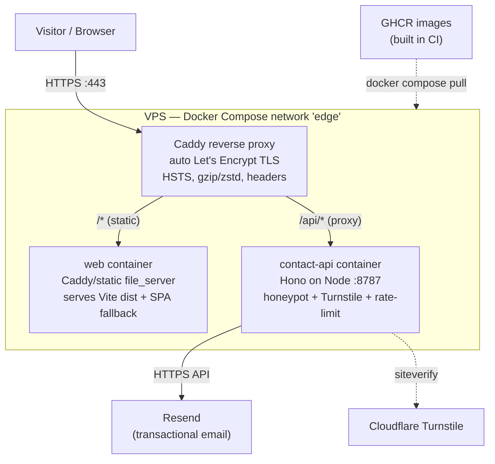

# VPS Deployment Plan

End-to-end plan for self-hosting this portfolio on **Jeronimo's own VPS** — no vendor lock-in, full control, first-party contact data. The runtime is three containers behind **Caddy** (auto-TLS reverse proxy): a static `web` (the Vite `dist`), a `contact-api` (Hono → Resend), and Caddy itself.

> [!decision] Shape of the deployment
> **Docker multi-stage** (Node build → static `dist`) served by **Caddy**, orchestrated by **Docker Compose**, fronted by Caddy as the only public-facing service. TLS is automatic via Let's Encrypt. Images are built in CI and pulled on the VPS (see [[CI-CD Pipeline]]). This is strictly less ops than nginx + certbot and uses ~3 containers vs Coolify's 6–10. See [[ADR-008 — Deployment Target (VPS)]] for the alternatives we rejected (Coolify/Dokploy/Dokku, nginx+certbot, managed PaaS).

---

## 1. Architecture



- Only **Caddy** binds host ports (`80`, `443`). `web` and `contact-api` are reachable only on the internal Compose network — never published to the host.
- Caddy terminates TLS, routes `/api/*` to `contact-api:8787`, and serves everything else from the `web` container (which itself is a tiny static `file_server` with SPA fallback for client routing — see [[Routing]]).
- The `web` image is a built artifact; **content lives in git** so the only stateful things on disk are Caddy's certs/data and the `.env` secrets file (see [[Observability & Backups]]).

---

## 2. VPS preparation (one-time)

> [!important] Do this before the first deploy. It is the foundation everything else assumes.

- [ ] Provision a small VPS (2 vCPU / 2–4 GB RAM is ample for static + tiny API). Ubuntu LTS or Debian stable.
- [ ] Create a non-root deploy user, add to `docker` group, disable root SSH + password auth (key-only).
- [ ] Configure UFW: allow `22` (SSH), `80`, `443`; deny everything else inbound.
- [ ] Install Docker Engine + Compose plugin from Docker's official apt repo (not the distro's stale package).
- [ ] Enable `unattended-upgrades` and install `fail2ban` (details in [[Observability & Backups]]).
- [ ] Create the app directory `/srv/portfolio` owned by the deploy user; this holds `docker-compose.yml`, `Caddyfile`, and `.env`.

```bash
# As root, first boot
adduser deploy && usermod -aG sudo deploy
install -d -m 700 /home/deploy/.ssh
# ...paste public key into /home/deploy/.ssh/authorized_keys, chmod 600...

# Harden sshd: PermitRootLogin no, PasswordAuthentication no -> systemctl restart ssh

# Firewall
ufw default deny incoming && ufw default allow outgoing
ufw allow OpenSSH && ufw allow 80/tcp && ufw allow 443/tcp && ufw enable

# Docker (official convenience path; pin in production)
curl -fsSL https://get.docker.com | sh
usermod -aG docker deploy

# App home
install -d -o deploy -g deploy /srv/portfolio
```

> [!warning] Never commit `.env`. It holds the Resend API key and Turnstile secret. It lives only on the VPS at `/srv/portfolio/.env` (mode `600`), injected into CI from GitHub Secrets, and is itself backed up out-of-band (see [[Observability & Backups]]).

---

## 3. Dockerfile — multi-stage Vite build (`web`)

The site is **prerendered** with `vite-react-ssg` (see [[Tech Stack]] / [[Performance Budget]]), so the build emits real static HTML per route. The runtime image is just Caddy serving that `dist`.

```dockerfile
# ---- build stage ----
FROM node:22-alpine AS build
WORKDIR /app
# Cache deps independently of source
COPY package.json package-lock.json ./
RUN npm ci
COPY . .
# tsc -b && vite build  (+ vite-react-ssg prerender)
RUN npm run build

# ---- runtime stage: static served by Caddy ----
FROM caddy:2-alpine AS web
# Per-container Caddyfile that just file_servers the SPA with fallback
COPY deploy/web.Caddyfile /etc/caddy/Caddyfile
COPY --from=build /app/dist /srv
EXPOSE 8080
# Caddy reads /etc/caddy/Caddyfile by default
```

`deploy/web.Caddyfile` (internal static server, no TLS — the edge Caddy handles that):

```caddyfile
:8080 {
    root * /srv
    encode zstd gzip
    # SPA fallback: unknown paths -> index.html for client router,
    # but only when the file truly doesn't exist (prerendered HTML wins).
    try_files {path} {path}/ /index.html
    file_server
    # Long cache for fingerprinted assets, no-cache for HTML
    @assets path /assets/*
    header @assets Cache-Control "public, max-age=31536000, immutable"
    @html path *.html /
    header @html Cache-Control "no-cache"
}
```

> [!tip] The `contact-api` has its own minimal Dockerfile (`node:22-alpine`, `npm ci --omit=dev`, copy built Hono server, `CMD node dist/server.js`, `EXPOSE 8787`). See [[Contact Backend]] for the app itself. Both images are built and pushed to GHCR in CI — the VPS never builds.

---

## 4. docker-compose.yml sketch

Lives at `/srv/portfolio/docker-compose.yml`. Images are pulled by tag/digest from GHCR.

```yaml
services:
  caddy:
    image: caddy:2-alpine
    restart: unless-stopped
    ports:
      - "80:80"
      - "443:443"
      - "443:443/udp"     # HTTP/3
    volumes:
      - ./Caddyfile:/etc/caddy/Caddyfile:ro
      - caddy_data:/data   # certs + ACME account (BACK THIS UP)
      - caddy_config:/config
    networks: [edge]
    depends_on: [web, contact-api]

  web:
    image: ghcr.io/jeronimo/portfolio-web:${IMAGE_TAG:-latest}
    restart: unless-stopped
    expose: ["8080"]       # internal only, not published
    networks: [edge]

  contact-api:
    image: ghcr.io/jeronimo/portfolio-contact-api:${IMAGE_TAG:-latest}
    restart: unless-stopped
    expose: ["8787"]       # internal only
    env_file: [./.env]     # RESEND_API_KEY, TURNSTILE_SECRET, MAIL_TO, ...
    networks: [edge]

networks:
  edge:

volumes:
  caddy_data:
  caddy_config:
```

> [!note] `${IMAGE_TAG}` is set per deploy (commit SHA) so rollback is just re-pulling a previous tag — see [[CI-CD Pipeline]]. `latest` is the fallback for manual ops only.

---

## 5. Edge Caddyfile sketch (auto-TLS)

Lives at `/srv/portfolio/Caddyfile`. This is the public-facing config; the domain comes from [[Domain, DNS & TLS]].

```caddyfile
{
    email jbetancur@idtsas.com   # ACME account / expiry notices
}

# Apex + www, www redirects to apex
jeronimo.dev, www.jeronimo.dev {
    encode zstd gzip

    # Security headers (HSTS only after you're confident — see Domain note)
    header {
        Strict-Transport-Security "max-age=31536000; includeSubDomains; preload"
        X-Content-Type-Options "nosniff"
        Referrer-Policy "strict-origin-when-cross-origin"
        -Server
    }

    @www host www.jeronimo.dev
    redir @www https://jeronimo.dev{uri} permanent

    # Contact API
    handle /api/* {
        reverse_proxy contact-api:8787
    }

    # Everything else -> static site container
    handle {
        reverse_proxy web:8080
    }
}
```

- **Auto-TLS:** naming the domain at the top of a site block makes Caddy obtain + renew a Let's Encrypt cert automatically. No certbot, no cron, no manual renewal.
- Certs persist in the `caddy_data` volume; losing it just triggers re-issuance (subject to LE rate limits) — so we back it up.

> [!question] CSP — a content-security-policy header is intentionally omitted from this sketch because the Frutiger-Aero layer uses inline styles/SVG data-URIs and a theme-flash inline script (see [[Theming — Light & Dark]]). Author a real CSP once the asset surface is final; track in [[Accessibility & SEO]].

---

## 6. Environment & secrets handling

| Secret | Where it lives | Consumed by | Notes |
|---|---|---|---|
| `RESEND_API_KEY` | `/srv/portfolio/.env` (600) + GitHub Secret | `contact-api` | Transactional email; rotate on leak. |
| `TURNSTILE_SECRET` | `.env` + GitHub Secret | `contact-api` | Server-side `siteverify`. Site key is public, ships in client. |
| `MAIL_TO` / `MAIL_FROM` | `.env` | `contact-api` | Destination inbox + verified sender domain. |
| `SSH_DEPLOY_KEY` | GitHub Secret only | CI runner | Deploys via SSH; never on the box's git. |
| GHCR pull token | VPS `docker login ghcr.io` once | Docker on VPS | Read-only PAT for private images. |

- **Flow:** GitHub Secrets → CI writes/refreshes `/srv/portfolio/.env` over SSH → `docker compose up -d` reloads. `.env` is `chmod 600`, owned by `deploy`, never committed, and `.env` is in `.gitignore`.
- **12-factor:** all config is env-injected; the same image runs anywhere. No secrets baked into images.

---

## 7. Deploy procedure (manual / what CI automates)

```bash
# On the VPS, in /srv/portfolio (CI does this over SSH — see CI-CD Pipeline)
export IMAGE_TAG=<git-sha>
docker compose pull            # fetch new web + contact-api images
docker compose up -d           # recreate only changed services
docker image prune -f          # reclaim space from old layers
```

- Static-only updates are atomic (new container swaps in; Caddy keeps serving the old one until the new one is healthy).
- For `contact-api`, a brief in-flight gap is acceptable for a contact form; if we ever need true zero-downtime, run two `contact-api` replicas behind Caddy. See zero-downtime notes in [[CI-CD Pipeline]].

---

## Next actions

- [ ] Pick the domain and wire DNS — [[Domain, DNS & TLS]].
- [ ] Write the actual `contact-api` Hono service — [[Contact Backend]].
- [ ] Stand up the GitHub Actions pipeline — [[CI-CD Pipeline]].
- [ ] Configure monitoring, fail2ban, backups of `caddy_data` + `.env` — [[Observability & Backups]].
- [ ] Decide HSTS preload timing (don't preload until confident) — see [[Domain, DNS & TLS]].

## See also

- [[ADR-008 — Deployment Target (VPS)]] — the decision + rejected alternatives.
- [[CI-CD Pipeline]] · [[Domain, DNS & TLS]] · [[Observability & Backups]] · [[Contact Backend]] · [[Tech Stack]]
