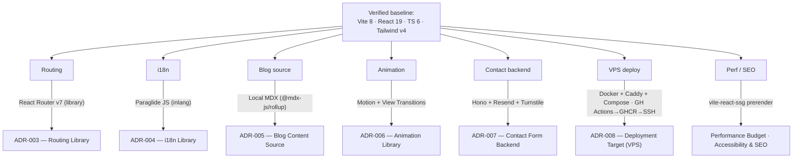

# Tooling Notes

> [!note] Purpose
> The **raw research record** for the 2026 tooling landscape — options, current versions, tradeoffs — per decision area. ADRs cite THIS note for evidence; this note does not itself make the binding call (that's the ADR's job). Where a recommendation is shown, it's the *digest's* recommendation, carried here so the ADR can accept, modify, or reject it with eyes open. Verified June 2026.

> [!important] Stack baseline (verified June 2026)
> - **Vite 8.0.9** — Rolldown/Rust bundler, 10–30× faster builds; `@vitejs/plugin-react` v6.
> - **React 19.2.6** / react-dom 19.2.
> - **Tailwind v4** — CSS-first `@theme`, `@import "tailwindcss";`, `@tailwindcss/vite` plugin; **no `tailwind.config.js`**. Targets Chrome 111+ / Safari 16.4+ / FF 128+.
> - **TS 6** — stricter `--strict` defaults, faster project builds. Nothing below needs legacy TS.
>
> These are settled in the repo (see [[Tech Stack]] / [[ADR-001 — Framework & Build Tool]] / [[ADR-002 — Styling Approach]]) — everything in this note is downstream of them.

## Decision map

---

## 1. Client routing → feeds [[Routing]] / [[ADR-003 — Routing Library]]

| Option | Version | Strengths | Tradeoffs |
|---|---|---|---|
| **React Router v7** | ~7.8+ | Battle-tested; library OR framework mode; mature loaders + devtools; huge ecosystem; nested routing makes `/en`/`/es` prefix + blog trivial; SSG/SSR path later without leaving | Type-safety on params/search weaker than TanStack |
| **TanStack Router** | ~1.131+ | Best-in-class TS type-safety on params + search | Newer, smaller ecosystem, steeper setup |
| **File-based (TanStack Start / RR framework mode)** | — | Convenient conventions | Heavier than this SPA needs |

> [!decision] Digest recommendation #decision
> **React Router v7, library mode.** Lowest friction for a bilingual blog SPA; the type-safety gap is negligible at this scale; clean upgrade path to prerender. Model routes as `/:lang/blog/:slug` with a `lang` param + redirect from `/` to detected locale. → [[ADR-003 — Routing Library]] makes the binding call.

## 2. i18n → feeds [[i18n Architecture]] / [[ADR-004 — i18n Library]]

| Option | Nature | Bundle | Notes |
|---|---|---|---|
| **Paraglide JS (inlang)** | Compile-time, tree-shaken, Vite-native | **47–144 KB** | Every key a typed function; zero-runtime; best DX/perf for a 2-locale static site |
| **react-i18next** | Runtime | **205–422 KB** | Most-installed, richest ecosystem/plugins; type-safety needs manual declaration merging |
| **Lingui** | Compile-time + ICU | Small | Good, but more ceremony than 2 locales warrant |

> [!decision] Digest recommendation #decision
> **Paraglide JS.** Compile-time tree-shaking + typed messages are ideal for a dev-authored bilingual portfolio. **Path-prefix pattern:** `/:lang(en|es)` route param drives `setLocale()`; persist in cookie/localStorage. **Switcher:** swap the `:lang` segment of the current pathname (`/en/blog/x` ↔ `/es/blog/x`) and re-navigate, preserving slug. → [[ADR-004 — i18n Library]].

> [!warning] Coupling risk #risk
> The locale strategy is shared between routing and i18n — `/:lang` param must be agreed across [[Routing]] and [[i18n Architecture]]. Decide them together so the switcher + redirect logic line up.

## 3. Blog content source → feeds [[Blog Content Pipeline]] / [[ADR-005 — Blog Content Source]]

| Option | What it gives | Cost |
|---|---|---|
| **Local MDX (`@mdx-js/rollup`)** | JSX-in-Markdown, components in posts; compiles through Vite | ESM-only → async-import in `vite.config.ts` |
| **Markdown + remark + `gray-matter` + `import.meta.glob`** | Lighter; glob auto-discovers posts | No JSX-in-content |
| **Git/headless CMS** | External authoring UI | Unnecessary overhead for in-repo dev authoring |

> [!decision] Digest recommendation #decision
> **Local MDX** via `@mdx-js/rollup` + `remark-frontmatter` + `remark-mdx-frontmatter`, indexed with `import.meta.glob('./posts/*.mdx', { eager: true })`. Frontmatter (title/date/lang/slug/description/og) feeds routing, meta, and bilingual filtering. Add `remark-gfm` + `rehype-pretty-code`/`shiki` for code blocks. Keep locale variants as `slug.en.mdx` / `slug.es.mdx`. → [[ADR-005 — Blog Content Source]].

## 4. Animation → feeds [[Motion & Animation]] / [[ADR-006 — Animation Library]]

| Option | Version | Size | Best at |
|---|---|---|---|
| **Motion (`motion`)** | v12+ (framer-motion successor) | ~34–46 KB | Declarative React API; layout/exit anims; ships `useReducedMotion()` |
| **GSAP** | v3 (now fully free incl. all plugins) | ~23 KB core | Imperative; unbeatable scroll/timeline storytelling |
| **View Transitions API** | Baseline Newly Available | 0 JS | Same-document route transitions (Chrome/Edge 111+, FF 133+, Safari 18+; cross-document not in FF yet) |

> [!decision] Digest recommendation #decision
> **Motion** for micro-interactions + `AnimatePresence` page transitions; **native View Transitions API** (`document.startViewTransition`) for route changes where supported, Motion as fallback. **Gate everything** behind `useReducedMotion()` / `@media (prefers-reduced-motion: reduce)` — collapse to opacity-only or instant. Reserve **GSAP** only if a scroll-driven hero is added. → [[ADR-006 — Animation Library]].

> [!tip] Cross-link
> The CSS glass/gloss/aurora layer is hand-rolled (not a JS lib) — see [[Frutiger Aero — References]] + [[Glass, Gloss & Depth]]. Motion handles *component* motion; CSS handles *surface* motion.

## 5. Contact form backend → feeds [[Contact Backend]] / [[ADR-007 — Contact Form Backend]]

- **API:** **Hono v4** — TypeScript-first, ~4–5× faster than Express, runs on Node/Bun/edge, built-in CORS + validation; `@hono-rate-limiter` for limits. Express = legacy alt (no first-class TS, heavier).
- **Email:** **Resend** (clean API, generous free tier, great deliverability) > raw `nodemailer`/SMTP (full control but you own SPF/DKIM/deliverability).
- **Spam:** **honeypot field + Cloudflare Turnstile** (free, privacy-friendly, server-side `siteverify`) + **IP rate-limit**. Honeypots alone are weak now that spam is LLM-generated — Turnstile is the real gate.
- **Validation:** `zod` + `@hono/zod-validator`.
- **SaaS alts:** Web3Forms (high daily cap, hCaptcha all tiers) or Formspree (50 subs/mo free, reCAPTCHA gated to paid).

> [!decision] Digest recommendation #decision
> **Self-host `Hono /api/contact` (Node) → Resend, guarded by honeypot + Turnstile + rate-limit.** Already running a VPS, so this keeps data first-party at zero cost. Fall back to Web3Forms only if zero-backend is preferred. → [[ADR-007 — Contact Form Backend]].

## 6. VPS deployment → feeds [[VPS Deployment Plan]] / [[CI-CD Pipeline]] / [[ADR-008 — Deployment Target (VPS)]]

| Option | Shape | Notes |
|---|---|---|
| **Docker multi-stage + Caddy + Compose** | Node build → static `dist` served by Caddy; Compose runs web (Caddy) + API (Hono) | Caddy auto-provisions Let's Encrypt TLS in one line; ~3 containers; strictly less ops than nginx+certbot |
| **nginx + certbot** | Manual TLS renewal/cron | Maximal control, more moving parts |
| **PaaS-on-VPS** | Coolify (Traefik+auto-LE, ~0.5–1.2 GB idle, 6–10 containers) / Dokploy (cleaner UI) / Dokku (git-push, lean) | Heroku-like dashboard; RAM overhead |

- **CI/CD:** **GitHub Actions** → build image → push **GHCR** → SSH `docker compose pull && up -d` on the VPS (cleaner than building on-server). See [[CI-CD Pipeline]].
- **Zero-downtime:** Compose `--no-deps` rolling restart, or two replicas behind Caddy; static-only swaps are atomic.

> [!decision] Digest recommendation #decision
> **Docker multi-stage + Caddy + Compose, deployed via GitHub Actions → GHCR → SSH.** Caddy gives auto-TLS + reverse-proxy to the Hono API in one Caddyfile. Pick **Coolify** instead only if a Heroku-like dashboard is wanted and the RAM overhead is acceptable. → [[ADR-008 — Deployment Target (VPS)]]. TLS/domain specifics live in [[Domain, DNS & TLS]]; logs/backups in [[Observability & Backups]].

## 7. Performance, SEO & meta → feeds [[Performance Budget]] / [[Accessibility & SEO]]

- **CWV budget (2026):** LCP < 2.5s · **INP < 200ms** (the FID successor) · CLS < 0.1 · JS budget ~ **<150 KB gzip initial**. Vite 8 + route-level `lazy()` + Tailwind's tiny CSS make this reachable.
- **SPA SEO problem:** `react-helmet-async` updates the DOM *client-side only* → crawlers/social cards may miss it. **Fix: prerender to static HTML.**
- **Prerender options:** **`vite-react-ssg`** (Vite-native SSG; `<Head>` for per-route title/OG/canonical; can auto-emit `sitemap.xml` + `robots.txt`) or **Vike** (vite-plugin-ssr successor) for more control. React Router v7 can also SSG.
- **OG images:** precompute static per-post OG PNGs at build (Satori/`@vercel/og`-style, or a Sharp script), referenced in frontmatter.

> [!decision] Digest recommendation #decision
> **SSG every blog post + landing page with `vite-react-ssg`**, emitting real `<meta>`/OG/Twitter tags per route via its `<Head>`, plus generated `sitemap.xml`/`robots.txt`; precompute per-post OG PNGs at build. Crawlable HTML + correct social cards, no Next.js, no Prerender.io cost. → [[Performance Budget]] + [[Accessibility & SEO]].

> [!warning] Interaction to watch #risk
> `vite-react-ssg` prerendering must cooperate with React Router v7 routes, Paraglide locale resolution, and the MDX glob index — all three need to be statically enumerable at build time (the `/:lang` × slug matrix). Validate this combination early; it's the highest-risk integration in the stack.

## Net stack (digest summary)

> [!example] One-liner
> React Router v7 (library) · Paraglide JS · MDX (`@mdx-js/rollup`) · Motion + View Transitions · Hono + Resend + Turnstile · Docker + Caddy + Compose via GitHub Actions/GHCR · `vite-react-ssg` for prerendered SEO.

## Next actions

- [ ] Land each recommendation as an accepted/modified ADR: [[ADR-003 — Routing Library]], [[ADR-004 — i18n Library]], [[ADR-005 — Blog Content Source]], [[ADR-006 — Animation Library]], [[ADR-007 — Contact Form Backend]], [[ADR-008 — Deployment Target (VPS)]].
- [ ] Spike the high-risk trio early: `vite-react-ssg` + React Router v7 + Paraglide + MDX glob (the static-enumeration matrix).
- [ ] Confirm bundle math against the [[Performance Budget]] (<150 KB gzip initial) once Paraglide + Motion + Router are wired.
- [ ] Re-verify versions before kickoff; this note is dated June 2026.

## See also

- [[ADR Index]] · [[Tech Stack]] · [[Project Structure]]
- [[Routing]] · [[i18n Architecture]] · [[Blog Content Pipeline]] · [[Contact Backend]]
- [[VPS Deployment Plan]] · [[CI-CD Pipeline]] · [[Domain, DNS & TLS]] · [[Observability & Backups]]
- [[Performance Budget]] · [[Accessibility & SEO]]
- [[Frutiger Aero — References]] — the aesthetic-research counterpart to this tooling record.
