# Home

Welcome to the **project brain** for Jeronimo Betancur Duque's personal developer portfolio — a self-hosted, bilingual, **Frutiger Aero** site that exists to *express who Jeronimo is as a developer* and to *delight* through glassy, techno-optimist spectacle. This vault is the map. The code lives in the repo; the *thinking* lives here.

> [!tip] Start here
> 1. New to the vault? Read **[[How to use this vault]]** (taxonomy, conventions, how to add a note).
> 2. Want the "why"? Read **[[Vision & Purpose]]** → **[[Developer Identity]]**.
> 3. Want to build *right now*? Jump to **[[Now · Next · Later]]** for the current focus.
> 4. Unsure of a term? **[[Glossary]]** defines everything (Frutiger Aero, glassmorphism, ADR, MDX, FOUC, …).

> [!important] The two north stars
> Treat **"express identity"** and **"delight via Frutiger Aero spectacle"** as *co-equal*. Optimize for emotional resonance + craft — **not** recruiter scan-speed or conversion funnels. This is craft-as-statement, not a job-hunting funnel.

---

## Map of content

```mermaid
flowchart TD
    H["🏠 Home (you are here)"]

    H --> M["00 — Meta"]
    H --> V["01 — Vision"]
    H --> D["02 — Design"]
    H --> IA["03 — Information Architecture"]
    H --> T["04 — Architecture & Tech"]
    H --> ADR["05 — Decisions (ADR)"]
    H --> R["06 — Roadmap"]
    H --> DEP["07 — Deployment"]
    H --> RES["99 — Research"]

    M --> M1["How to use this vault"]
    M --> M2["Glossary"]

    V --> V1["Vision & Purpose"]
    V --> V2["Developer Identity"]
    V --> V3["Audience & Goals"]
    V --> V4["Success Criteria"]
    V --> V5["Principles & Constraints"]

    D --> D1["Frutiger Aero — Design Language"]
    D --> D2["Color & Gradients"]
    D --> D3["Typography"]
    D --> D4["Glass, Gloss & Depth"]
    D --> D5["Theming — Light & Dark"]
    D --> D6["Design Tokens"]

    IA --> IA1["Sitemap"]
    IA --> IA2["Navigation & Flows"]
    IA --> IA3["Page — Home / About / …"]

    T --> T1["Tech Stack"]
    T --> T2["Project Structure"]
    T --> T3["Routing"]
    T --> T4["i18n Architecture"]

    ADR --> ADR1["ADR Index → ADR-001…008"]

    R --> R1["Roadmap & Phases"]
    R --> R2["Now · Next · Later"]
    R --> R3["Backlog / Definition of Done"]

    DEP --> DEP1["VPS Deployment Plan"]
    DEP --> DEP2["CI-CD Pipeline"]
    DEP --> DEP3["Domain, DNS & TLS"]

    RES --> RES1["Tooling Notes"]
    RES --> RES2["Frutiger Aero — References"]
    RES --> RES3["Inspiration Gallery"]
```

---

## 01 — Vision (the WHY)

The soul of the project. Read this before touching design or code.

- **[[Vision & Purpose]]** — why this site exists: a meaningful artifact, not a funnel. The two north stars.
- **[[Developer Identity]]** — who Jeronimo *is* as a developer; the way of being the site must embody.
- **[[Audience & Goals]]** — who it's for and what "success" feels like (resonance over conversion).
- **[[Success Criteria]]** — how we'll know it worked; the bar for "done well".
- **[[Principles & Constraints]]** — the non-negotiables (accessibility, performance, no vendor lock-in, self-hosted).

## 02 — Design (the Frutiger Aero language)

The disciplined system behind the playful surface.

- **[[Frutiger Aero — Design Language]]** — the authoritative aesthetic brief: glass, gloss, water, nature, optimism.
- **[[Color & Gradients]]** — luminous sky/aqua/lime palettes, auroras, animated multi-stop gradients.
- **[[Typography]]** — humanist sans (Source Sans 3 / Hind / Open Sans) evoking Frutiger / Myriad.
- **[[Glass, Gloss & Depth]]** — glassmorphism recipes, aqua/gel buttons, layered depth, soft glows.
- **[[Theming — Light & Dark]]** — luminous "day/sky" light + deep "ocean/aurora" dark; no-FOUC strategy.
- **[[Design Tokens]]** — the CSS custom properties + Tailwind v4 `@theme` values that encode all of the above.
- **[[Component Visual Library]]** — the catalog of glass/gel components built from the tokens.
- **[[Imagery & Motifs]]** — bubbles, droplets, blobs, god-rays, bokeh, lens flares.
- **[[Motion & Animation]]** — spring micro-interactions, parallax, View Transitions, reduced-motion gates.

## 03 — Information Architecture (the WHAT & WHERE)

How the site is structured and how people move through it.

- **[[Sitemap]]** — the full page tree, per-locale, including the blog.
- **[[Navigation & Flows]]** — primary nav, language switcher, key user journeys.
- **[[Page — Home]]** · **[[Page — About]]** · **[[Page — Projects]]** · **[[Page — Blog]]** · **[[Page — Contact]]** — per-page intent, content, and components.

## 04 — Architecture & Tech (the HOW)

The engineering plan, grounded in the verified 2026 stack.

- **[[Tech Stack]]** — React 19 · Vite 8 · TS 6 · Tailwind v4, plus the chosen libraries.
- **[[Project Structure]]** — folder layout, content directories, where things live.
- **[[Routing]]** — React Router v7, `/:lang/blog/:slug` path-prefix model.
- **[[i18n Architecture]]** — Paraglide JS, EN/ES, the language-switcher pattern.
- **[[Blog Content Pipeline]]** — local MDX, frontmatter, `import.meta.glob` indexing.
- **[[Contact Backend]]** — the self-hosted Hono `/api/contact` → Resend service.
- **[[Performance Budget]]** — Core Web Vitals targets (LCP < 2.5s, INP < 200ms, CLS < 0.1).
- **[[Accessibility & SEO]]** — contrast over glass, reduced-motion, SSG-for-crawlers.

## 05 — Decisions (ADR)

Every significant choice, with rationale, tradeoffs, and a decision tree.

- **[[ADR Index]]** — the register of all decisions.
- **[[ADR-001 — Framework & Build Tool]]** · **[[ADR-002 — Styling Approach]]** · **[[ADR-003 — Routing Library]]** · **[[ADR-004 — i18n Library]]** · **[[ADR-005 — Blog Content Source]]** · **[[ADR-006 — Animation Library]]** · **[[ADR-007 — Contact Form Backend]]** · **[[ADR-008 — Deployment Target (VPS)]]** · **[[ADR-009 — Theming Strategy]]**
- **[[ADR-000 — Template]]** — copy this to start a new decision.

## 06 — Roadmap (the WHEN)

What we're doing, in what order.

- **[[Roadmap & Phases]]** — the phased plan from skeleton → shippable.
- **[[Now · Next · Later]]** — the live focus board (see "Current focus" below).
- **[[Backlog]]** — everything not yet scheduled.
- **[[Definition of Done]]** — the quality gate every piece must pass.

## 07 — Deployment (to the net)

Getting it onto Jeronimo's own VPS, with TLS, on a real domain.

- **[[VPS Deployment Plan]]** — Docker multi-stage + Caddy + Compose.
- **[[CI-CD Pipeline]]** — GitHub Actions → GHCR → SSH deploy.
- **[[Domain, DNS & TLS]]** — custom domain, DNS records, Caddy auto-Let's-Encrypt.
- **[[Observability & Backups]]** — logs, uptime, and what we back up.

## 99 — Research (grounding material)

The verified digests everything above is built on.

- **[[Tooling Notes]]** — the 2026 tooling landscape (routing, i18n, blog, animation, backend, deploy, SEO).
- **[[Frutiger Aero — References]]** — implementation digest: CSS recipes, palettes, type, perf/a11y.
- **[[Inspiration Gallery]]** — reference imagery and revival examples.

---

## Current focus

> [!example] Now
> The live priority is tracked in **[[Now · Next · Later]]**. Keep that note honest — it is the single source of truth for "what should I touch today." Everything else is context.

The build philosophy: **plan here, build in the repo.** Decisions get an ADR before code; the [[Glossary]] keeps shared language tight; the [[Definition of Done]] is the gate. See **[[How to use this vault]]** for the full workflow and how this brain maps to the root `CLAUDE.md` and `src/`.

---

## Status legend

Every note carries a `status` in its frontmatter. Read it as a maturity signal:

| Status | Meaning | You can rely on it? |
| --- | --- | --- |
| `idea` | A spark, unvetted. | No — brainstorm only. |
| `exploring` | Actively being figured out; options open. | Partially — direction may shift. |
| `proposed` | A concrete proposal awaiting acceptance (ADRs). | Soon — pending decision. |
| `decided` / `accepted` | Committed. Build to this. | **Yes.** |

> [!note]
> When a note's reality changes, update its `status` **and** its `updated:` date. A stale `accepted` note is worse than an honest `exploring` one.

## See also

- **[[How to use this vault]]** — the operating manual.
- **[[Glossary]]** — shared vocabulary.
- **[[Now · Next · Later]]** — the live focus board.
